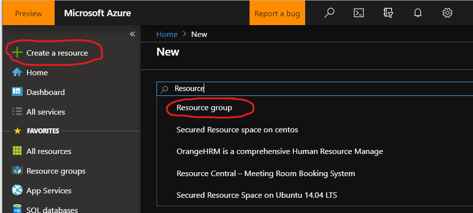
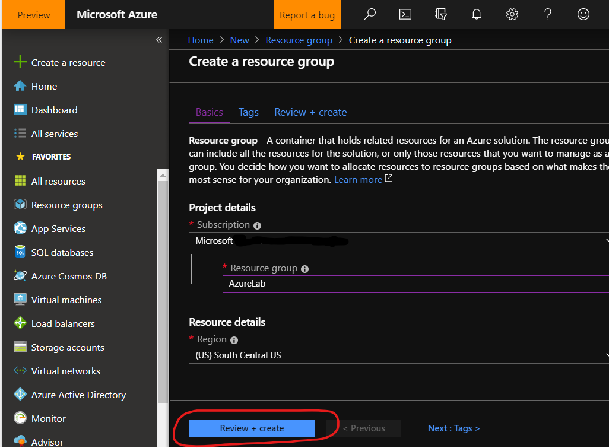
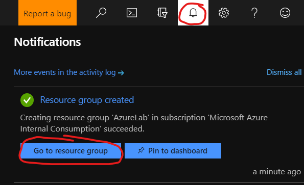

# Create a Resource Group

Azure Resources Groups are logical collections of virtual machines, storage accounts, virtual networks, web apps, databases, and/or database servers. Typically, users will group related resources for an application, divided into groups for production and non-production — but you can subdivide further as needed.


## Task Completion Options
- [Create a Resource Group via the Azure Portal](#azure-portal)
- [Create a Resource Group via Azure CLI](#azure-cli)


## Azure Portal
1. In the [Azure Portal](https://portal.azure.com), click the **+Create a resource** link at the top left of the page.
1. In the Search field, type *Resource* and click on **Resource Group** that appears in the drop down list.

1. Click the **Create** button.
1. Select the appropriate **Subscription**, type in a *AzureLab* for **Resource group** and select the **Region** closest to you.
1. Click **Review + Create**, and then **Create** once validation has passed.

1. Check the **Notifications** icon in the upper right and wait unitl you see **Resource group created**, then click the **Go to resource** button.  


## Azure CLI 
### Prerequisite: [Open Azure CLI](../OpenAzureCLI/OpenAzureCLI.md) ###
To see all Azure regions, use the following command:

```azurecli-interactive
az group create --name AzureLab --location southcentralus
```


> We will use the name of your resource group across this lab

Where:

* `--name` is the name of your Resource Group
  commands.
* `--location` is the region your Resource Group is deployed in


### Next: [Create a Virtual Network](../VirtualNetwork/VirtualNetwork.md) ###
