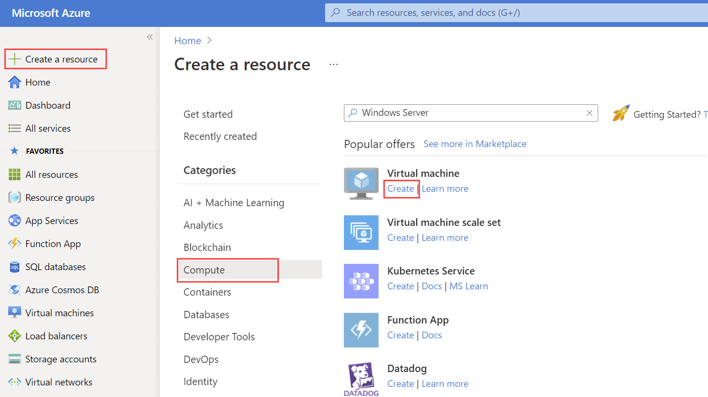
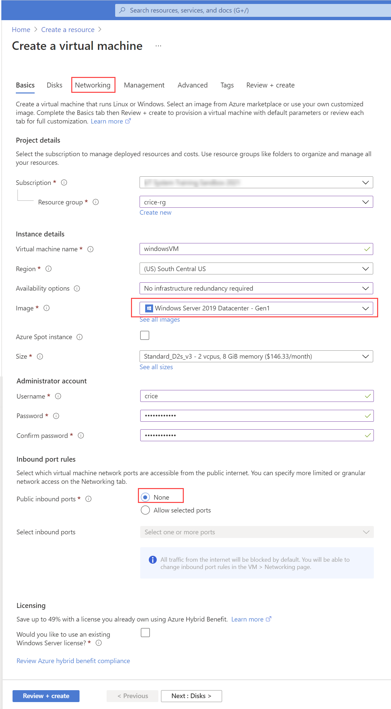
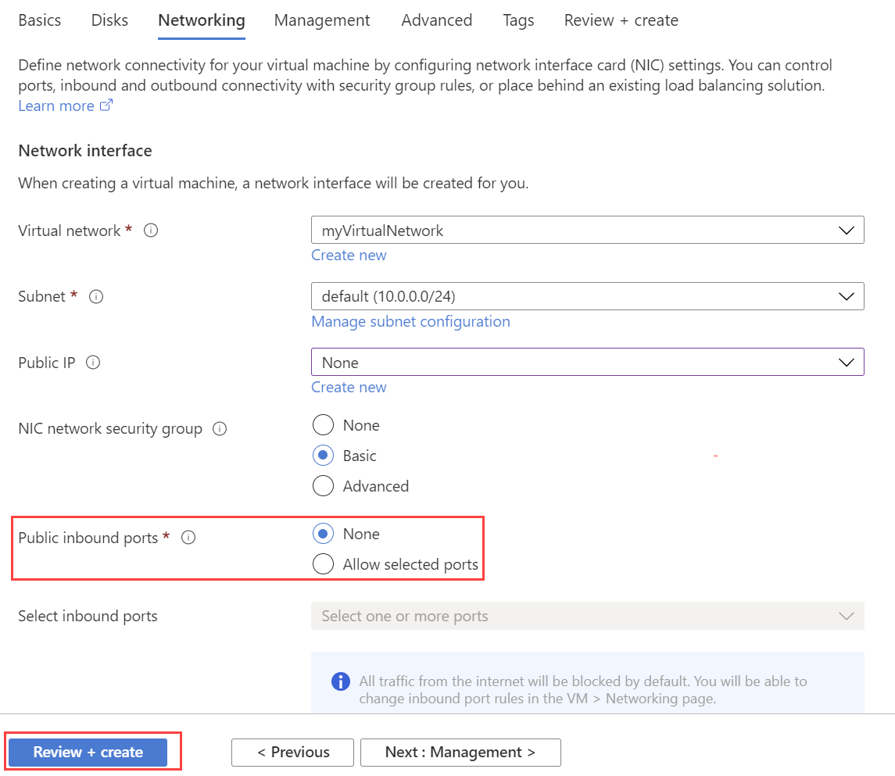
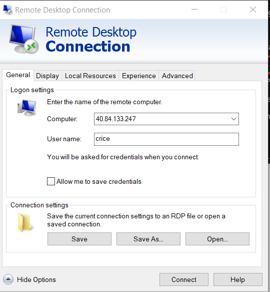
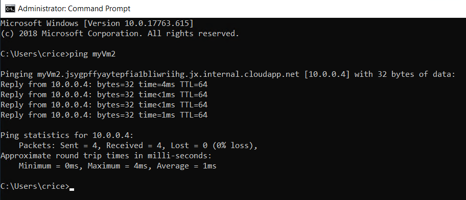

## Task Completion Options
- Create a Virtual Machine
    - [Create a Virtual Network via the Azure Portal](#azure-portal)
    - [Create a Virtual Network via Azure CLI](#azure-cli)
- [Connect to your virtual machines](#connect-to-your-virtual-machines)


## Azure Portal
### Create a Windows Server Virtual Machine
1. In the [Azure Portal](https://portal.azure.com), click the **+Create a resource** link at the top left of the page.
1. Under *Categories* click on **Compute**, then click on **Create** under *Virtual Machines*.

1. In **Create a virtual machine**, enter or select this information:
    - `Instance details - Subscription`	Select your subscription.
    - `Instance details - Resource group`	Select this lab's resource group.
    - `Instance details - Virtual Machine name`	windowsVM
    - `Instance details - Region`	Select South Central US.

    - `Availability options` Select No infrastructure redundancy required
    - `Image` Select Windows Server 2019 Datacenter - Gen1
    
    - `Administrator account - Username`	Enter your Local administrator account name.
    - `Administrator account - Password` and `Confirm password` Enter your Local adminsitrator account's password

    - `Inbound Port Rules - Public inbound ports` Choose **None**
    


1. Click on **Networking**
1. Ensure **Virtual Network** is set to *myVirtualNetwork*, set **Public inbound ports** to *None* and leave all else as default. Next, click **Review + Create** followed by **Create** once validation has passed.


For a Linux VM, follow the same steps above but choose *Ubuntu Server 20.04 LTS - Gen1* for the **Image**. 

## Azure CLI

### Create a Windows Server Virtual Machine


```azurecli-interactive
az vm create --resource-group AzureLab --name myVm1 --image Win2019Datacenter --admin-username '<LocalAdminUser>' --admin-password '<LocalAdminPassword>' --no-wait
```


### Create an Ubuntu Virtual Machine
```azurecli-interactive
az vm create  --resource-group AzureLab  --name myVm2  --image UbuntuLTS --generate-ssh-keys
```

The following output will be displayed for VM2 - Note the Public IP Address
~~~~~~~~~~
{
  "fqdns": "",
  "id": "/subscriptions/00000000-0000-0000-0000-000000000000/resourceGroups/myResourceGroup/providers/Microsoft.Compute/virtualMachines/Vm2",
  "location": "eastus",
  "macAddress": "00-0D-3A-23-9A-49",
  "powerState": "VM running",
  "privateIpAddress": "10.0.0.5",
  "publicIpAddress": "13.66.35.3",
  "resourceGroup": "AzureLab"
  "zones": ""
}
~~~~~~~~~~

## Connect to your Virtual Machines ##
----
### Windows Virtual Machine
1. Open the Remote Desktop Connection client on your workstation and click **More Options**
1. Input myVm1's Public IP address in the **Computer** field and your Local Administrator username as the **User name**, then click **Connect** and input your Local Administrator Password in the **Password** field. 

1. Once logged in, open the **Command Prompt** and type *ping myVm2* followed by **Enter**, you will now receive replies from the Ubuntu virtual machine.


### Ubuntu Virtual Machine
#### Connect to myVm2 using the public id using Bash
*If created following CLI instructions*
```sh
ssh  13.66.35.3
```

*If created following Azure Portal instructions*
```sh
ssh  username@13.66.35.3
```

You'll receive four replies from myVm1


[Next -> Create a File Share & Mount to VM]

[Create Virtual Network Documentation]: <https://docs.microsoft.com/en-us/azure/virtual-network/quick-create-portal>
[Create DNS Record Documentation]: <https://docs.microsoft.com/en-us/azure/dns/dns-getstarted-cli>
[Next -> Create a File Share & Mount to VM]:<https://github.com/Microsoft-USEduAzure/workshops/blob/master/AzureFundamentals/FileShare/CreateAFileShare.md>

