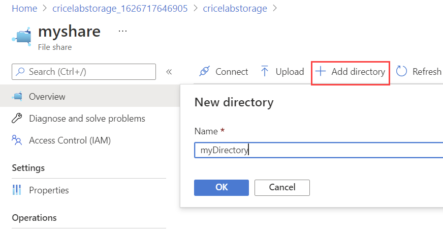
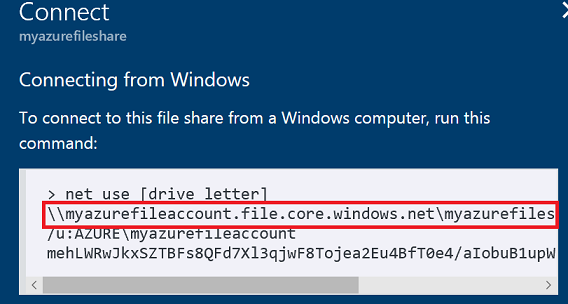
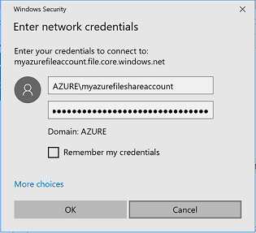

# Create a File Share and Mount to VM

## Tasks 
- Create a File Share
    - [Create a File Share and Mount to VM via the Azure Portal](#azure-portal)
    - [Create a File Share and Mount to VM via Azure CLI](#azure-cli)  
- [Mount Files Share to VM](#Mount-Files-Share)

In this document you will learn how to:
- Create a Storage Account
  - Create a FileShare
  - Upload a file
  - List files  
- Attach the FileShare to a VM
- List files on VM

----
## Azure Portal
### Task 1: Create a Storage Account
Before you can work with an Azure file share, you have to create an Azure storage account. A general-purpose v2 storage account provides access to all of the Azure Storage services: blobs, files, queues, and tables. The quickstart creates a general-purpose v2 storage account but, the steps to create any type of storage account are similar. A storage account can contain an unlimited number of shares. A share can store an unlimited number of files, up to the capacity limits of the storage account.

Storage account names must be unique, so make sure to replace "USEDUAzureLabstorage" with a unique name.

1. In the [Azure Portal](https://portal.azure.com), click the **+Create a resource** link at the top left of the page.
1. In the Search field, type *Storage Account* and click on **Storage Account** that appears in the drop down list and click **Create.**

1. In **Create storage account**, enter or select this information:
    - `Project details - Subscription`	Select your subscription.
    - `Project details - Resource Group`	Select *AzureLab*.
    
    - `Instance details - Storage account name`	Enter a *globally unique* name.
    - `Instance details - Region`	Select *South Central US*.
    - `Instance details - Redundancy`	Select *Locally-redundant Storage (LRS)*  

1. Click **Review + Create** and once validation has passed, click **Create**
1. Once the resource is fully deployed, click the **Go to resource** button.

1. From the Storage Account menu, click on **Access Keys**, next copy the value of **key2's Key** into a text editor.


### Task 2: Create an Azure Files File Share
1. From the Storage Account menu, click on **File sh** and then **+File share**

1. Set the **Name** to *myshare*,  the **Quota** to *100 GiB*, Tier to **Transaction optimized**, and press **Create**  

1. From the the Files screen, select the **myshare** share we have just created and then click on **+Add Directory**
1. Enter *myDirectory* as the directory **Name** and click **OK**

1. Upload a local text file to the directory by clicking the **Upload** button, followed by the **Folder** icon, selecting the local file, and finally clicking the second **Upload** button on the Upload Files blade.  


## Azure CLI
### Create a Storage Account

Before you can work with an Azure file share, you have to create an Azure storage account. A general-purpose v2 storage account provides access to all of the Azure Storage services: blobs, files, queues, and tables. The quickstart creates a general-purpose v2 storage account but, the steps to create any type of storage account are similar. A storage account can contain an unlimited number of shares. A share can store an unlimited number of files, up to the capacity limits of the storage account.

The following example creates a storage account named mystorageaccount  by using the az storage account create command, and then puts the name of that storage account in the $STORAGEACCT variable. Storage account names must be unique, so make sure to replace "USEDUAzureLabstorage" with a unique name.

```sh

az storage account create  --resource-group "AzureLab"   --name "useduazurelabstorage"  --location eastus2 --sku Standard_LRS --query "name" | tr -d '"'
```
Further documentation:  [Create a File Share Documentation](https://docs.microsoft.com/en-us/azure/storage/files/storage-how-to-use-files-cl)

### Get the Storage Account Key

```sh
az storage account keys list --resource-group "AzureLab"  --account-name useduazurelabstorage --query "[0].value" | tr -d '"'
```

Note your storage key that looks like this:
> WZIIDm1DfDRtIulvX8RdyAKt0t8K2E6lvY6OgaPd7sM6O68jMn/ClhRfasfQvJXfrAM9HnGblBEiJbNahlsCMQ==

----

### Create FileShare

```sh
az storage share create --account-name useduazurelabstorage --account-key WZIIDm1DfDRtIulvX8RdyAKt0t8K2E6lvY6OgaPd7sM6O68jMn/ClhRfasfQvJXfrAM9HnGblBEiJbNahlsCMQ== --name "myshare"
```

### Create a Directory

```sh
az storage directory create \
   --account-name useduazurelabstorage \
   --account-key WZIIDm1DfDRtIulvX8RdyAKt0t8K2E6lvY6OgaPd7sM6O68jMn/ClhRfasfQvJXfrAM9HnGblBEiJbNahlsCMQ== \
   --share-name "myshare" \
   --name "myDirectory"
```

### Upload a File

```bash

date > ~/clouddrive/SampleUpload.txt

az storage file upload --account-name useduazurelabstorage --account-key WZIIDm1DfDRtIulvX8RdyAKt0t8K2E6lvY6OgaPd7sM6O68jMn/lhRfasfQvJXfrAM9HnGblBEiJbNahlsCMQ== --share-name "myshare" --source "~/clouddrive/SampleUpload.txt" --path "myDirectory/SampleUpload.txt"

```  

----

After you upload the file, you can use the az storage file list command to make sure that the file was uploaded to your Azure file share:

```sh

az storage file list --account-name useduazurelabstorage --account-key WZIIDm1DfDRtIulvX8RdyAKt0t8K2E6lvY6OgaPd7sM6O68jMn/ClhRfasfQvJXfrAM9HnGblBEiJbNahlsCMQ== --share-name "myshare"   --path "myDirectory" --output table
```  
----

## Mount Files Share
### Mount to Linux VM

We will attach the File Share to one of the VM created on our previous Lab

Log into MyVM2 created on the previous lab

```sh
ssh 104.46.2.155
```

install the following packages

```sh
sudo apt-get update
sudo apt-get install cifs-utils
```

Make a directory to mount the file share

```sh
sudo mkdir /mnt/MyAzureFileShare
```

Mount the file share to your VM

Use the mount command to mount the Azure file share: Remember to replace storage-account-name, share-name,smb-version, storage-account-key, and mount-point with the appropriate information for your environment. If your Linux distribution supports SMB 3.0 with encryption (see Understand SMB client requirements for more information), use 3.0 for smb-version. For Linux distributions that do not support SMB 3.0 with encryption, use 2.1 for smb-version. An Azure file share can only be mounted outside of an Azure region (including on-premises or in a different Azure region) with SMB 3.0.

>sudo mount -t cifs //"storage-account-name".file.core.windows.net/"share-name" "mount-point" -o vers="smb-version",username="storage-account-name",password="storage-account-key",dir_mode=0777,file_mode=0777,serverino

This is how your comand should look:

```sh

sudo mount -t cifs //useduazurelabstorage.file.core.windows.net/myshare /mnt/MyAzureFileShare -o vers=3.0,username=useduazurelabstorage,password=nuwwceasqU8Bph4deS/i4/4qZGr8fVEM1n7OvRTGt7zVMUWwALOedHXtQ1hUJ1QXp5czRK6+W/XQaC6dNRzLgw==,dir_mode=0777,file_mode=0777,serverino
```  
Check the mounted drives in your VM

```sh

mount
```

List Files on the mounted File Share

```sh
cd /mnt/MyAzureFileShare
ls -all
```

Output

```sh
usr@myVm2:~$ cd /mnt/MyAzureFileShare
usr@myVm2:/mnt/MyAzureFileShare$ ls -all
total 5
drwxrwxrwx 2 root root    0 May 24 15:44 .
drwxr-xr-x 4 root root 4096 May 24 15:39 ..
-rwxrwxrwx 1 root root   29 May 24 15:24 SampleUpload.txt
drwxrwxrwx 2 root root    0 May 24 15:30 myDirectory
usr@myVm2:/mnt/MyAzureFileShare$
```

Further documentation: [Mount Files Share to Linux VM](https://docs.microsoft.com/en-us/azure/storage/files/storage-how-to-use-files-linux)

### Mount to Windows VM
1. Use the RDP client to remotely connect to your Windows virtual machine.  
1. Open **File Explorer.** This can be done by opening from the Start Menu, or by pressing Win+E shortcut.  
1. Navigate to the **This PC** item on the left-hand side of the window. This will change the menus available in the ribbon. Under the Computer menu, select **Map network drive.**   

1. Copy the UNC path from the Connect pane in the Azure portal.  

1. Select the drive letter and enter the UNC path and check **Connect using different credentials**  

1. Use the storage account name prepended with AZURE\ as the username and a storage account key as the password.    

1. Use Azure file share as desired.   


Further documentation: [Mount Files Share on Windows VM](https://docs.microsoft.com/en-us/azure/storage/files/storage-how-to-use-files-windows)

### Next: [Use Serverless Tools to Analyze Text](../Serverless/CreateCognitiveService.md) ###