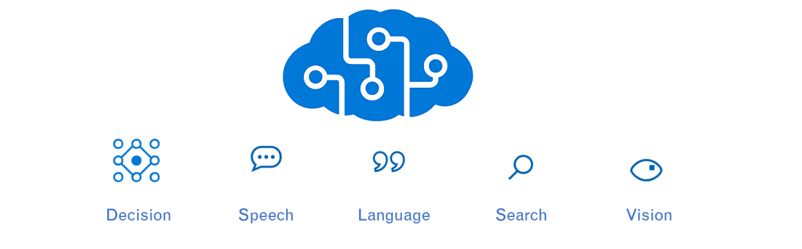
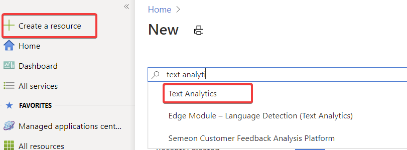
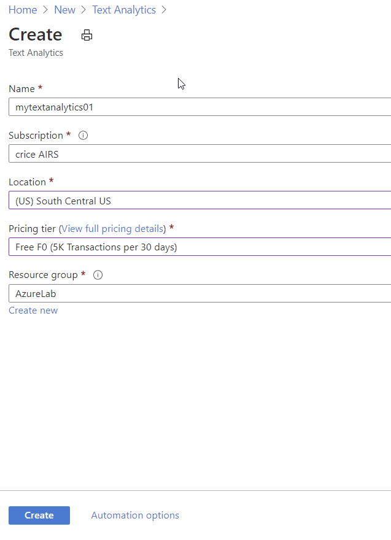
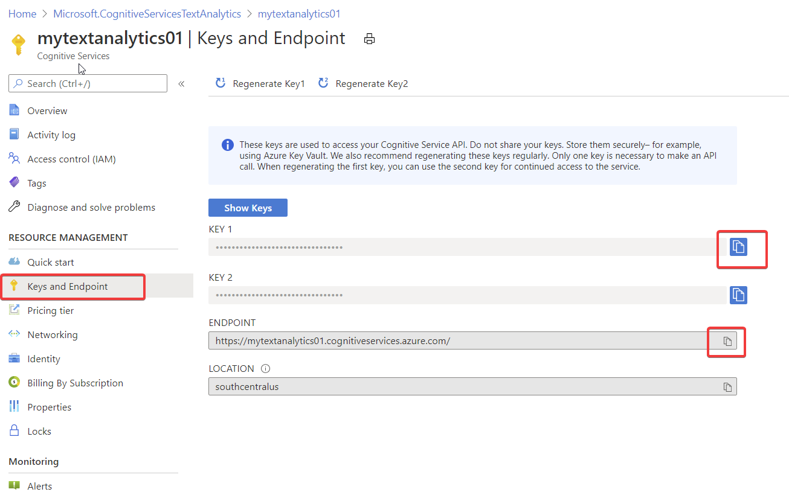

# Create a Cognitive Services Resource

The Cognitive Services APIs are available in Azure as individual resources. Use the Text Analytics API to detect the sentiment, Microsoft Translator to translate, and Content Modreator to detect profanity of the tweets being monitored. 

**Documentation: https://docs.microsoft.com/en-us/azure/cognitive-services/**
### Prerequisite: [Create a File Share and Mount to VM](../FileShare/CreateAFileShare.md) ####

## Tasks
- [Create a Sentiment Analysis resource](#Create-a-Sentiment-Analysis-resource)

## Create a Sentiment Analysis resource

1. Sign in to the [Azure portal](https://portal.azure.com/).
1. Click **Create a resource** in the upper left-hand corner of the Azure portal.
1. In the Search field, type in "Text Analytics" and choose "Text Analytics"  

1. Click the **Create** button and fill out the resource creation form

    | Setting      |  Suggested value   | Description                                        |
    | --- | --- | --- |
    | **Name** | mytextanalytics01 | Choose a globally unique account name. |
    | **Location** | South Central US | Use the location nearest you. |
    | **Pricing tier** | F0 | Start with the lowest tier. If you run out of calls, scale to a higher tier.|
    | **Resource group** | AzureLab | Use the same resource group for all services in this tutorial.|
    
1. Click **Create** to create your resource.  

1. From your Resource Group, go to your Sentiment Analysis resource and copy and paste the the **Key1** and **Endpoint** value from within *Keys and Endpoint* into a text editor. 

 

### Next: [Create a Logic App](./CreateLogicApp.md) ###
#### Previous: [Create a File Share and Mount to VM](../FileShare/CreateAFileShare.md) ####
