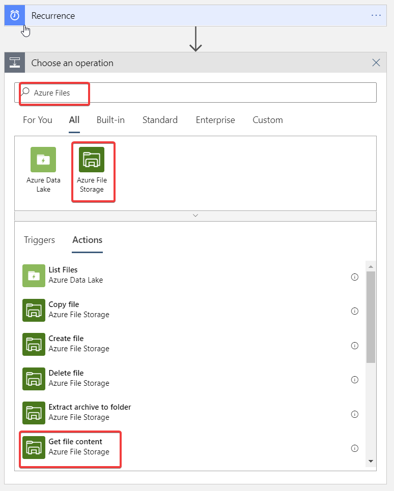

# Create a Logic App
Azure Logic Apps simplifies how you build automated scalable workflows that integrate apps and data across cloud services and on-premises systems. Learn how to create, design, and deploy logic apps that automate business processes with our quickstarts, tutorials, templates, and APIs.  
**Documentation: https://docs.microsoft.com/en-us/azure/logic-apps/**

### Prerequisite: [Create a Cognitive Services Resource](./CreateCognitiveService.md) ###
## Tasks
  - [Create the Logic App](#create-the-logic-app)
  - [Create a Trigger](#create-a-trigger)
  - [Create the Azure Files Connection](#create-the-azure-files-connection)
  - [Create the Text Analytics Connection](#create-the-text-analytics-connection)
  - [Detect and Record Sentiment](#detect-and-record-sentiment)

## Create the Logic App

1. In the Azure portal, click the **New** button found on the upper left-hand corner of the Azure portal.

2. Click **Web** > **Logic App**.
 
3. Then, type a value for **Name** like `MyLogicApp`, and use the settings as specified in the table.

    

    | Setting      |  Suggested value   | Description                                        |
    | ----------------- | ------------ | ------------- |
    | **Name** | MyLogicApp | Choose an appropriate name for your app. |
    | **Resource group** | AzureLab | Choose the same existing resource group as before. |
    | **Location** | South Central US | Choose a location close to you. |    

4. Once you have entered the proper settings values, click **Create** to create your logic app. 

5. After the app is created, click your new logic app pinned to the dashboard. Then in the Logic Apps Designer, scroll down and click the **Blank Logic App** template. 

    

You can now use the Logic Apps Designer to add services and triggers to your app.

## Create a Trigger
First, we'll need to create a trigger to run the Logic App. For the purposes of this exercise, we will create a simple recurrence trigger; however, it would be worthwhile to explore the various triggers to get a better understanding of what may be possible. For example, instead of running on a recurrence, we could instead trigger the Logic App to run upon the creation or modification of any file within a directory or share. 
1. In the designer, type in **Recurrence** in the search bar and select **Recurrence Schedule** from the recommended triggers. 
    
1. Set the **Interval** to **1** and the **Frequency** to **Hour**. This will prevent the Logic App from running excessively during the workshop. 
    
## Create the Azure Files Connection
We will now create a connection to Azure Files so that we may analyize files within it. 
1. Click **New Step**, and then **Add an action**.
1. In **Choose an action**, type **Azure Files**, and then click on **Get file content**.
    
1. For the **Connection Name**, type **AzureFiles**, and then select the storage account that was previously created. 
    
1. After the connection is created, click on the **Folder Icon**, then click on the arrow next to your share name followed by the file name we uploaded previously. 
    
## Create the Text Analytics Connection
We will now create a connection to the Text Analytics Cognitive Service we created earlier so that we may analyze the text in the file. 
1. Click **New Step**, and then **Add an action**.
1. In **Choose an action**, type **sentinment**, and then click on **Detect Sentiment**.
    
1. For the **Connection Name**, type **TextAnalytics**, and put in the **Account Key** and the **Endpoint URL** from your text editor in the appropriate fields.
    
## Detect and Record Sentiment
Now we will pass through the contents of our text file to Azure Cognitive Services. The Text Analytics Service will then return a sentiment score that can range from 0 to 1, where 0 is completely negative sentiment and 1 is completely positive. 
1. Next, expand the **Add new parameter** and check the box next to **Text**.
    
1. Click within the **Text to analyze** field and select **File Content** from the **Dynamic Content** menu.
    
1. Click **New Step**, and then **Add an action**.
1. In **Choose an action**, type **Azure Files**, and then click on **Update File**.
    
1. Within the **Update File** step, click the folder button to select your Storage Account, Share, and File again. Then, click within the **File Content** field and choose **File Content** from the dynamic menu.
    
1. Within the **File** field, place your cursor to the right of **File Content**, insert a **hard return**, and type "**Your sentiment score is:**". Next, click **See More** under **Detect Sentiment** in the **Dynamic Menu**
    
1. From the **Dynamic Content** menu, select **Score**.
    
1. Finally, save your Logic App. Upon saving, it will immediately run the logic for the first time. After a successful run of the logic, open your file from either within the virtual machine or the Azure Portal and inspect it to ensure the sentiment score was recorded as expected. 
    

**Note:** Since we set recurrence to 1 hour, it will automatically run again in 60 minutes. If you'd like to manually run the file, click on **Run Trigger** from the Logic App interface.
    

Your completed Logic App should look very similar to the following:
