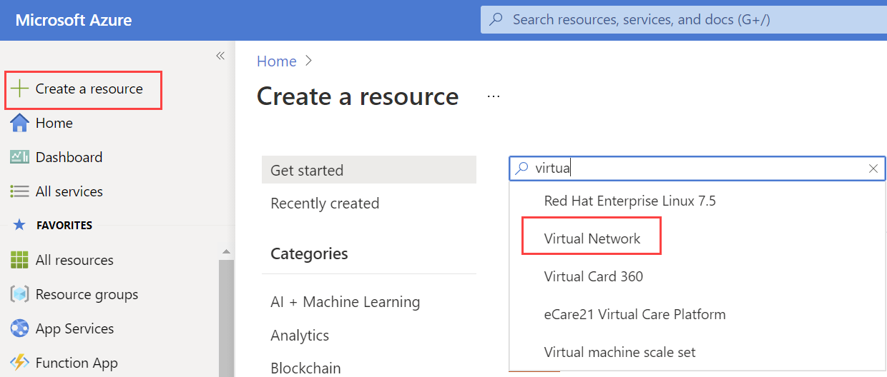
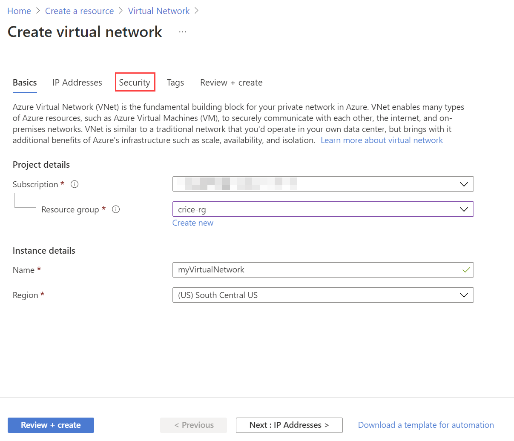
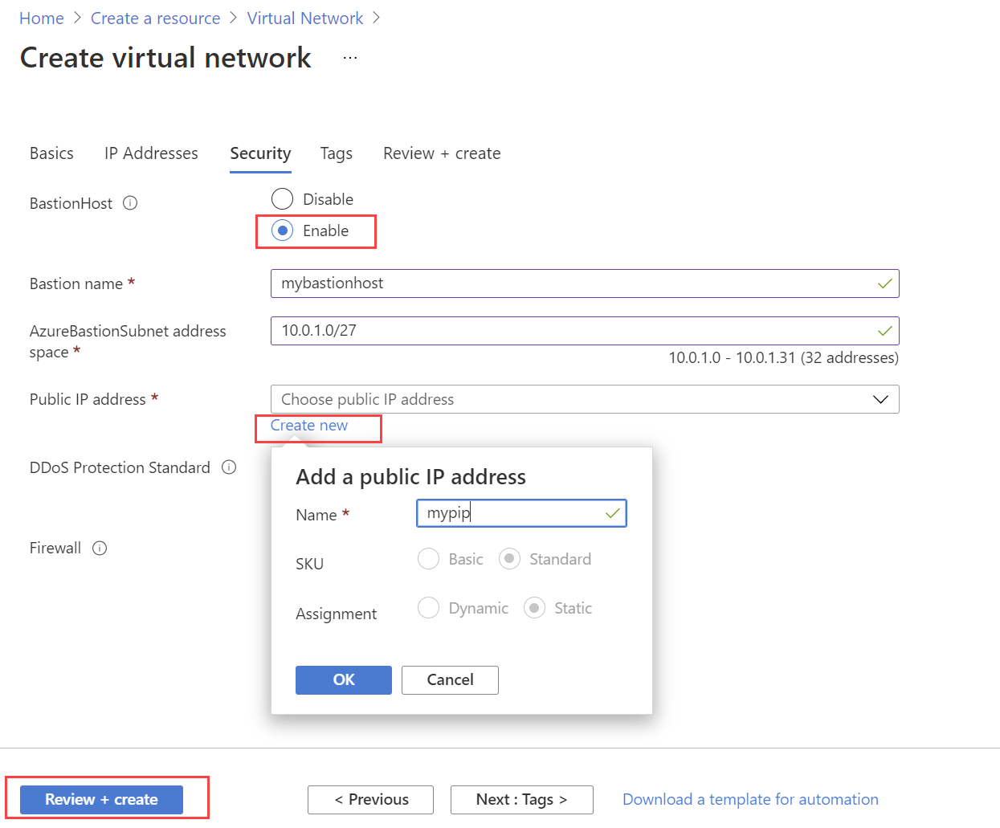

# Create a Virtual Network

## Task Completion Options
- [Create a Virtual Network via the Azure Portal](#azure-portal)
- [Create a Virtual Network via Azure CLI](#azure-cli)


## Azure Portal
1. In the [Azure Portal](https://portal.azure.com), click the **+Create a resource** link at the top left of the page.
1. In the Search field, type *Virtual* and click on **Virtual Network** that appears in the drop down list.

1. Click the **Create** button.
1. In **Create virtual network**, enter or select this information, then click the **Security** tab.
    - `Subscription`	Select your Azure subscription.
    - `Resource group`	Select this lab's resource group.
    - `Location`	Select South Central US.

    

1. From within the **Security** tab, enable **BastionHost**, and click **Create new** for Public IP address.

    
    
1. Finally, enter the following information and press **Review + Create**, followed by **Create.** 
    - `Bastion name` myBastionHost
    - `AzureBastionSubnet address space` 10.0.1.0/27

----

## Azure CLI

You first need to create a network on the same recource group you created on the previous excercise:

```sh
az network vnet create --name myVirtualNetwork --resource-group AzureLab --subnet-name default  --location southcentralus
az network vnet subnet create --resource-group AzureLab --vnet-name MyVirtualNetwork -n AzureBastionSubnet --address-prefixes 10.0.1.0/27
az network public-ip create --resource-group AzureLab --name myPip --sku Standard --location southcentralus
az network bastion create --name MyBastionHost --public-ip-address myPip --resource-group AzureLab --vnet-name myVirtualNetwork --location southcentralus
```
Further documentation:  [Create Virtual Network Documentation](https://docs.microsoft.com/en-us/azure/virtual-network/quick-create-portal)

### Next: [Create Virtual Machines](../CreateVirtualMachine/CreateVirtualMachine.md) ###
