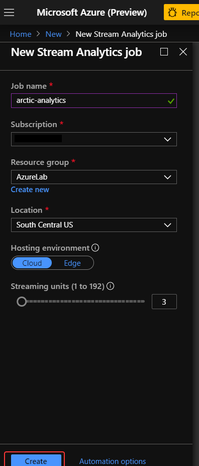
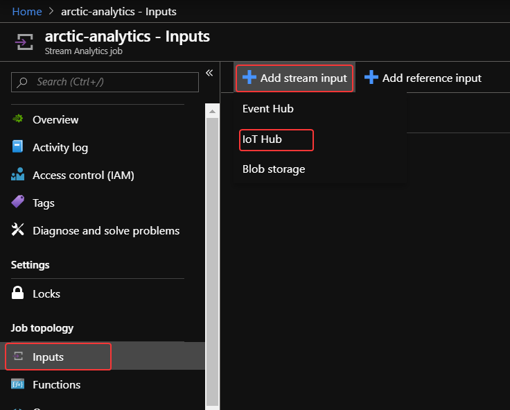
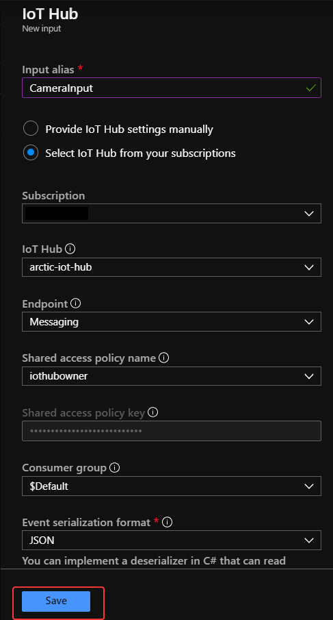
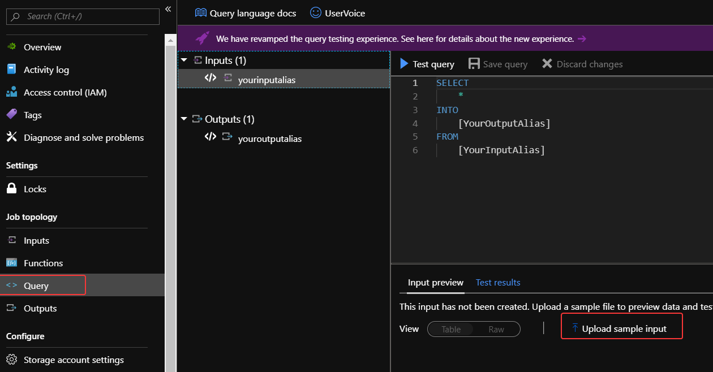

# Connect a Stream Analytics job to IoT hub
Now that we have our IoT hub connected to the blob container, let's connect a Stream Analytics job to process the input.

1. From the Azure Portal, click **+ Create a resource** in the left-hand sidebar of the Azure portal, followed by **Internet of Things** and **Stream Analytics Job**.

    

1. Fill out the Stream Analytics Job deployment screen appropriately and click on **Create**
    | Field | Suggested Value  |
    |------|------|
    |Job name |```polar-bear-analytics```|
    |Subscription |Your Azure Subscrription|
    |Resource Group |The resource group you're using for this lab.|
    |Location |Use the location nearest you.|
    |Hosting Environment |Cloud|
    |Streaming Units |3|

    

1. Open the **polar-bear-analytics** Stream Analytics job in the portal. If the Stream Analytics job doesn't appear in the resource group, click the **Refresh** button at the top of the view until it does.
1. Click **Inputs** in the left-side menu.
1. Select **Add stream input > IoT Hub** to add an input to the Stream Analytics job.

    

1. Fill out the **New Input** blade with the suggested values and accept defaults elsewhere, then click **Save**


    | Field | Suggested Value  |
    |------|------|
    |Input Alias |```CameraInput```|
    |Subscription |Your Azure Subscription|
    |IoT Hub | The IoT hub that you created earlier.|
    |Endpoint | Messaging|


    

After a few moments, the new input "CameraInput" appears in the list of inputs for the Stream Analytics job. This is the only input you'll create, but you can add any number of inputs to a Stream Analytics job.

In the [Stream Analytics Query Language](https://msdn.microsoft.com/library/azure/dn834998.aspx), each input is treated as a separate data source similar to tables in a relational database. The query language is expressive, even allowing input streams to be joined in a manner similar to joining database tables.


## Set up a Stream Analytics query to retrieve data
The heart of a Stream Analytics job is the query that extracts information from the data stream. It's recommended to test a query using sample data before deploying it against a live data stream, because with sample data, you can verify a known set of inputs produces the expected outputs.

The sample data we'll test with is in the same GitHub repo the assets came from.

1. Download the [sample-data.json](https://raw.githubusercontent.com/MicrosoftDocs/mslearn-build-ml-model-with-azure-stream-analytics/master/sample-data.json) file to your local computer. Right-click the link and select "Save As" or the equivalent in your browser.

    This JSON file contains some sample IoT events we can test our query against. Here's an example event from the file:
    ```json
    {
    "deviceId": "polar_cam_0003",
    "latitude": 74.996653,
    "longitude": -96.60178,
    "url": "https://streaminglabstorage.blob.core.windows.net/photos/image_09.jpg",
    "timestamp": "2017-12-22T19:00:18.000Z",
    "EventProcessedUtcTime": "2017-12-22T19:04:35.2124006Z",
    "PartitionId": 1,
    "EventEnqueuedUtcTime": "2017-12-22T19:00:17.6720000Z",
    "IoTHub": {
        "MessageId": null,
        "CorrelationId": null,
        "ConnectionDeviceId": "polar_cam_0003",
        "ConnectionDeviceGenerationId": "636494537606587154",
        "EnqueuedTime": "2017-12-22T19:00:17.0710000Z",
        "StreamId": null
        }
    }
    ```
1. Return to the Stream Analytics job in the portal and click Query in the menu on the left side of the view.
1. Select **Upload sample data from file** in the bottom panel.

    

1. Select the **folder** icon on the right and select the **sample-data.json** file you just downloaded, then click **OK** to upload the file.

    

1. When the upload is complete, type the following query into the query window. Then click the **Test query** button to execute it:
    ```sql
    SELECT * FROM CameraInput
    ```
    

1. Confirm that you see the output pictured below. The test data contains 50 rows, each representing an event transmitted to the IoT hub by one of the cameras in the camera array. ```DEVICEID``` is the camera's device ID, ```LATITUDE```, and ```LONGITUDE``` specify the camera's location, ```UR```L is the URL of the blob containing the picture that was taken, and ```TIMESTAMP``` is the time at which the picture was taken. The other fields were added by Azure.

    


## Refine the query
One of the key features of the Stream Analytics Query Language is its ability to group results using windows of time whose length you specify.

Windowing is specified using query keywords in a ```GROUP BY``` clause. Tumbling window functions are used to segment a data stream into distinct time segments and perform a function against them. For example, "Tell me the count of tweets per time zone every 10 seconds". The key differentiators of a Tumbling window are that they repeat, do not overlap, and an event cannot belong to more than one tumbling window. [Click here for full documentation on windowing](https://docs.microsoft.com/en-us/stream-analytics-query/windowing-azure-stream-analytics).


1. Execute the following query to count the number of times the cameras were triggered each minute:

    ```sql
    SELECT System.Timestamp as [Time Ending],
    COUNT(*) AS [Times Triggered]
    FROM CameraInput TIMESTAMP BY timestamp
    GROUP BY TumblingWindow(n, 1)
    ```
    ```TIMESTAMP BY``` is an important element of the Stream Analytics Query Language. If it was omitted from the query above, you would be querying for the number of events that arrived *at the event hub* each minute rather than the number of events that occurred at the camera locations. ```TIMESTAMP BY``` allows you to specify a field in the input stream as the event time.
1. Confirm that you see the output below:
    

## Create the live query
Now it's time to check for two photos snapped by the same camera within 10 seconds. *This is the query that you'll use against a live data stream.* The assumption is that since polar bears tend to move rather slowly, we'll ignore pictures taken more than 10 seconds apart, but if the same camera snaps two pictures within 10 seconds, it's worth examining them to see if one of them contains a polar bear.
1. Enter the following query and click Test to execute it:
    ```sql
        SELECT C1.deviceId, C1.latitude, C1.longitude, C1.url, C1.timestamp
        FROM CameraInput C1 TIMESTAMP BY timestamp
        JOIN CameraInput C2 TIMESTAMP BY timestamp
            ON C1.deviceId = C2.deviceId
                AND DATEDIFF(ss, C1, C2) BETWEEN 0 AND 10
                AND C1.timestamp != C2.timestamp
    ```
1. This time the output should contain six rows, each representing two photographs taken by the same camera within 10 seconds and containing the URL of one of the pictures.

    

1. Finish up by clicking the Save button at the top of the view to save the query.

1. Select Yes if asked to confirm. This will be the query that's executed when you run the Stream Analytics job.

### Next unit: [Create and Connect to an Azure Service Bus Queue](create-azure-service-bus.md)