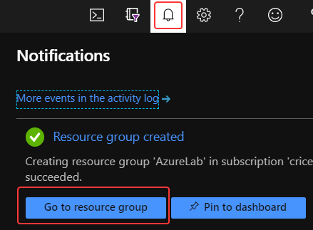
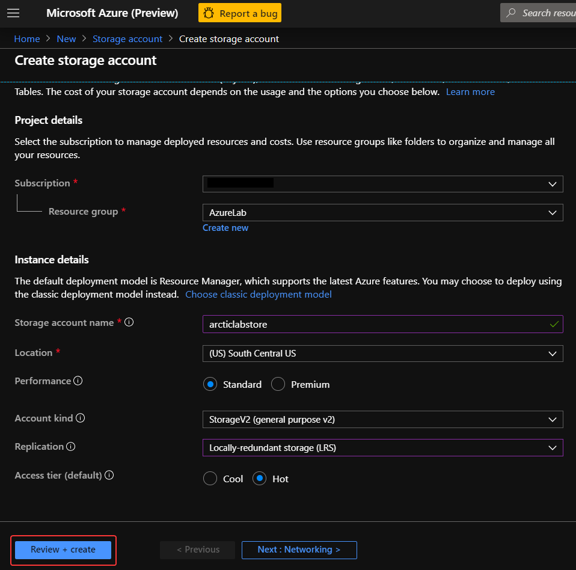
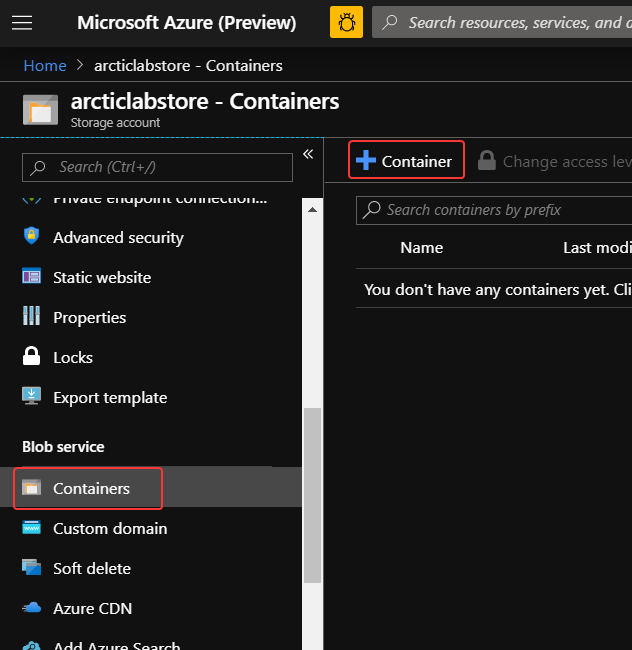

# Create storage account to hold photos

We're going to be using several Azure services together to create our Polar Bear scanner. In this unit, we'll identify and create all of the necessary resources to manage the photographs.

- A resource group to hold all the necessary Azure resources.
- A general-purpose Azure Storage account.
- A blob container to hold the photographs taken by the remote cameras.

## 1. Create a Resource Group

Azure Resources Groups are logical collections of Azure resources (e.g virtual machines, storage accounts, virtual networks, web apps, databases.) Typically, users will group related resources for an application, divided into groups for production and non-production — but you can subdivide further as needed. Resource groups are also an efficient way of managing related resource lifecycles. 

1. In the [Azure Portal](https://portal.azure.com), click the **+Create a resource** link at the top left of the page.
1. In the Search field, type *Resource* and click on **Resource Group** that appears in the drop down list.

1. Click the **Create** button.
1. Select the appropriate **Subscription**, type in a *AzureLab* for **Resource group** and select the **Region** closest to you.
1. Click **Review + Create**, and then **Create** once validation has passed.

1. Check the **Notifications** icon in the upper right and wait unitl you see **Resource group created**, then click the **Go to resource** button.  

## 2. Create a Storage Account

A general-purpose v2 storage account provides access to all of the Azure Storage services: blobs, files, queues, and tables. The quickstart creates a general-purpose v2 storage account but, the steps to create any type of storage account are similar.

Storage account names must be unique, so make sure to replace "*useduazurelabstorage*" with a unique name.

1. In the [Azure Portal](https://portal.azure.com), click the **+Create a resource** link at the top left of the page.
1. In the Search field, type *Storage* and click on **Storage Account** that appears in the drop down list and click **Create.**

1. In **Create storage account**, enter or select this information:
    - `Project details - Subscription`	Select your subscription.
    - `Project details - Resource Group`	Select *AzureLab*.
    
    - `Instance details - Storage account name`	Enter a *globally unique* name.
    - `Instance details - Location`	Select *South Central US*.
    - `Instance details - Replication`	Select *Locally-redundant Storage (LRS)*  

1. Click **Review + Create** and once validation has passed, click **Create**
1. Check the **Notifications** icon in the upper right and wait unitl you see **Resource group created**, then click the **Go to resource** button.
1. From the Storage Account menu, click on **Access Keys** and copy the value of **key2's Key**. Paste the contents of your clipboard into a text editor for future use.

    

1. Finally, also copy and paste the name of your storage account (e.g. *useduazurelabstorage*) into your text editor.

## 3. Create a Blob container
Before you can upload images to a storage account, you must create a blob container to store them in.
1. Once the deployment of your storage account is complete, click the **Go to resource** button.

1. From Storage Account overview, click on **Containers** in the left-hand blade, then click on the **+ Container** link. 

1. Enter in **photos** for the container name and set *Public access level* to **Blob (anonymous read access for blobs only)**. Then, click **OK**

### Next unit: [Create an IoT hub to connect cameras](create-an-iot-hub.md)