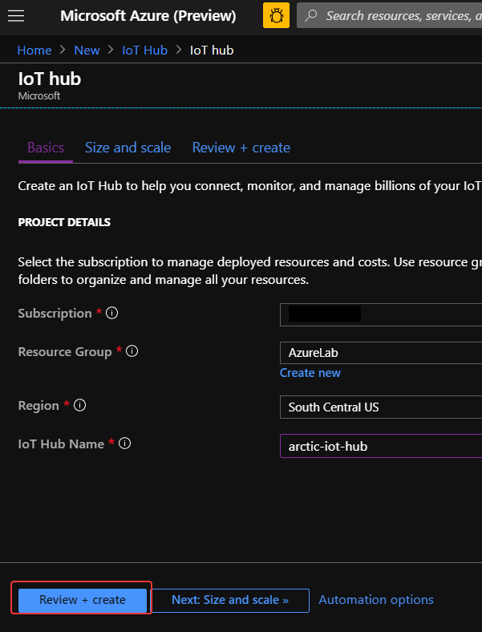
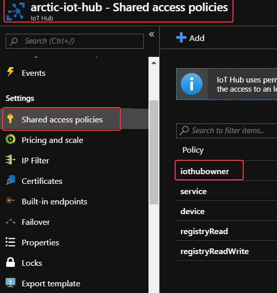
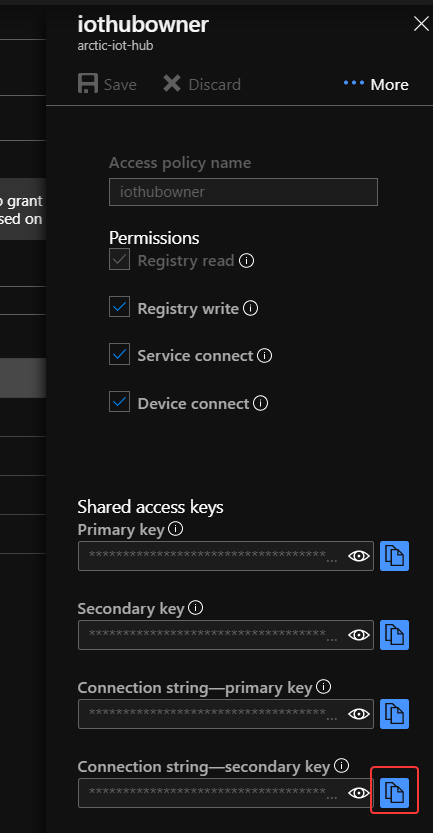

# Create an IoT hub to connect cameras

Recall that our goal is to collect images from remote cameras and analyze those images in real time to look for polar bears. Azure IoT hub is a great way to connect and communicate with remote devices - we can then feed the results right into Azure Stream Analytics for processing and analysis.  

Data is securely transmitted to IoT hubs through either field gateways for devices that aren't IP-capable, or cloud gateways for devices that are IP-capable. A single Azure IoT hub can handle millions of events per second from devices spread throughout the world.  

In this unit, you'll create an Azure IoT Hub to receive input from a simulated camera array.  

## 1. Create an Azure IoT Hub

1. In the [Azure Portal](https://portal.azure.com), click the **+Create a resource** link at the top left of the page.

1. In the Search field, type *IoT* and click on IoT Hub that appears in the drop down list. Then, click the **Create** button.
    
    

1. Fill out the IoT Hub creation form and click **Review + Create** followed by **Create** to deploy the IoT Hub in your subscription. 

    | Field | Suggested value   |
    |------|------|
    |**Subscription**  | The subscription associated with your account.|
    |**Resource group**  | The resource group you're using for this lab.|
    |**Region**  | Use the location nearest you.|
    |**IoT Hub Name**  | A **Globally Unique** name for your IoT Hub.|  

    

1. Once the IoT Hub is deployed, click on the **Go to Resource**, next click on the **Shared access policies** from the IoT Hub blade and click on **iothubowner**.  

    

1. From the **iothubowner** permissions pane, click the blue **Copy** icon next to *Connection string-secondary key*

      

1. Paste the contents of your clipboard into a text editor for future use.

1. Finally, copy and paste the name of your IoT Hub (e.g. *azureedu-iothub*) into a text editor as well.

### Next unit: [Register simulated devices with the IoT hub](register-simulated-devices.md)