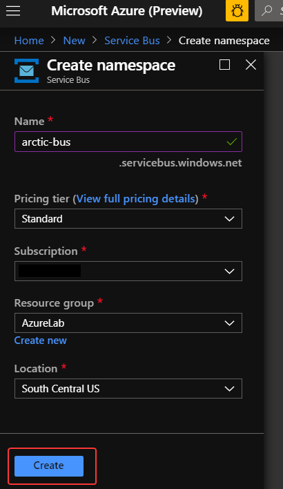
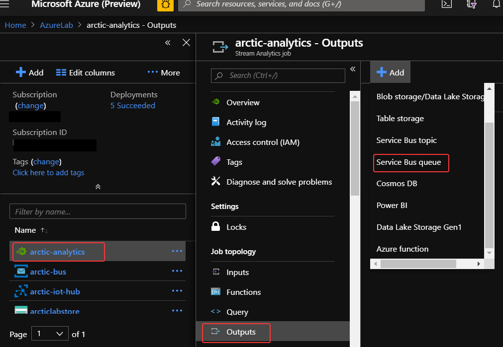
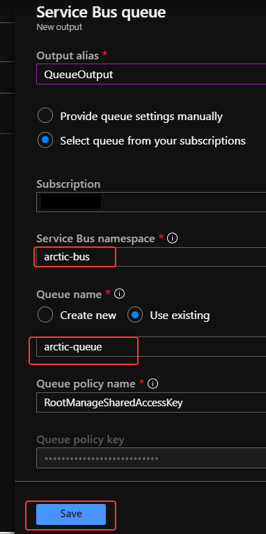

# Create and Connect to an Azure Service Bus Queue
Microsoft Azure Service Bus is a fully managed enterprise integration message broker. Service Bus is most commonly used to decouple applications and services from each other, and is a reliable and secure platform for *asynchronous data and state transfer.* Data is transferred between different applications and services using messages.

Messages are sent to and received from **queues**. Queues enable you to store messages until the receiving application is available to receive and process them.


We will use an Azure Service Bus Queue as an Output for our Stream Analytics IoT Stream so that we may asynchronously process each message.

## Create an Azure Service Bus Namespace
1. From the Azure Portal, click **+ Create a resource** in the left-hand sidebar of the Azure portal and search for *Service Bus*, then select Service Bus from the list of results. Next, click the **Create** button.

1. Fill out the Create namespace form with the suggested values, then click the **Create** button.

    | Field | Suggested Value  |
    |------|------|
    |Name |A **Globally Unique** name.|
    |Pricing Tier |Standard|
    |Subscription |Your Azure subscription.|
    |Resource Group |The resource group you're using for this lab.|
    |Location |Use the location nearest you.|

    

## Create a Queue

1. From your Azure Service Bus Namespace, click on **Queues**, then click on the **+ Queue** link.

    

1. Set the Name to ```arctic-queue``` and leave all other fields as their default values. Then, click the **Create** button.
    
    

## Set Stream Analytics Output
1. Return to the Stream Analytics job in the portal by returning to your resource group and select **Outputs** in the menu on the left side. Next, click **+ Add** and select *Service Bus queue*.

    

1. Set the Output alias as **QueueOutput**. Select the Service Bus and Queue you created earlier and accept the defaults elsewhere. Then click **Save**.

    


    Just as a Stream Analytics job will accept multiple inputs, it supports multiple outputs, too. In addition to passing the output to an Azure Service Bus Queue, you could easily add outputs to log the output from the job in an Azure SQL database, an Azure Function app an Azure Cosmos DB database, blob storage, and other locations.

1. Wait for the output to appear in the list of outputs, indicating that it has been successfully added to the Stream Analytics job.

1. Select **Query** from the left-hand menu and modify the query you wrote in the previous exercise to include an INTO clause (line 2 below) that directs query results to the output you just added. Then, click **Save query**.

    ```sql
    SELECT C1.deviceId, C1.latitude, C1.longitude, C1.url, C1.timestamp
    INTO QueueOutput
    FROM CameraInput C1 TIMESTAMP BY timestamp
    JOIN CameraInput C2 TIMESTAMP BY timestamp
        ON C1.deviceId = C2.deviceId
            AND DATEDIFF(ss, C1, C2) BETWEEN 0 AND 10
            AND C1.timestamp != C2.timestamp
    ```
    

1. Select **Overview** in the menu on the left and click **Start** to start the Stream Analytics job running.

    

1. Make sure **Job output start time** is set to **Now**, and then click **Start** to start the run.

The job will take a couple of minutes to start. You can move to the next unit and begin setting up the simulation to generate camera events.

### Next unit: [Simulate camera activity with Node.js](simulate-camera-activity.md)