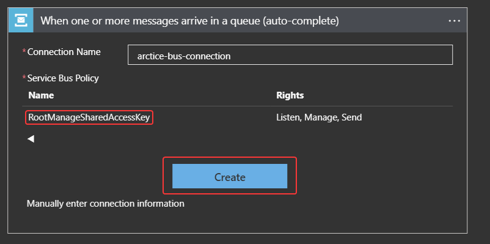
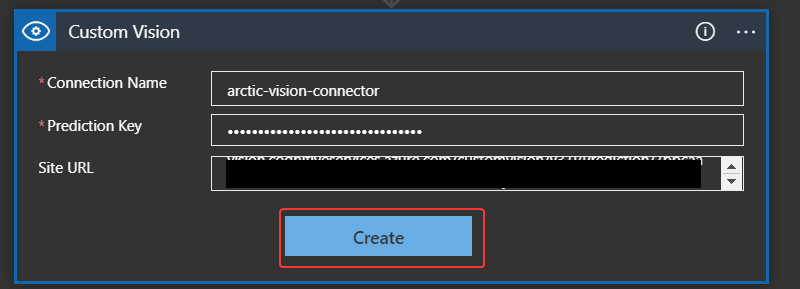
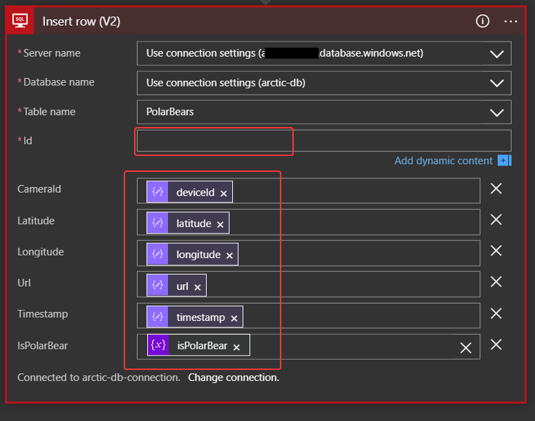
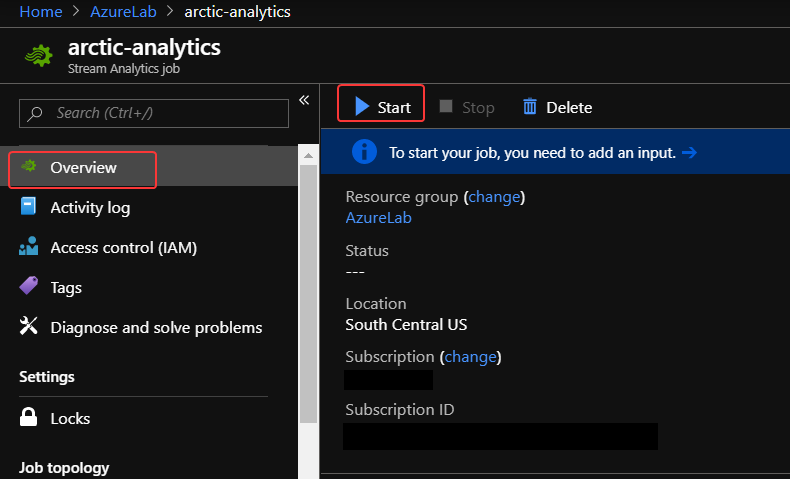
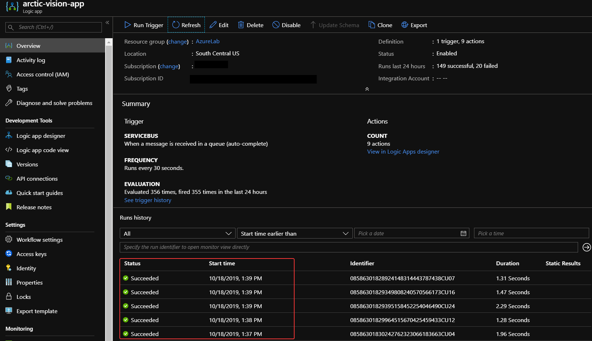

# Create a Logic App to run prediction model and write to SQL
Azure Logic Apps simplifies how you build automated scalable workflows that integrate apps and data across cloud services and on-premises systems. Learn how to create, design, and deploy logic apps that automate business processes with our quickstarts, tutorials, templates, and APIs. 

We'll use a Logic App to receive IoT data from the Service Bus Queue, analyize it with the Custom Vision API, and finally write the data into the Azure SQL Database table.

1. In the Azure portal, click the **New** button found on the upper left-hand corner of the Azure portal.

1. Click **Web** > **Logic App**, then click **Create**.
 
1. In the Logic App create from, use the suggested values, then click **Create**.

    | Field | Suggested Value  |
    |------|------|
    |Name |```arctic-vision-app```|
    |Subscription |Your Azure subscription.|
    |Resource Group |**Use Existing** and the resource group you're using for this lab.|
    |Location |Use the location nearest you.|

    

1. After the app is created, click your new logic app pinned to the dashboard. Then in the Logic Apps Designer, scroll down and click the **Blank Logic App** template. 

    

    You can now use the Logic Apps Designer to add services and triggers to your app.

## Connect to the Azure Service Bus Queue

1. From the *Logic App Designer*, search for *Azure Service Bus* and then choose **When a message is received in a queue (auto-complete)**.

    

1. Give your connection a memorable name, this will be an API connection that you may use at any point in the future for other projects. Then, select the *Service Bus Namespace* you created earlier for this project. 

    

1. Next, select the *RootManageSharedAccessKey* policy and click **Create**.

    

1. Select your queue name from the drop down and change the *Interval* to 30 and the *Frequency* to Second. Then, click **+ New Step**.

    

1. From *Choose an action*, type in *Variable* in the search field and select **Initialize variable**.

    

1. Set the values for the action to the suggested values.

    | Setting      |  Suggested value   | Description                                        |
    | ----------------- | ------------ | ------------- |
    | **Name** | message-content | The variable name to reference later. |
    | **Type** | String | The variable type. |

1. Click in the *Value* field and choose **Content** from the dynamic content pop-up.

   

1. Click **New Step**, search for *Parse JSON* and select the **Parse JSON** action.

   

1. Click in the *Content* text-field, and choose **message-content** from the dynamic content pop-up.

   

1. Copy the following code and paste it into the *Schema* text area, then click **New step**.

    ```json
    {
        "properties": {
            "deviceId": {
                "type": "string"
            },
            "latitude": {
                "type": "number"
            },
            "longitude": {
                "type": "number"
            },
            "timestamp": {
                "type": "string"
            },
            "url": {
                "type": "string"
            }
        },
        "type": "object"
    }
    ```
1. From *Choose an action*, type in *Custom Vision* in the search field and select **Classify an image url (preview)**.

   

1. Set the values for the action to the suggested values, then click **Create**.

    | Setting      |  Suggested value   | Description                                        |
    | ----------------- | ------------ | ------------- |
    | **Name** | ```arctic-vision-connector``` | The name of your API connection. |
    | **Prediction Key** | ```prediction_key_value``` | The value of your custom vision prediction key |
    | **Site URL** | ```site_url``` | The value of your custom vision prediction URL |

   

1. Set the values for the action to the suggested values. 

    | Setting      |  Suggested value   | Description                                        |
    | ----------------- | ------------ | ------------- |
    | **Project ID** | ```project_id``` | The Project ID value that was pasted into a text editor |
    | **Published Name** | ```published_name``` | The Published Name of the model iteration we will be using. |


1. Click inside the *Image URL* field and select the **url** value from *parse JSON* in the dynamic content menu, then click **+ New step**

   

1. In *Choose an action*, search for Variable and select **Initialize Variable**. 

   

1. Set the values to the suggested values below, then click **+ New step**.

    | Setting      |  Suggested value   | Description                                        |
    | ----------------- | ------------ | ------------- |
    | **Name** | isPolarBear | The variable name to reference later. |
    | **Type** | Boolean | The variable type. |
    | **Value** | false | Default to not a polar bear. |

    

1. In *Choose an action*, search for *for each* and select **For each**. 

   

1. Click the *Select an output from previous steps* field within the *For each* action, and choose **Predictions** from the Dynamic Content menu.

  

1. Within the *For each* action, click **Add an action**.

  

1. Choose *Parse JSON* as the action, select **Current Item** from the Dynamic Content Menu for the *Content* and paste the following in the *Schema* box. Then click **Add Action**

    ```json
        {
            "properties": {
                "probability": {
                    "type": "number"
                },
                "tagId": {
                    "type": "string"
                },
                "tagName": {
                    "type": "string"
                }
            },
            "type": "object"
        }
    ```

    

1. In *Choose an action*, search for *condition* and select **Condition**. 

    

1. Under *Condition* click on *Choose a value*, click on **Expression** from the Dynamic Content menu and type *toLower()*.

    

1. Click on **Dynamic Content**, then click within the parenthesis of the toLower() expression and select **tagName**. Next, click **OK**.

    

1. Set the condition to **is equal to** and the condition value to *polar bear*. Next, click **+ Add** and **Add Row** to add another condition. 

    

1. Under *Condition* click on *Choose a value*, click on **Expression** and type in ```float()``. Then click within the parenthesis of the float() expression and select **probability**. Next, click **OK**.

    

1. Set the condition to **is greater than or equal to** and the condition value to ```0.8```.

    

1. Under *If True*, click **Add an action** and select *Set Variable*. Under *Name*, choose **isPolarBear** and set the *Value* to **true**. Then, click **+ New Step** *outside of the condition and for each loop.*

    

1. Search for **SQL** in the *Choose an action* box. Select **SQL Server**, and then select **Insert row (V2)**

    

1. Set a memorable connection name for your SQL Server, choose the SQL server and database you created previously, enter the appropriate username and password and finally click **Create**.

    

1. Select the **Use Connectiong String** option for both *Server Name* and *Database Name*, and set the *Table* value to equal **PolarBears.**. 

1. Click **Add new parameter** to add the ```ID```, ```CameraId```, ```Latitude```, ```Longitude```, ```Url```, ```Timestamp```, and ```IsPolarBear``` fields. Add the corresponding value from the *Parse JSON* dynamic content into their respective fields and click the **\*Id** field.

    

1. From the Dynamic Content menu, click on **Expression** and then type in ```guid()```, next click **OK** followed by **Save**.

    

## Start Stream Analytics Job

1. Return to your Stream Analytics job and click **Start** to start the Stream Analytics job running.

    

1. Make sure **Job output start time** is set to **Now**, and then click **Start** to start the run.

The job will take a couple of minutes to start.


## Simulate IoT device activity
If the Azure Cloud Shell timed out while you were working in the portal, go ahead and reconnect it. 

1. In the Cloud Shell on the right, make sure you are in the project folder photoproc. Recall you can use the cd command in the shell to switch to the proper folder.
    ```bash
    cd photoproc/
    ```

1. Run the simulation/

    ```bash
    node run.js
    ```
1. Confirm that you see output similar to the following, indicating that all 10 "cameras" are connected to the IoT hub:

    ```output
    polar_cam_0003 connected
    polar_cam_0005 connected
    polar_cam_0001 connected
    polar_cam_0009 connected
    polar_cam_0004 connected
    polar_cam_0006 connected
    polar_cam_0008 connected
    polar_cam_0007 connected
    polar_cam_0002 connected
    polar_cam_0010 connected
    ```

    The order in which the cameras connect to the IoT hub will probably differ from what's shown here, and will also vary from one run to the next.

1. After a few seconds, additional output should appear. Each line corresponds to an event transmitted from a camera to the IoT hub. The output will look something like:

    ```output
    polar_cam_0008: https://streaminglabstorage.blob.core.windows.net/photos/image_24.jpg
    polar_cam_0004: https://streaminglabstorage.blob.core.windows.net/photos/image_10.jpg
    polar_cam_0005: https://streaminglabstorage.blob.core.windows.net/photos/image_26.jpg
    polar_cam_0007: https://streaminglabstorage.blob.core.windows.net/photos/image_27.jpg
    polar_cam_0001: https://streaminglabstorage.blob.core.windows.net/photos/image_15.jpg
    polar_cam_0007: https://streaminglabstorage.blob.core.windows.net/photos/image_20.jpg
    polar_cam_0003: https://streaminglabstorage.blob.core.windows.net/photos/image_18.jpg
    polar_cam_0005: https://streaminglabstorage.blob.core.windows.net/photos/image_21.jpg
    polar_cam_0001: https://streaminglabstorage.blob.core.windows.net/photos/image_20.jpg
    polar_cam_0009: https://streaminglabstorage.blob.core.windows.net/photos/image_26.jpg
    ```
1. Confirm that the cameras are running and generating events as shown above.

## Validate successful Logic App runs

After a few minutes, go back to the Logic App that was created and validate successful run history

1. From the Logic App *Overview* page, you can see the history of all runs. They should be 

    
    
## Validate successful SQL inserts

1. Go to the Query Editor of your SQL database and log in with the credentials you set. Then, click OK.

    

1. Copy the following query into the Query Editor pane and click **Run**. You should now see data in your database. 

    ```sql
        Select * from [dbo].[PolarBears]
    ```

    
    
### Next unit: [Visualize the camera activity with Power BI](visualize-with-power-bi.md)
