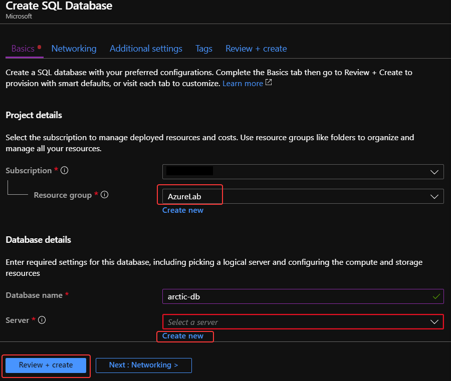
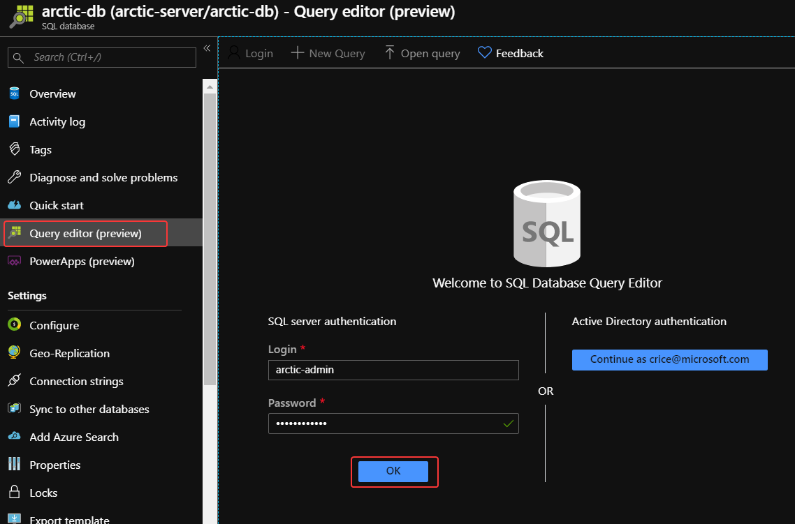

# Create an Azure SQL DB to hold results
In this unit, we will use the Azure portal to create a an Azure SQL Database. This database will collect historical output that can then be queried and visualized at a later date.

1. From the Azure Portal, click **+ Create a resource** in the left-hand sidebar of the Azure portal and search for *SQL*, then select **Azure SQL** from the list of results. Next, click the **Create** button.

    

1. From the *SQL Deployment Options* screen, ensure that *Resource Type* is set to **Single Database** for the *SQL databases* service and click the **Create** button. 

    

1. In the *Create SQL Database* form, select the **Resource Group** you have been working out of for this lab and enter *photodb* as the **Database Name**, then click **Create new** for *Server*.

    

1. In the *New Server* pane, enter a **globally unique** server name, a name for the local SQL admin account, a strong password, and the region closest to you. Then, click **OK**.

    


1. For *Compute + Storage* click **Configure database** and on the following screen click on **Looking for basic, standard, premium?**

    

1. Under the *Configure* pane, click on **Standard** and set *Data max size* to **1 GB**. Finally, click on **Apply**.

    

1. From *Create SQL Database*, click on **Review + Create**, then **Create** and await the deployment of your Azure SQL DB.

    


## Set up network access to the database
We need to access the database from our other Azure services and Power BI for reporting. We'll add those rules to the firewall using the Azure portal.

1. From the Azure Portal, locate the database server - you can type the name you used into the global search box at the top of the screen to easily find the resource.

1. Select **Firewalls and virtual networks** in the menu on the left.

1. Turn on **Allow access to Azure services** to allow other Azure services to connect to the server.

1. Select **+ Add client IP** so you can connect to the database from Power BI Desktop.

1. Click **Save** at the top of the view to save these changes.

    


## Create the database table
We need a table to hold our polar bear sightings. Let's create it with the Azure portal.

1. Select the database you created on the server. You can switch to the Overview pane and then select your database from there, or select SQL databases from the left sidebar and then select your database.

1. Select Query editor in the menu on the left and enter the user name and password you specified when you created the server.

1. Select OK to sign in to the database.

    

1. Paste the following statements into the query window and click **Run** to create a database table:

    ```sql
    CREATE TABLE [dbo].[PolarBears]
    (
        [Id] [uniqueidentifier] NOT NULL,
        [CameraId] [nvarchar](16) NULL,
        [Latitude] [real] NULL,
        [Longitude] [real] NULL,
        [Url] [varchar](max) NULL,
        [Timestamp] [datetime] NULL,
        [IsPolarBear] [bit] NULL,
        PRIMARY KEY CLUSTERED ([Id] ASC)
        WITH (STATISTICS_NORECOMPUTE = OFF, IGNORE_DUP_KEY = OFF) ON [PRIMARY]
    )
    ON [PRIMARY] TEXTIMAGE_ON [PRIMARY]
    GO

    ALTER TABLE [dbo].[PolarBears] ADD DEFAULT (newid()) FOR [Id]
    GO

    ALTER TABLE [dbo].[PolarBears] ADD DEFAULT (getdate()) FOR [Timestamp]
    GO

    ALTER TABLE [dbo].[PolarBears] ADD DEFAULT ((0)) FOR [IsPolarBear]
    GO
    ```
1. Expand the list of tables in the tree view on the left and confirm that the PolarBears table was created, and that it has the following schema:

    

The main column we need is named ```IsPolarBear``` which will be set to 1 or 0 to indicate that the corresponding images contain a polar bear.

### Next unit: [Create a Logic App to run prediction model and write to SQL](create-logic-app.md)