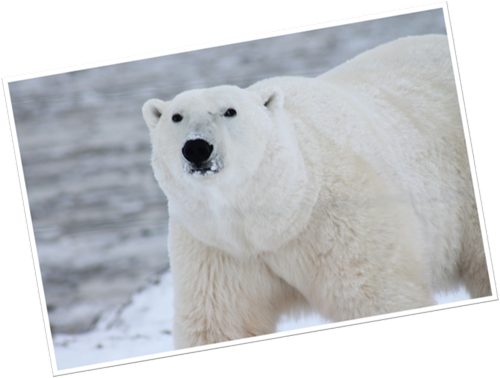

# Analyze streaming data with a machine learning model and visualize the output.

### Prerequisites
- An Azure subscription
- Basic knowledge of Azure services, the Azure portal, and the Azure CLI tools ([Link to Azure Fundamentals Workshop](https://aka.ms/edu/Azure101))
- Power BI Desktop ([Download Here](https://powerbi.microsoft.com/desktop/))

### In this module, you will:

- Create an Azure Storage account and an IoT hub and use a Node.js app to connect them to a simulated camera
- Use Azure Stream Analytics to run queries on live streams to analyze input and an Azure Function to return output
- Use Microsoft Cognitive Services to train an image classification model and call the model from an app or service
- Connect Power BI to an Azure SQL database and visualize data from the database

# Introduction

Imagine you are the leader of a group of climate scientists who are concerned about the polar-bear population in the Arctic. As such, your team has placed hundreds of motion-activated cameras at strategic locations throughout the region.  

Rather than manually examine each photograph to determine if it contains a polar bear, you have been challenged to devise an automated system that processes data from these cameras in real time and displays an alert on a map when a polar bear is photographed. You need a solution that incorporates real-time stream processing to analyze raw data for potential sightings, and one that incorporates artificial intelligence (AI) and machine learning to determine with a high degree of accuracy whether a photo contains a polar bear. And you need it fast, because climate change won't wait.  

Azure provides all the services and features you need to build a solution for this problem including storage capabilities for photographs, live stream analytics, zero-code development with Azure Logic Apps, image classifications with Microsoft Cognitive services, and data visualization with Power BI.

## Syllabus

- [Design Architecture](design-architecture.md)
- [Create storage account to hold photos](create-a-storage-account.md)
- [Create an IoT hub to connect cameras](create-an-iot-hub.md)
- [Test IoT hub connectivity](test-iot-hub-connectivity.md)
- [Connect a Stream Analytics job to IoT hub](connect-stream-analytics.md)
- [Create and Connect to an Azure Service Bus Queue](create-azure-service-bus.md)
- [Simulate camera activity with Node.js](simulate-camera-activity.md)
- [Train and Test the Image Classifier](train-and-test-image-classifier.md)
- [Create an Azure SQL DB to hold results](create-sql-db.md)
- [Create a Logic App to run prediction model and write to SQL](create-logic-app.md)
- [Visualize the camera activity with Power BI](visualize-with-power-bi.md)