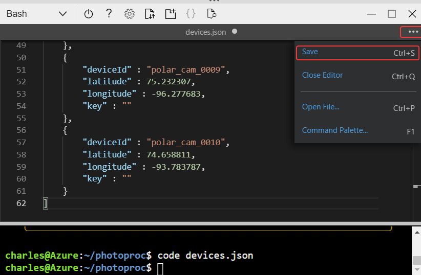
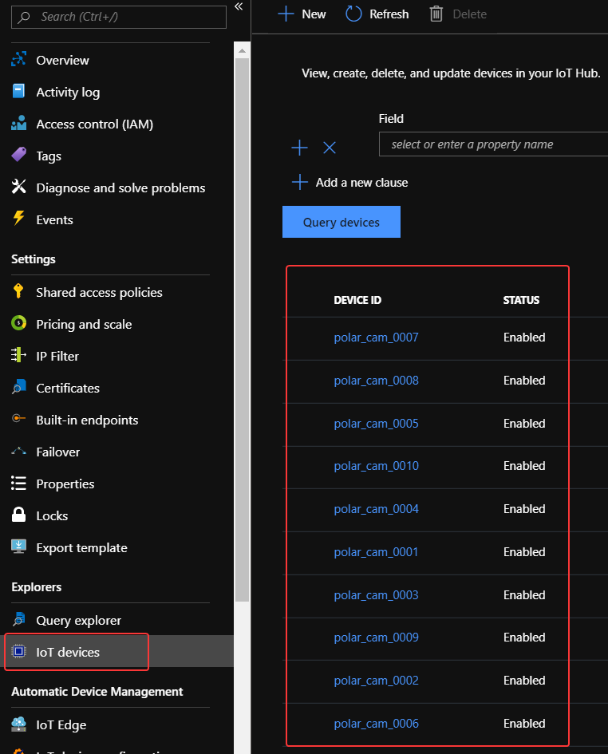

# Register sample devices with the IoT hub

Devices that transmit events to an Azure IoT hub must be registered with that IoT hub. Once registered, a device can send events to the IoT hub using one of several protocols, including HTTPS, [AMQP](http://docs.oasis-open.org/amqp/core/v1.0/os/amqp-core-complete-v1.0-os.pdf), and [MQTT](http://docs.oasis-open.org/mqtt/mqtt/v3.1.1/mqtt-v3.1.1.pdf).

We'll create a Node.js app that registers an array of simulated cameras with the IoT hub you've created. The Azure Cloud Shell you're working in has Node.js installed.


## Start Cloud Shell
1. Launch Cloud Shell from the top navigation of the Azure portal.  
    
1. Select a subscription to create a storage account and Microsoft Azure Files share.  
1. Select **Create storage**  
1. Check that the environment drop-down from the left-hand side of shell window says **Bash**.  
    
## Install Node.js Packages
1. Create a directory in the Cloud Shell to serve as the project directory. Then cd to that directory in a Command Prompt or terminal window.
    ```bash
    mkdir photoproc
    cd photoproc
    ```
1. Execute the following commands in sequence to initialize the project directory to host a Node project and install a trio of packages that Node can use to communicate with Azure IoT hubs:
    ```bash
    npm init -y
    npm install azure-iothub --save
    npm install azure-iot-device azure-iot-device-mqtt --save
    ```
    The **azure-iothub** package provides APIs for registering devices with IoT hubs and managing device identities. The **azure-iot-device** and **azure-iot-device-mqtt** enable devices to connect to IoT hubs and transmit events using the MQTT protocol respectively.

## Define the data for the simulated cameras
Next, let's define a set of simulated camera devices with coordinates. We'll use the IoT SDK with a Node.js app to do the work, but we need to define some data first.  
1. Create a file named **devices.json** in the project directory using the Cloud Shell editor.
    ```bash
    code devices.json
    ``` 
1.  Paste the following JSON into the file.
    ```json
    [
        {
            "deviceId" : "polar_cam_0001",
            "latitude" : 75.401451,
            "longitude" : -95.722518,
            "key" : ""
        },
        {
            "deviceId" : "polar_cam_0002",
            "latitude" : 75.027715,
            "longitude" : -96.041859,
            "key" : ""
        },
        {
            "deviceId" : "polar_cam_0003",
            "latitude" : 74.996653,
            "longitude" : -96.601780,
            "key" : ""
        },
        {
            "deviceId" : "polar_cam_0004",
            "latitude" : 75.247701,
            "longitude" : -96.074436,
            "key" : ""
        },
        {
            "deviceId" : "polar_cam_0005",
            "latitude" : 75.044926,
            "longitude" : -93.651951,
            "key" : ""
        },
        {
            "deviceId" : "polar_cam_0006",
            "latitude" : 75.601571,
            "longitude" : -95.294407,
            "key" : ""
        },
        {
            "deviceId" : "polar_cam_0007",
            "latitude" : 74.763102,
            "longitude" : -95.091160,
            "key" : ""
        },
        {
            "deviceId" : "polar_cam_0008",
            "latitude" : 75.473988,
            "longitude" : -94.069432,
            "key" : ""
        },
        {
            "deviceId" : "polar_cam_0009",
            "latitude" : 75.232307,
            "longitude" : -96.277683,
            "key" : ""
        },
        {
            "deviceId" : "polar_cam_0010",
            "latitude" : 74.658811,
            "longitude" : -93.783787,
            "key" : ""
        }
    ]
    ``` 

    This file defines ten virtual cameras that will transmit events to the IoT hub. Each "camera" contains a device ID, a latitude, and a longitude specifying the camera's location, and an access key for per-device authentication. The **key** values are empty for now, but that will change once the cameras are registered with the IoT hub.  

1. Save the file using the "..." context menu in the top-right corner of the editor.
    
1. Close the editor with the same context menu. You can verify the contents of the file with the following command in the Cloud Shell:
    ```bash
    cat devices.json
    ``` 

## Create a set of simulated camera devices
As a final step, let's register all these cameras as devices with our IoT hub. We'll create a Node.js app that reads the camera data from the devices.json file and uses the IoT SDK to register them with IoT hub.
1. Add a file named **deploy.js** to the project directory and open it in the online code editor.
    ```bash
    code deploy.js
    ```
1. Paste the following JavaScript code into the file.
    ```javascript
    var fs = require('fs');
    var iothub = require('azure-iothub');
    var registry = iothub.Registry.fromConnectionString('<CONNECTION_STRING>');

    console.log('Reading devices.json...');
    var devices = JSON.parse(fs.readFileSync('devices.json', 'utf8'));

    console.log('Registering devices...');
    registry.addDevices(devices, (err, info, res) => {
        registry.list((err, info, res) => {
            info.forEach(device => {
                devices.find(o => o.deviceId === device.deviceId).key = device.authentication.symmetricKey.primaryKey;
            });

            console.log('Writing cameras.json...');
            fs.writeFileSync('cameras.json', JSON.stringify(devices, null, 4), 'utf8');
            console.log('Done');
        });
    });
    ```
    This code registers all the simulated devices defined in devices.json with the IoT hub that you created earlier. It also retrieves from the IoT hub the access key created for each device and creates a new file named cameras.json that contains the same information as devices.json, but with a value assigned to each device's key property. It's this key, which is transmitted in each request, that enables a device to authenticate to the IoT hub.  

1. Replace the **<CONNECTION_STRING>** value above with the value of the connection string that was copied earlier from your IoT Hub. Next, save and close the editor. 
1. Execute the command to run **deploy.js**: 
    ```bash
    node deploy.js
    ```
1. Confirm that the output looks like this:
    ```bash
    Reading devices.json...
    Registering devices...
    Writing cameras.json...
    Done
    ```

## Verify the registered devices
Next, let's verify that the IoT hub knows about the cameras. 

1. From the Azure Portal, click on **Resource Groups**, then click on the resource group for this lab. Finally, click on your IoT hub.
    
1. From your IoT Hub, click on **IoT Devices** in the left-hand blade. You should see a listing of all 10 Polar cameras:  
    
1. From the Cloud Shell, verify that a file named cameras.json was created in the project directory.
    ```bash
    ls cameras.json
    ```
1. Display the contents of the file with the cat tool.
    ```bash
    cat cameras.json
    ```
1. Confirm that the **key** properties, which are empty strings in **devices.json**, have values in **cameras.json**.

Now that we have the cameras all registered and our IoT Hub is connected to Azure Storage, let's do a quick test by uploading an image - this will simulate a remote camera being triggered by some motion and snapping a photograph.

### Next unit: [Test IoT hub connectivity](test-iot-hub-connectivity.md)
