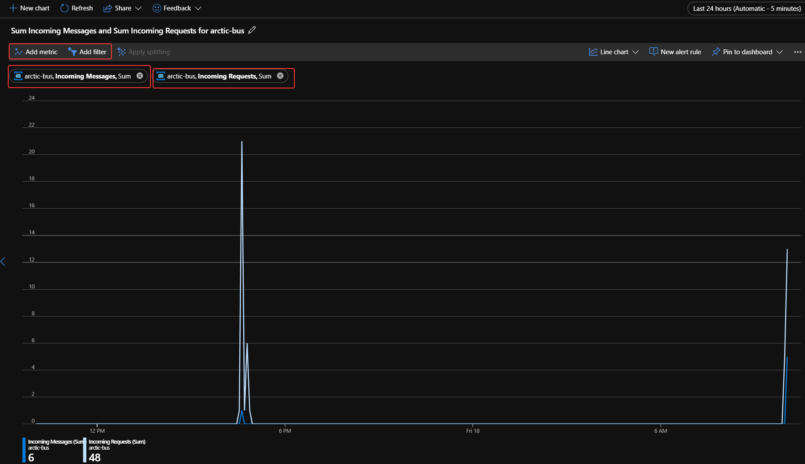

# Simulate camera activity with Node.js
We're ready to start generating events that will push images up to Blob Storage from one of our simulated cameras. This upload will trigger our IoT hub, which will in turn, notify the Azure function you created.

We'll use an existing Node.js app included with the assets you cloned earlier to simulate the cameras. The app will read the **cameras.json** created earlier and periodically upload a photo to Blob storage to simulate a camera catching movement.

If the Azure Cloud Shell timed out while you were working in the portal, go ahead and reconnect it. 

1. In the Cloud Shell on the right, make sure you are in the project folder photoproc. Recall you can use the cd command in the shell to switch to the proper folder.
    ```bash
    cd photoproc/
    ```

1. Copy the **run.js** app into the project folder from assets.

    ```bash
    cp assets/src/run.js .
    ```

## Modify the simulation code

1. Open the simulation code with the Cloud Shell editor.
    ```bash
    code run.js
    ```
1. Replace the following values, then save and close the editor.

   | Line | Value  | Replacement Value   |
    |------|------|------|------|
    |5 |```jprocess.env.HUB_NAME```|Your IoT Hub Name (with single quotes)|
    |6 |```process.env.ACCOUNT_NAME```|Your Storage Account Name (with single quotes)| 
    |9 |```'ACCOUNT_KEY'```|Your Storage Account Key (with single quotes)|

    **Example:**
    

1. Run the simulation/

    ```bash
    node run.js
    ```
1. Confirm that you see output similar to the following, indicating that all 10 "cameras" are connected to the IoT hub:

    ```output
    polar_cam_0003 connected
    polar_cam_0005 connected
    polar_cam_0001 connected
    polar_cam_0009 connected
    polar_cam_0004 connected
    polar_cam_0006 connected
    polar_cam_0008 connected
    polar_cam_0007 connected
    polar_cam_0002 connected
    polar_cam_0010 connected
    ```

    The order in which the cameras connect to the IoT hub will probably differ from what's shown here, and will also vary from one run to the next.

1. After a few seconds, additional output should appear. Each line corresponds to an event transmitted from a camera to the IoT hub. The output will look something like:

    ```output
    polar_cam_0008: https://streaminglabstorage.blob.core.windows.net/photos/image_24.jpg
    polar_cam_0004: https://streaminglabstorage.blob.core.windows.net/photos/image_10.jpg
    polar_cam_0005: https://streaminglabstorage.blob.core.windows.net/photos/image_26.jpg
    polar_cam_0007: https://streaminglabstorage.blob.core.windows.net/photos/image_27.jpg
    polar_cam_0001: https://streaminglabstorage.blob.core.windows.net/photos/image_15.jpg
    polar_cam_0007: https://streaminglabstorage.blob.core.windows.net/photos/image_20.jpg
    polar_cam_0003: https://streaminglabstorage.blob.core.windows.net/photos/image_18.jpg
    polar_cam_0005: https://streaminglabstorage.blob.core.windows.net/photos/image_21.jpg
    polar_cam_0001: https://streaminglabstorage.blob.core.windows.net/photos/image_20.jpg
    polar_cam_0009: https://streaminglabstorage.blob.core.windows.net/photos/image_26.jpg
    ```
1. Confirm that the cameras are running and generating events as shown above.

## Watch Azure Service Bus Metrics

The Streaming Analytics job is sending events to the Azure Service Bus Queue. We can monitor these in the Azure portal.

1. From the Azure Portal, go to the Azure Service Bus namespace you created earlier and notice the new activity displayed under **Overview**. 

    

1. You can also create your own custom queries by selecting **Metrics** from the Service Bus namespace menu.

    

1. Return to the Stream Analytics job in the portal and click **Stop** to stop it. Then click **Yes** when asked to confirm that you want to stop the job.

    

1. Return to the Command Prompt or terminal window where run.js is executing and press ```Ctrl+C``` (```Cmd+C``` on a Mac) to stop the flow of events from the simulated cameras.

    

### Next unit: [Train and Test the Image Classifier](train-and-test-image-classifier.md)