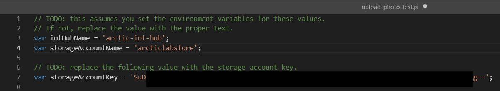

# Test IoT hub connectivity
The next step is to test the IoT hub connectivity by uploading a photo to the blob container.

We'll use a sample image for this test. The images that the simulated cameras will upload to blob storage show wildlife including Arctic foxes, polar bears, and walruses. Here are a few of the example images:  


1. From the Cloud Shell, clone a GitHub repo with the images and starter code to the **assets** folder. Execute the following statement in the Cloud Shell in your project folder.
    ```bash
    git clone https://github.com/MicrosoftDocs/mslearn-build-ml-model-with-azure-stream-analytics.git assets
    ```
1. Next, copy the **upload-photo-test.js** source file from the cloned repo into your project folder.
    ```bash
    cp assets/src/upload-photo-test.js .
    ```

    This Node.js program uploads a file named **image_19.jpg** from the "assets/photos" folder to the storage account's "photos" container.

    Then it opens a connection from polar_cam_0003 to the IoT hub using polar_cam_0003's access key (which comes from **cameras.json**) and transmits a message containing a JSON payload over MQTT.

    That message includes a camera ID, a latitude and longitude, the URL of the blob that was uploaded, and the event time.

1. Execute the following command to install the [Microsoft Azure Storage SDK for Node.js](https://www.npmjs.com/package/azure-storage) package:
    ```bash
    npm install azure-storage --save
    ```
    This package provides a programmatic interface to Azure storage, including blob storage.

1. Open the upload-photo-test.js file in the Cloud Shell editor.
    ```bash
    code upload-photo-test.js
    ```
1. Replace the following values, then save and close the editor.

    | Line | Value  | Replacement Value   |
    |------|------|------|------|
    |3 |```jprocess.env.HUB_NAME```|Your IoT Hub Name (with single quotes)|
    |4 |```process.env.ACCOUNT_NAME```|Your Storage Account Name (with single quotes)| 
    |7 |```'ACCOUNT_KEY'```|Your Storage Account Key (with single quotes)|
    
    **Example:**
    

1. Run the test with the following command:
    ```bash
    node upload-photo-test.js
    ```
1. Confirm that you see the following output indicating that the command completed successfully:
    ```bash
    Blob uploaded
    Event transmitted
    ```
## Verify the upload
1. In the lab's resource group, select the storage account you creatd to hold the photos.

    

1. In the view for the storage account, click on **Containers** to view a list of containers. 

    

1. Click photos to open the "**photos**" container, then verify that **image_19.jpg** exists in the container. 

### Next unit: [Connect a Stream Analytics job to IoT hub](connect-stream-analytics.md)