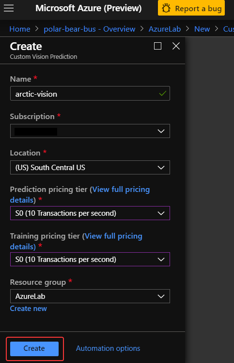

# Train and Test the Image Classifier
You can build, train, and test image-classification models using either the Custom Vision Service portal, or the Custom Vision Training REST API. Once a model is trained, apps can use the Custom Vision Prediction REST API to call the model and return results in JSON.

In this unit, you'll create a new Custom Vision Service project. Then you'll upload images of polar bears, arctic foxes, and walruses and tag the images so the Custom Vision Service can learn to differentiate between them.

## Create a Custom Vision resource in Azure
1. From the Azure Portal, click **+ Create a resource** in the left-hand sidebar of the Azure portal and search for *Custom Vision*, then select **Custom Vision** from the list of results. Next, click the **Create** button.

    

1. Fill out the Custom Vision creation form with the suggested values, then click **Create**.

    | Field | Suggested Value  |
    |------|------|
    |Name |```arctic-vision```|
    |Subscription |Your Azure subscription.|
    |Location |Use the location nearest you.|
    |Prediction pricing tier |S0 (10 Transactions per second)|
    |Training pricing tier |S0 (10 Transactions per second)|
    |Resource Group |The resource group you're using for this lab.|
    
     

1. When you Custom Vision resource has been deployed, visit the [**Custom Vision Service Portal**](https://www.customvision.ai/) and click **Sign In**. Sign in with the same credentails associated with your Azure Subscription. 

    

## Create a new Custom Vision project

1. Click **+ NEW PROJECT** to display the "Create new project" dialog. Enter a project name such as "Polar Bear Project", then select the name of the customer vision resource that was just created.

    

1. Next, select **Classification** as the project type, **Multiclass** as the classification type, and **General** as the domain. Then click **Create Project**.

    


## Add the training images

The vision service needs to be trained to recognize visual elements within images. This step is done by uploading multiple images that include the element you want to locate and tagging the images in the service.

We'll use a set of training images that show three arctic animals we expect to see on camera: foxes, walruses, and polar bears.

1. Download the [training images](assets/training-images.zip) and unzip the contents to a folder on your local computer.

1. Click **Add images** to add images to the project.

    

1. Browse to the folder containing the training images and select all of the files in the **training-arctic-fox** folder.

1. OK the selection and type "*Arctic fox*" as the tag for the images.

1. Select the **Upload 130 files** button. Wait for the upload to complete, and then click **Done.**

    

1. Click **Add images** at the top of the page and repeat the previous step to upload all of the images in the **training-polar-bear** folder to the Custom Vision Service and tag them with the term "*Polar bear*." Wait for the upload to complete, and then click **Done**.

1. Upload all of the images in the **training-walrus** folder to the Custom Vision Service and tag them with the term "*Walrus*." Wait for the upload to complete, and then click **Done**.

## Negative training

Not only should you train the model of what is a polar bear, arctic fox, or walrus, but you should also train the model for what in the photos is *not* one of these animals. Since all of our images are against a snowy backdrop, the model may learn to associate snow with each of the animals. This may result in false negatives for a polar bear walking on tundra in the summer months or a false positive for another type of bear walking against a snowy landscape. 

To teach the Custom Vision model that the snow in the images is not the animal, we will now upload images of snow as *Negatives*. 

1. Upload all of the images in the **training-snow** folder to the Custom Vision Service. This time, instead of a custom tag, select the **- Negative** value. Then, click **Upload**.

    

## Train the vision model
With the images tagged and uploaded, the next step is to train the model so it can distinguish between arctic foxes, polar bears, and walruses, and determine whether an image contains one of these animals.

Training can be accomplished with a simple button click in the portal, or by calling the **TrainProject** method in the Custom Vision Training REST API. Once trained, a model can be refined by uploading additional tagged images and retraining it. Let's use the portal approach since it's the easiest to start with. If you wanted to continue to refine the model over time, the REST API allows you to do it programmatically.

1. Click the **Train** button at the top of the page to train the model. Select **Fast Training**. Each time you train the model, a new iteration is created. The Custom Vision Service maintains several iterations, allowing you to compare your progress over time.

    

1. Wait for the training process to complete. (It should only take a few seconds.) Then review the training statistics presented to you for iteration 1.

    

### Determining model accuracy
The statistics provided in the results display three related values that can be used to determine the model's accuracy.

**Precision** and **Recall** are separate but related measures of the model's accuracy. Suppose the model was presented with three polar-bear images and three walrus images, and it correctly identified two of the polar-bear images properly, but incorrectly identified two of the walrus images as polar-bear images. In this case, the precision would be 50% (two of the four images it classified as polar-bear images actually are polar-bear images), while its recall would be 67% (it correctly identified two of the three polar-bear images as polar-bear images).

**AP**, short for Average Precision, is a third measurement of the model's accuracy. Where precision measures the false-positive rate and recall measures the false-negative rate, AP is a mean of false-positive rates computed across a range of thresholds.

## Test the vision model

Now let's test the model using the portal's Quick Test feature, which allows you to submit images to the model and see how it classifies them using the knowledge gained during training.

1. Download the [test images](assets/test-images.zip) and unzip the folder on your local computer.

1. Click the **Quick Test** button at the top of the page. Then click **Browse local files**, browse to the **test-polar-bear** folder, and select any one of the test images in that folder.

1. Examine the results of the test in the "*Quick Test*" dialog. What is the probability that the image contains a polar bear? What is the probability that it contains an Arctic fox or a walrus?

    

1. Repeat this test for arctic foxes and walruses. 

The "*Testing Images*" folder in the downloaded assets contains subdirectories with a total of 30 different images for testing. Perform additional quick tests using these images until you're satisfied that the model is reasonably adept at predicting whether an image contains a polar bear.

## Publish the vision model
1. Return to the project and click **Publish**. Enter a name for this iteration of the model and choose the appropriate prediction resource. Then click **Publish**. Next, click **Prediction URL**.

    

1. The dialog lists two URLs: one for uploading images through a URL, and another for uploading images as byte streams. Copy the first one (URL-based) to the clipboard, and paste it into your favorite text editor so you can retrieve it later.

1. Do the same for the Prediction-Key value underneath the URL. This value must be passed in each call to the prediction URL.

    

1. Click on the *Cog* icon on the top right of your screen, and copy and paste the *Project ID* into a text editor. 

  

1. Finally, click on *Performance* in the horizontal menu and copy and paste your *Published as:* iteration name into a text editor. 

  

You now have a machine-learning model that can determine whether an image contains a polar bear, and a ```URL``` and ```API key``` for invoking the model. The next step is to create a database for storing the results of those calls.

### Next unit: [Create an Azure SQL DB to hold results](create-sql-db.md)