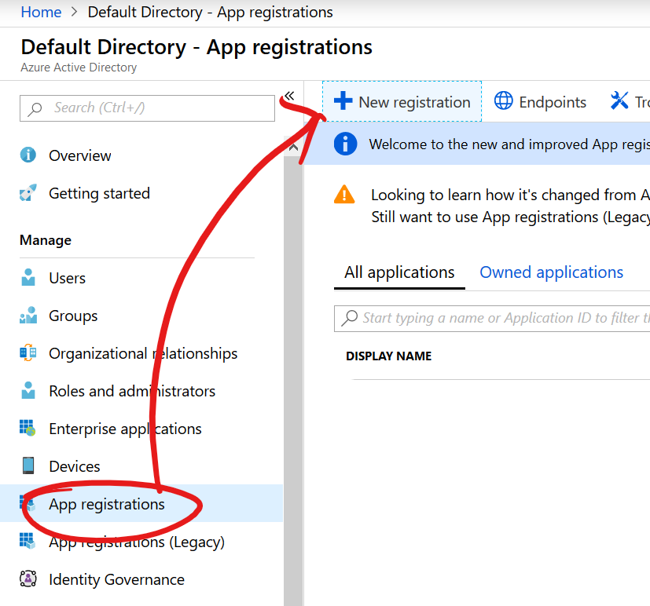
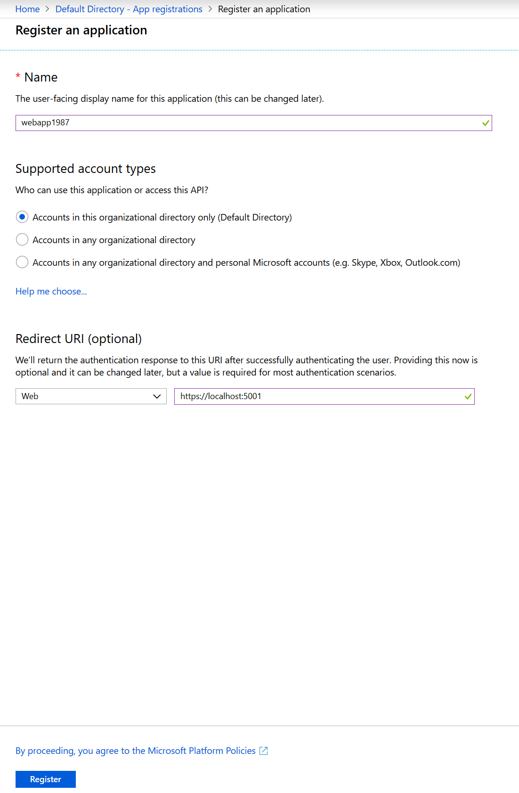
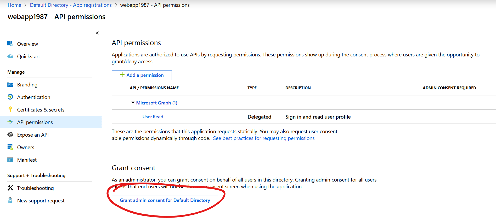
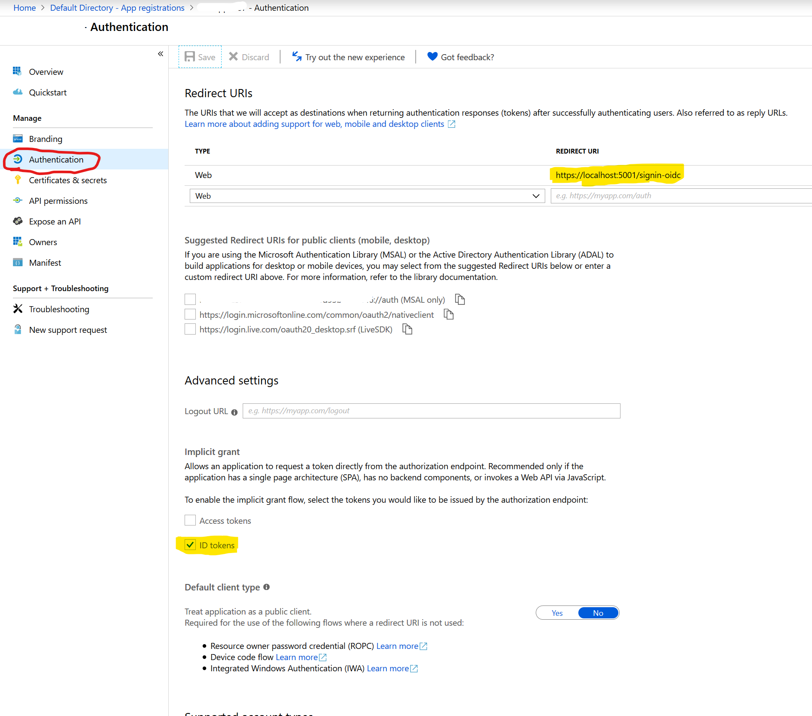

# Azure App Registration

## Task: Create new application registration

1. In Azure Portal, navigate to the Azure Active Directory blade, click **Application Registrations** and click **+ New registration**

    

1. Enter an application name and URL. Note this URL must be the same URL as your local MVC application (https://localhost:5001)

    

1. Navigate to the API Permissions blade and grant permissions

    

1. Navigate to the Authentication blade and enable, **ID Tokens** and update the reply URL to include **/signin-oidc** in the path

    


1. In VS Code terminal, execute the following commands to create new MVC web application using app registration properties and run the application

    ```
    cd ~
    
    mkdir securewebapp
    
    cd securewebapp

    dotnet new mvc --auth SingleOrg --client-id <CLIENT_ID_(APP_ID)> --tenant-id <TENANT_ID> --domain <TENANT_DOMAIN>

    dotnet run
    ```

1. Open web browser, and navigate to https://localhost:5001 to verify you are challenged with authentication