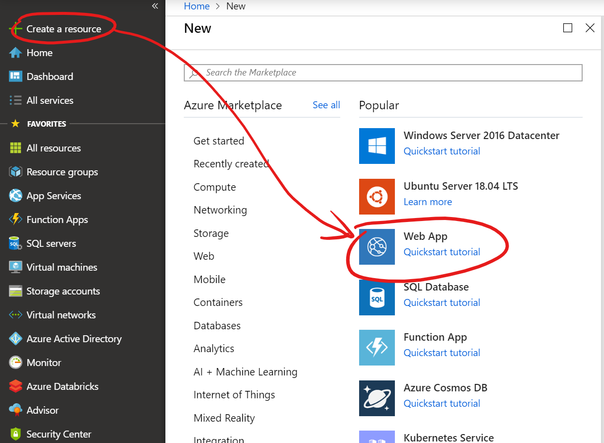
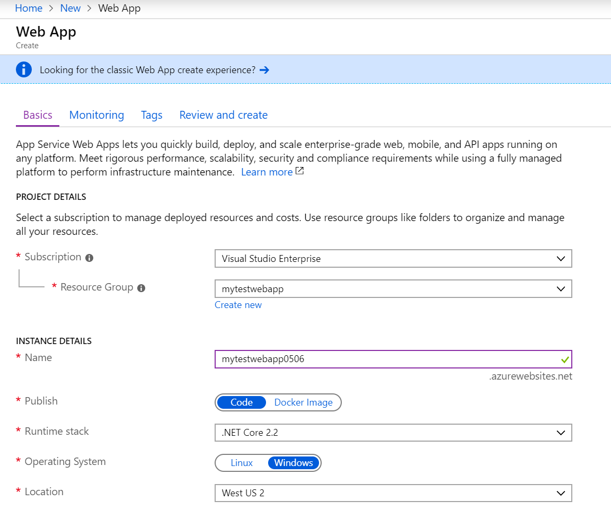
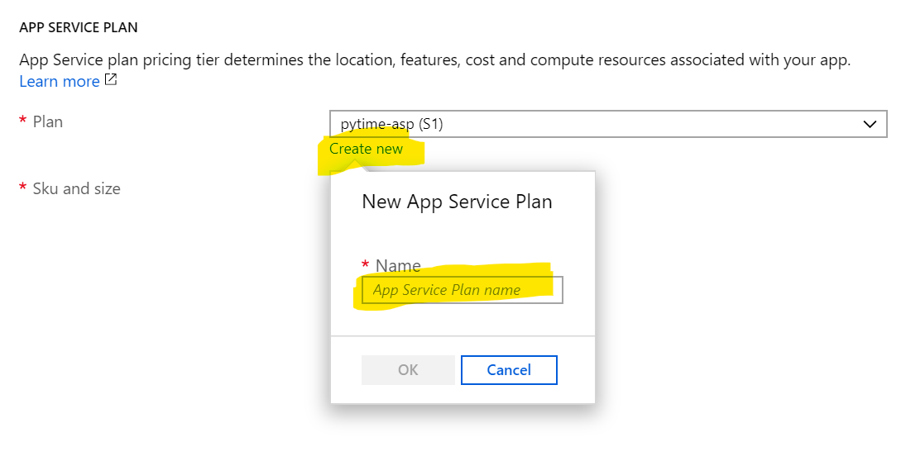
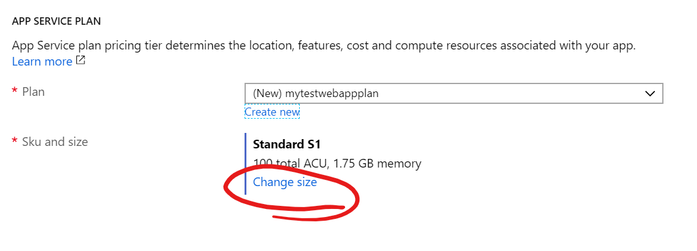

# Azure App Service

## Task: Create Azure App Service Plan

1. In the Azure Portal, click on **+ Create a resource** and click on **Web App**

    

1. Enter basic settings

    - Select your **Resource group**

    - Enter a unique instance **Name**

    - Select **Publish** option to be *Code*

    - Select **Runtime stack** to be *.NET Core 2.2*

    - Select **Operating System** to be *Windows*

    - Select your **Location**

        

1. Create new app service plan

    - Click the **Create new** link under the **Plan** drop down and enter a new app service plan name

        

    - Click the **Change size** link to see the various plan types and pricing

        

    - To see additional plan options, you'll need to click on the *See additional options* link. We'll stick with the default plan of S1, so simply click the **Apply** button

1. Click the **Review and create** button at the bottom of the window, then click **Create**

## Next task: [Create MVC web application using .NET Core SDK](../dotnet-mvc/create-mvc-app.md)