# .NET Core MVC

## Task: Create MVC web application using .NET Core SDK

### [Prerequisite task: Create Azure App Service Plan](../azure-app-service/create-azure-app-service-plan.md)

1. Open VS Code, and go to **Terminal** --> **New Terminal**

    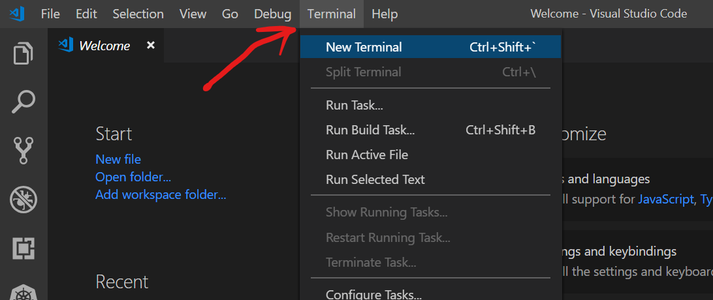
    
1. In the terminal, execute the following commands:

    ```
    mkdir mytestwebapp
    cd mytestwebapp
    dotnet new mvc
    dotnet build
    dotnet run
    ```

    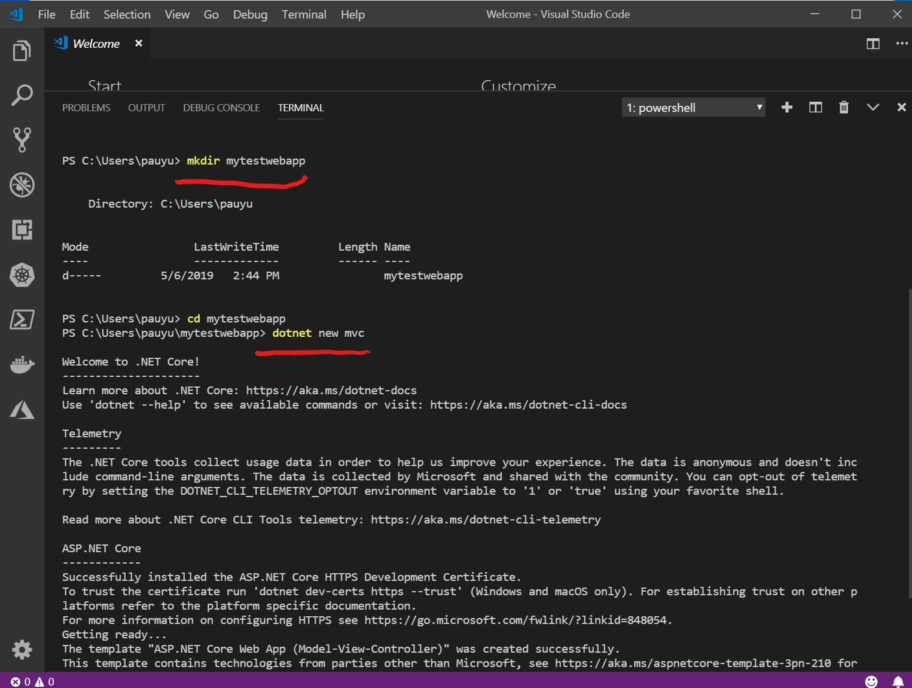

    > The code above will create a new directory named `mytestwebapp` which you will navigate into and use the .NET Core CLI to create a new MVC web application. In this case you do not need to specify a project name as it assumes the name of the directory in which the project was created in. From there you will build the application and run it.

1. The application should now be running on `http://localhost:5000`. Open a web browser and enter the URL into the address bar.

    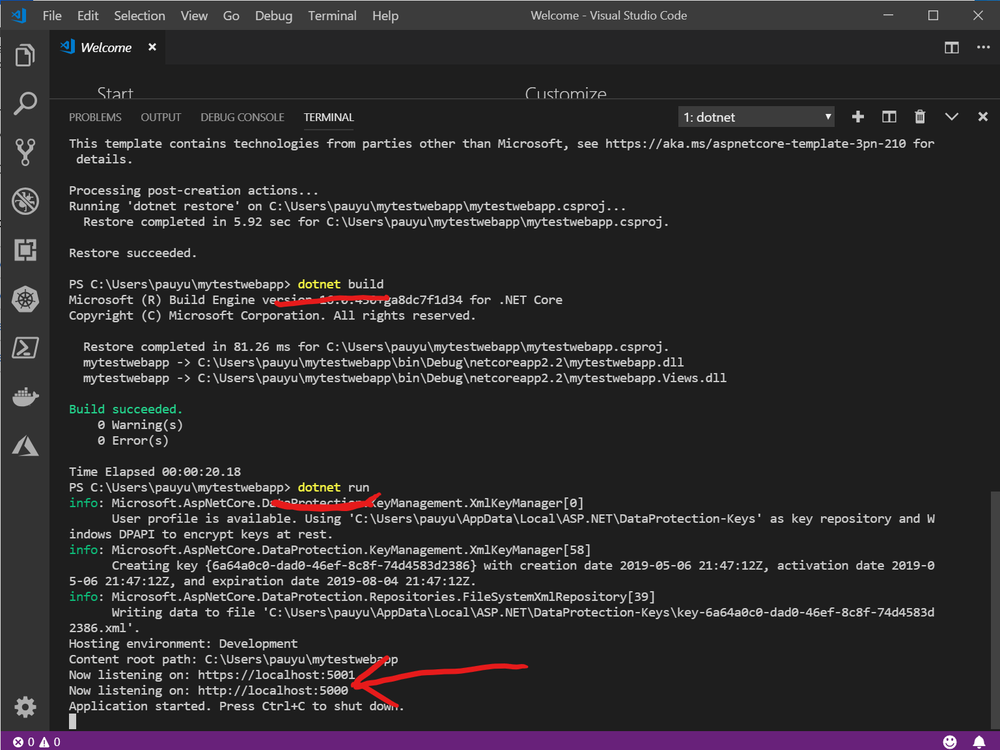

    > You may get a security warning from your browser, stating that the connection is not private. Click on the **Advanced** and click the *Proceed to localhost (unsafe)* link. This is due to the fact that the SSL certificate is not installed on your PC. 

    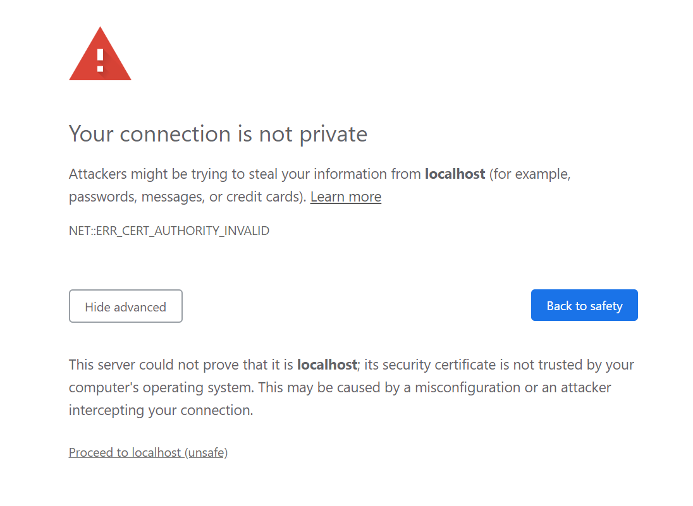

1. You should see a webpage that looks like this

    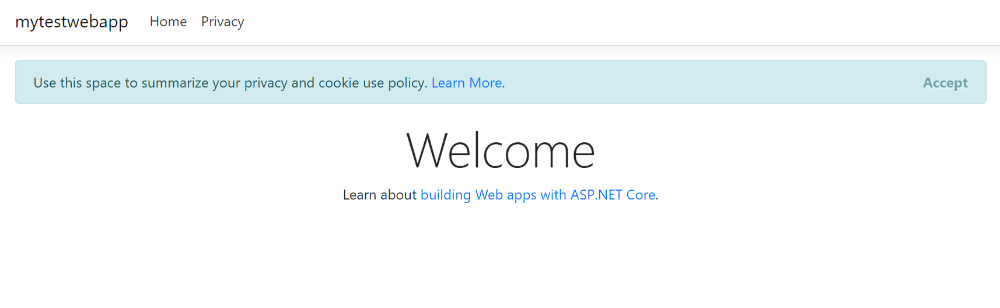

1. Go back to VS Code and enter `Ctrl + C` to stop the web application, then execute the following code to compile the app for publishing

    ```
    dotnet publish --configuration Release --runtime win-x86
    ```

1. Click on the **Extensions** icon in the left navigation column, enter *azure app service* into the search text box, and click the **Install** button when you find **Azure App Service** by Microsoft

    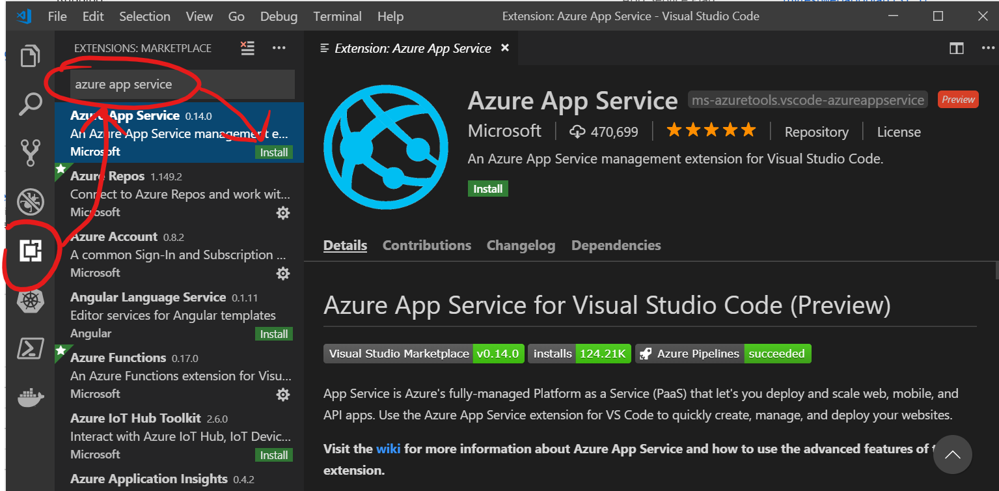

    > When prompted, sign into your Azure Account

1. Click on the *Azure* icon in the left navigation column and click on the *upload* button in the **AZURE: APP SERVICE** pane.

    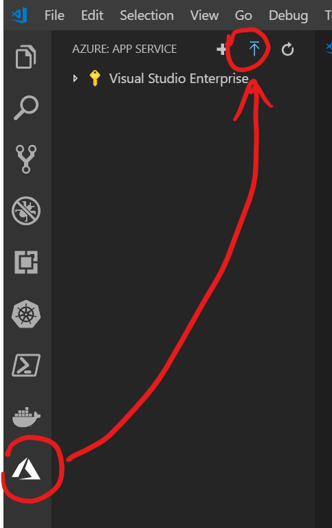

1. Follow the prompts to upload the web application to the previously created app service, and click the **Deploy** button

    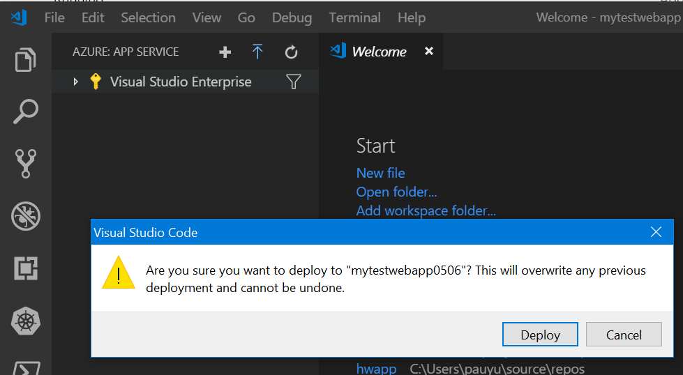

    > Be sure when prompted for the directory to upload, you browse to the `\bin\Release\netcoreapp2.2\win-x86\publish` directory 

1. When the deployment is complete, click the **Browse website** button to validate you can access

    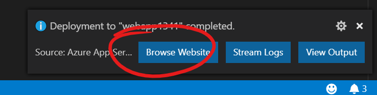

1. You should be able to navigate the site anonymously (no authentication)

1. To add authentication to the site, click on the **Authentication / Authorization** button and click the following options

    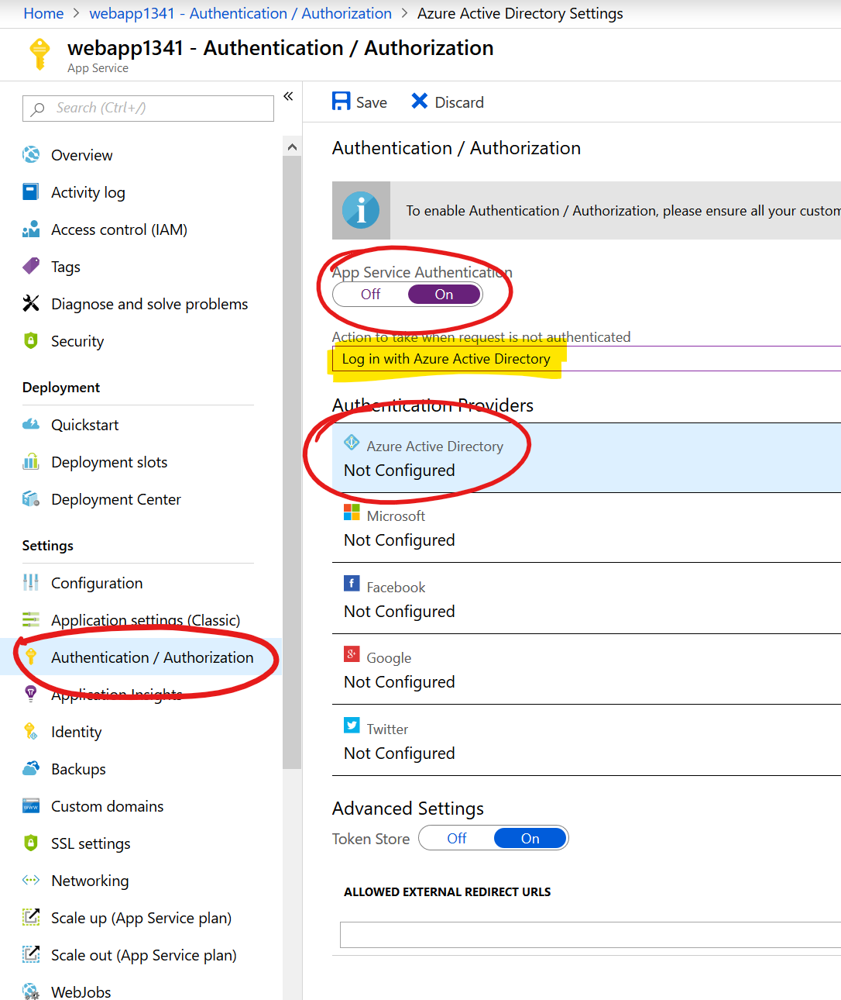

1. Configure Azure Active Direcotry Settings

    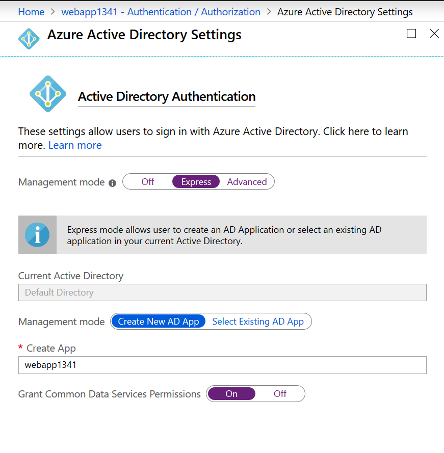

1. Click **Save**

    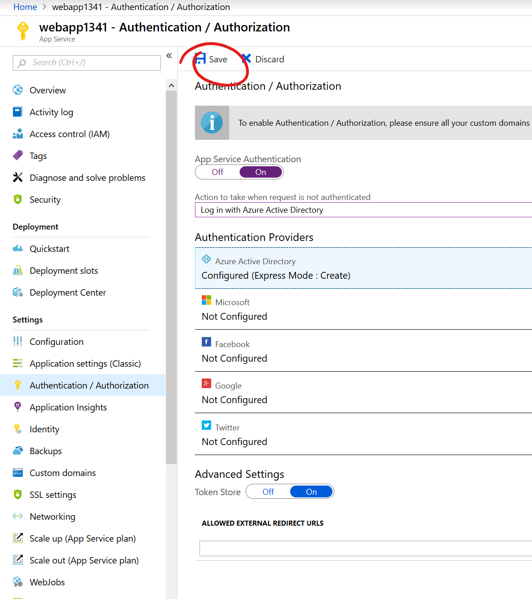

1. Navigate back to the **Overview** blade, then click the **Restart** button to have the change take effect

1. Open a new web browser in incognito mode and navigate to the website. You should now be challenged to authenticate

    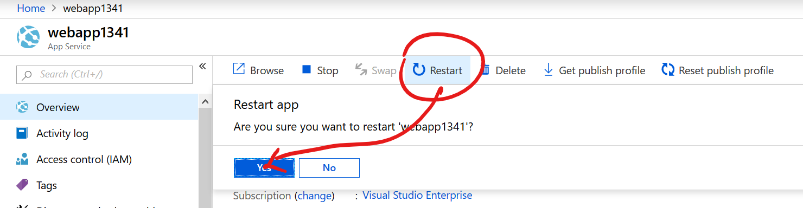

> Troubleshooting tips if you cannot access the page or recieve permissions issues. Naviage back to teh Azure Active Directory settings, click on **Manage Permissions**, and click **Grant permissions** (You may also need to delete service principals that were created in error and they will be denoted by a caution icon)

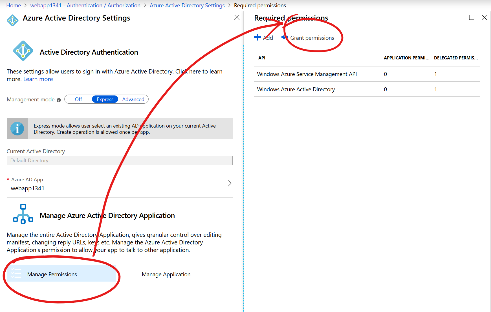

## [Next task: Create Azure Active Directory App Registration and secure web application](../azure-app-registration/create-new-app-registration.md)
