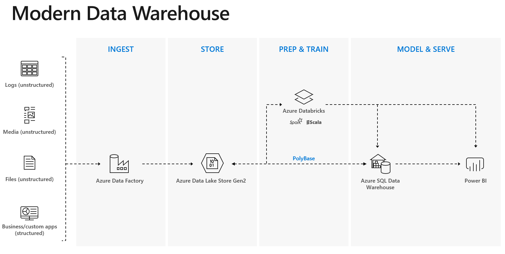

# Higher Education Modern Data Warehouse in Azure

Register for this workshop to learn how to leverage Microsoft Azure tools and services to build a modern data warehouse. During this session, we'll cover the steps involved in ingestion, validation, processing, serving, visualization, and analytics. 

### Pre-requisites:
  - Ensure users are able to create App Registrations within Azure Active AD tenant
  
  - Ensure the following Resource providers are registered within subscription
  
    - Microsoft.DataFactory
    
    - Microsoft.Databricks
    
    - Microsoft.Sql

### [Task 1: Create Azure Resource Group](azure-resource-group/create-resource-group.md)

### [Task 2: Create Azure Blob Storage](azure-storage/provision-azure-storage-account.md)

### [Task 3: Create Azure Data Lake Gen 2](azure-data-lake-gen2/provision-azure-datalake-gen2.md)

### [Task 4: Create Azure Service Principal](azure-ad-service-principal/create-service-principal.md)

### [Task 5: Create Azure SQL Data Warehouse](azure-sql-datawarehouse/provision-azure-sql-data-warehouse.md)

### [Task 6: Create Azure Data Factory V2](azure-data-factory-v2/provision-azure-data-factory-v2.md)

### [Task 7: Build copy pipeline using Azure Data Factory](azure-data-factory-v2/copy-file-into-adls-gen2.md)

### [Task 8: Create Azure Databricks](azure-databricks/provision-azure-databricks.md)

### [Task 9: Create Azure Databricks Cluster](azure-databricks/create-spark-cluster.md)

### [Task 10: Create Azure Databricks Workspace](azure-databricks/create-workspace.md)

### [Task 11: Develop Azure Databricks notebook](azure-databricks/develop-databricks-notebook.md)

### [Task 12: Update Azure Data Factory pipeline to transform data using Databricks](azure-data-factory-v2/transform-data-using-databricks.md)

### [Task 13: Verify data](azure-sql-datawarehouse/verify-data.md)

### [Task 14: Visualize data](power-bi/visualize-data.md)
