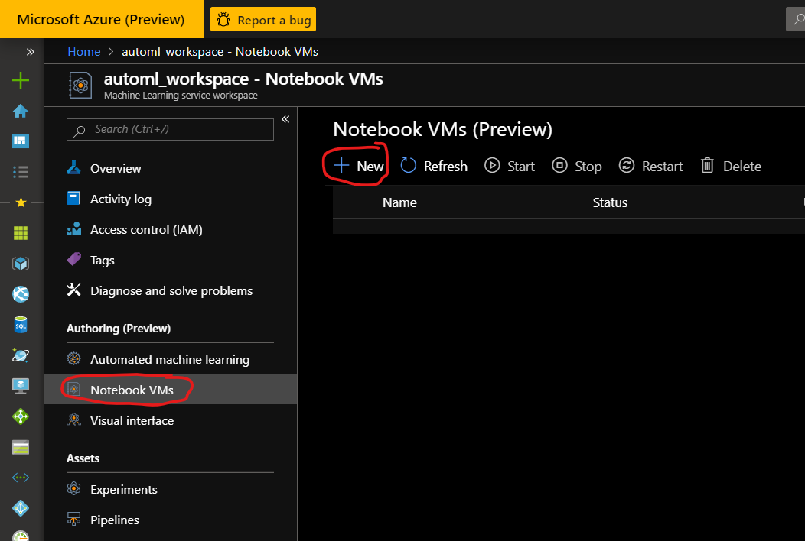
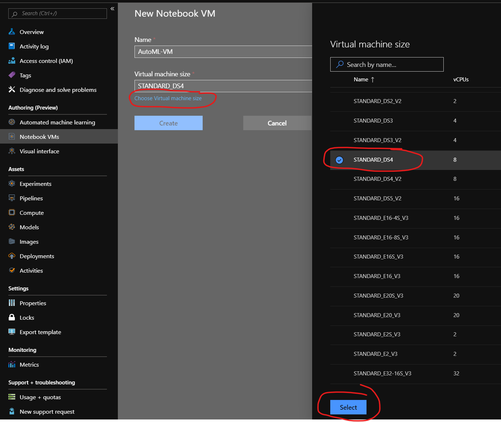
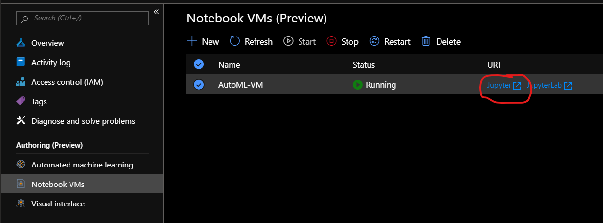
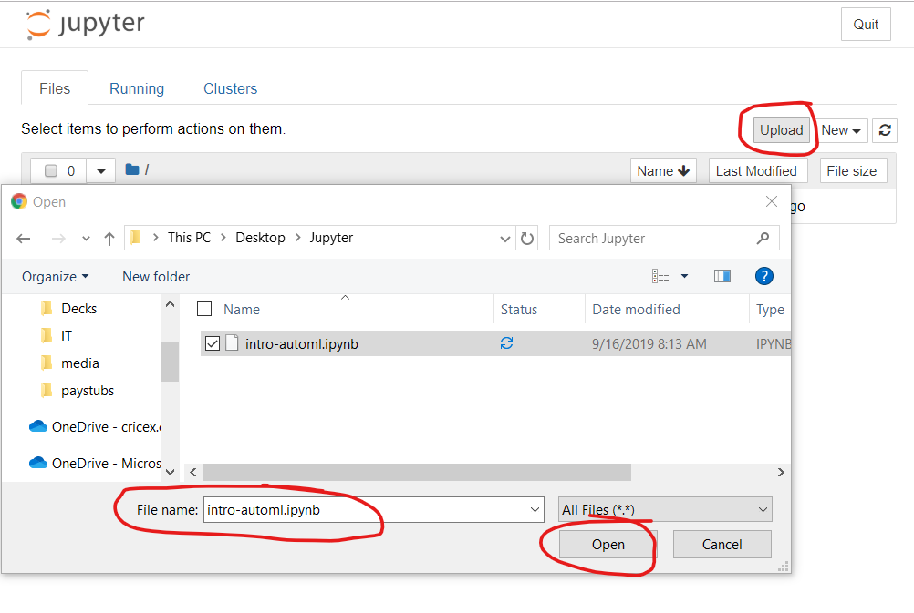

## Create a Notebook VM
1. From your Azure Machine Learning Service Workspace, click on **Notebook VMs** in the resource blade, then click **+New**.

1. Enter a **Globally Unique Value** for the **Name** field. Then, click on *Choose Virtual Machine Size* and select *STANDARD_DS4*, next click **Create**.

1. Your VM will take a few minutes to deploy. Once deployed, click on the **Jupyter** hyperlink to launch Jupyter Notebooks.

1. From the Jupyter interface, click the **Upload** button and upload the **Intro-automl.ipynb** that was saved to your desktop.

1. Open the **Intro-Automl.ipynb** file and proceed to follow the instructions in the notebook. 

## [Back to Syllabus](readme.md)