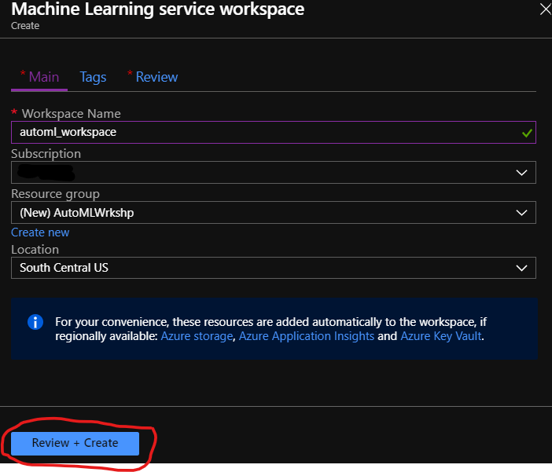
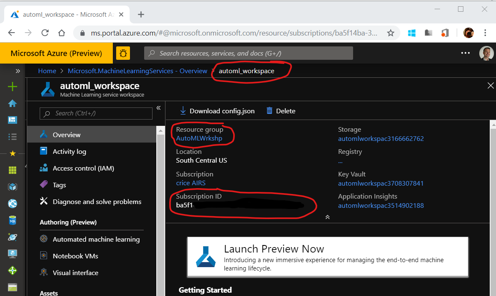

## Create an Azure Machine Learning Services Workspace
1. Sign in to the [Azure portal](https://portal.azure.com/).
1. Click **Create a resource** in the upper left-hand corner of the Azure portal.
1. In the Search field, type in *Machine Learning* and choose **Machine Learning Service Workspace**

1. Click on the **Create** button and fill out the Resource Creation form accordingly, then click **Review + Create**, followed by **Create**.  

| Setting | Suggested value   |
|------|------|
|**Wokrspace Name**  | Your Workspace Name|
|**Subscription**  | The subscription associated with your account.|
|**Resource group**  | Create a new resoruce group for this workshop.|
|**Location**  | Use the location nearest you.|

5. Go to the Workspace once it has been deployed and retrieve the:  
    - Subscription ID
    - Resource Group Name
    - Workspace Name  

1. From the same page, click on the **Storage** hyperlink.  
1. From the Storage Account Overview, click on **Access Keys**, and retrieve **key2**  

## [Back to Syllabus](readme.md)
## Next: 
- [Create a Notebook VM](create-a-notebook-vm.md)
