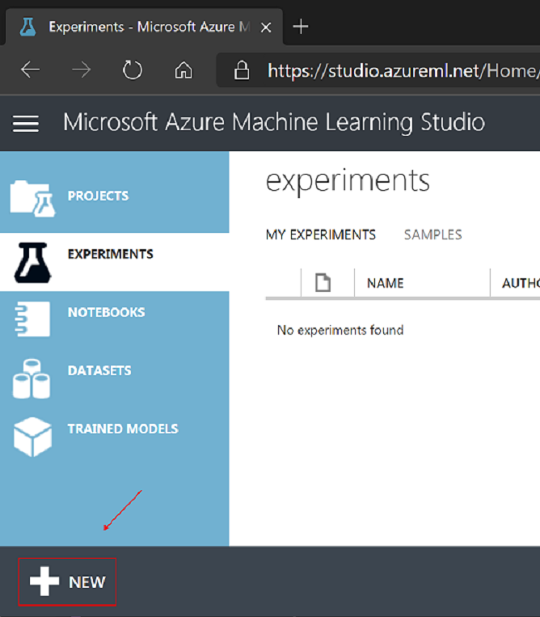
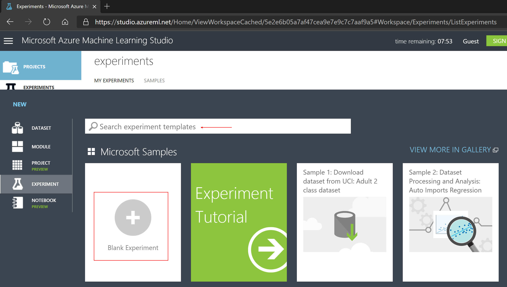
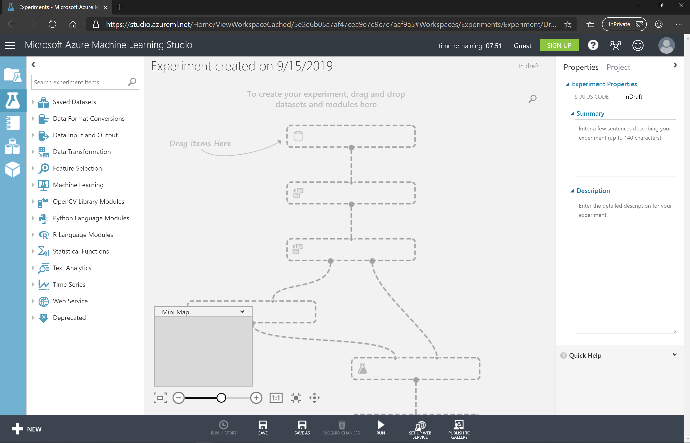
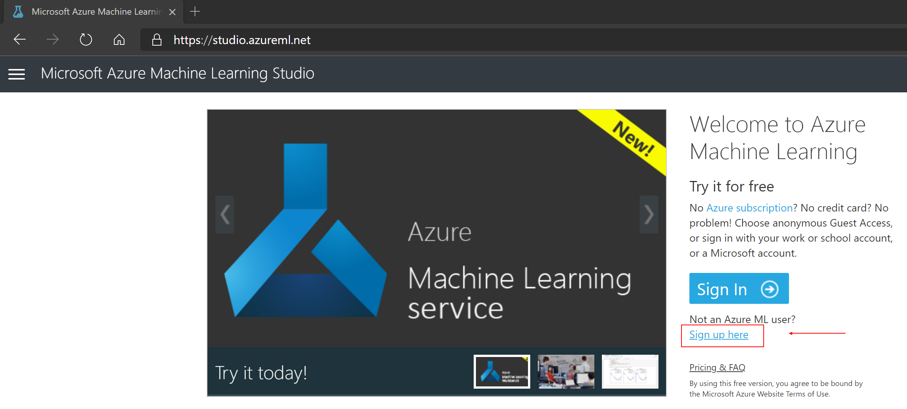
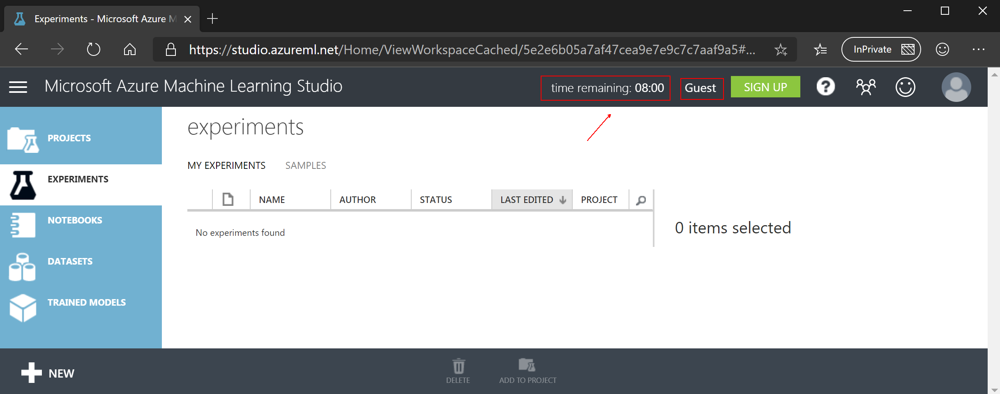

# Use Azure Machine Learning Studio to create, train, score and evaluate a model

## Task List

- [Create a Blank Experiment](#Create-a-Blank-Experiment)
- [Load Data from Azure SQL Server](#Load-Data-from-Azure-SQL-Server)
- [Examine, transform and prepare data](#Examine,-transform-and-prepare-data)
- [Select classification algorithm](#Select-classification-algorithm)
- [Train model](#Train-model)
- [Score model](#Score-model)
- [Evaluate model](#Evaluate-model)

### Create a Blank Experiment

1. No experiments will exists when you first log into Azure Machine Learning Studio.  At the lower left hand corner click on the **+ NEW** icon:

  

2. When creating a new experiment you can choose templates from the [Azure AI Gallery](https://gallery.azure.ai/), run through a guided *Experiment Tutorial* or create a *Blank Experiment*.  Click on **Blank Experiment**:

1. something

### Load Data from Azure SQL Server

1. Type *sql* in the module search window and hit enter.  Drag and drop the **Import Data** module onto the experiment canvas:
1. Set the *Data source* to: **Azure SQL Database**
1. Connection

    | Property | Value  |
    |------|------|
    |**Database server name**  | higheredu.database.windows.net|
    |**Database name**  | HigherED_DW|
    |**User name**  | utreader|
    |**Password**  | h00k'3mhornz|
    |**Accept any server certificate (insecure)**  | leave the box unchecked|
    |**Database query**  | SELECT * FROM MLInput.DropClass;|
    |**Use cached results**  | check the box|

### Examine, transform and prepare data

### Select classification algorithm

### Train model

### Score model

### Evaluate model

1. Open a InPrivate or Incognito browser window and navigate to [studio.azureml.net](https://studio.azureml.net/).
1. Click **Sign up here** just underneath the blue *Sign In* button:

1. Click **Enter** on the *Guest Workspace* option:

1. You should now have access to a guest Azure Machine Learning Studio workspace.  Notice in the upper left the *time remaining* and *Guest* user access:

## *You have completed the Visual ML Classification workshop*

## [Back to Syllabus](readme.md)
