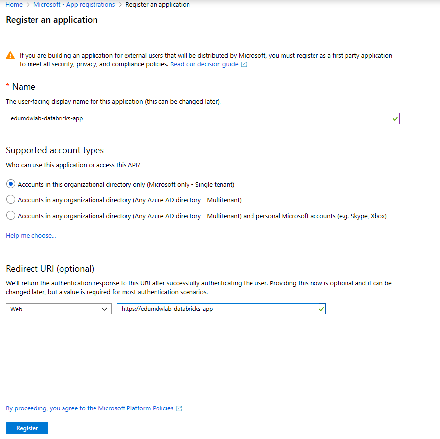
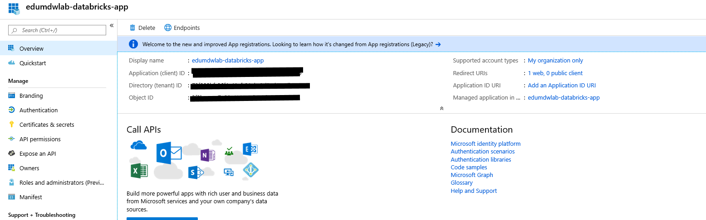
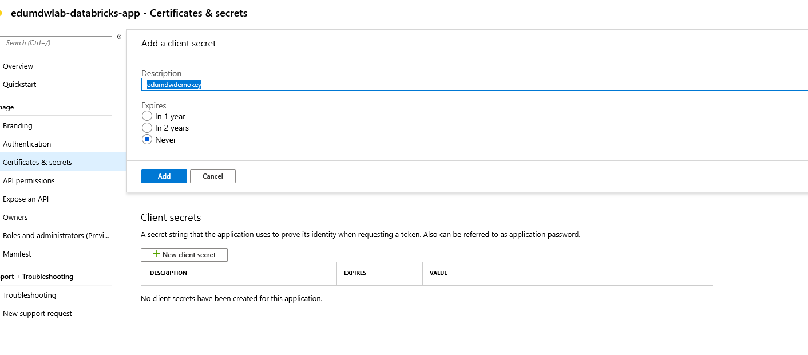
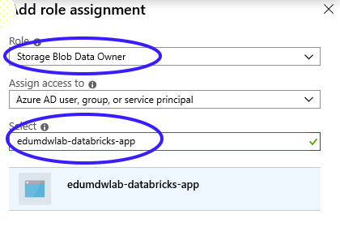
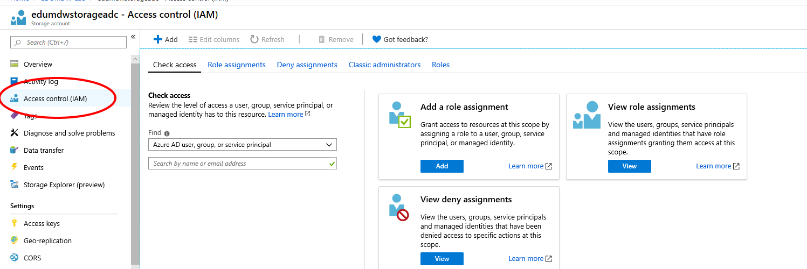

# Create Service Principal

## Pre-requisite task: [Create Azure Data Lake Gen 2](../azure-data-lake-gen2/provision-azure-datalake-gen2.md)

## Task: Create service principal and add role assignment for ADLS Gen2 & Storage Account

### We'll need to create a new service principal name (SPN) so that we can authenticate from our Databricks notebook to our Azure AD tenant using Oauth2 tokens. 

1. In the Azure Portal search box, type "*azure active*" and click on **Azure Active Directory**.

    

1. In the Azure Active Directory blade, click on **App registrations**.

    

1. Click on the **+ New application registration** button

1. Enter a name for the app and a sign-on URL (NOTE: The sign-on URL does not need to be an actual URL but needs to be URL encoded)

      - **Name**: edumdwlab-databricks-app
      - **URL**: https://edumdwlab-databricks-app
    
    

1. Click the **REGISTER** button.

1. The registered app blade will be displayed upon creation. Copy the **Application ID** to notepad for later use.

    

1. Click on **Certificates & Secrets**, click **+ New Client Secrets** in the settings blade, enter a **key description**, select a **duration**, click the **Save** button, and copy the **value** that is generated to notepad for later use.

     - keyname: edumdwdemokey

    > **NOTE:** YOU ONLY GET ONE CHANCE TO VIEW THE VALUE SO BE SURE TO COPY THIS; OTHERWISE YOU'LL HAVE TO GENERATE A NEW KEY.
    
    

1. Navigate back to the Azure Active Directory blade, click **Properties**, and copy the **Directory ID** to notepad for later use.

    

## Task: Add Role Assigment to the Data Lake Account
1. Navigate back to your Azure Data Lake Gen2 resource, click on **Access control (IAM)**, click the **+ Add** button, then click **Add role assignment**.

    

1. In the role assignment blade, be sure to select the **Storage Blob Data Owner** role, and begin typing in your SPN in the **Select** text box. When your role appears in the list, click it to select it, then click **Save**.

    

## Task: Add Role Assigment to the Storage Account
1. Navigate back to your Azure Storage Account resource, click on **Access control (IAM)**, click the **+ Add** button, then click **Add role assignment**.

    

1. In the role assignment blade, be sure to select the **Storage Blob Data Owner** role, and begin typing in your SPN in the **Select** text box. When your role appears in the list, click it to select it, then click **Save**.

    

## Next task: [Create Azure SQL Data Warehouse](../azure-sql-datawarehouse/provision-azure-sql-data-warehouse.md)
