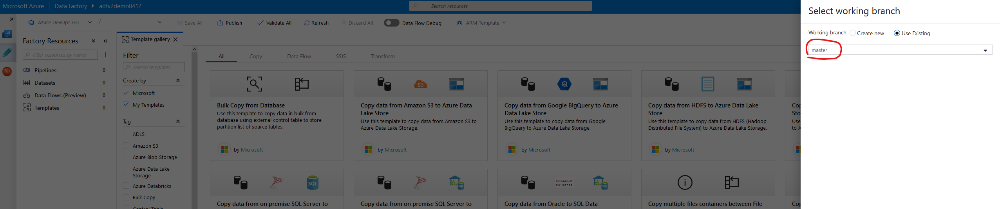

# Configure Git Repository

> **NOTE:** If you are using Azure DevOps, you must have your Azure DevOps Organization already created prior to proceeding.

## Pre-requisite: [Provision Azure Data Factory V2](provision-azure-data-factory-v2.md)

1. On the ADF overview page, click **Set up Code Repository**

    

1. Select **Repository Type** and select the appropriate organization/project/branch.

    > **NOTE:** ADF supports either Azure DevOps or GitHub.

    - ### Settings for Azure DevOps:

        

    - ### Settings for GitHub:

        

1. In the Overview page, click the **Create pipeline from template** button.

    

1. If prompted, select the working branch.

    

1. Verify the correct branch is selected.

    

## Next task: [Build copy pipeline using Azure Data Factory](copy-file-into-adls-gen2.md)