# Build copy pipeline using Azure Data Factory

## Pre-requisite task: [Create Azure Data Factory V2](azure-data-factory-v2/provision-azure-data-factory-v2.md)

## Task: Copy JSON file to Azure Data Lake Gen 2

1. In Data Factory workspace, click on the **Author** icon, click the **plus** icon, then click **Pipeline**

    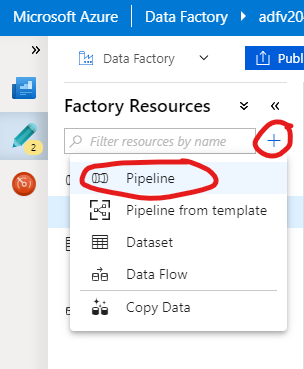

1. In the Pipeline editor, drag and drop the **Copy Data** activity onto the work area

    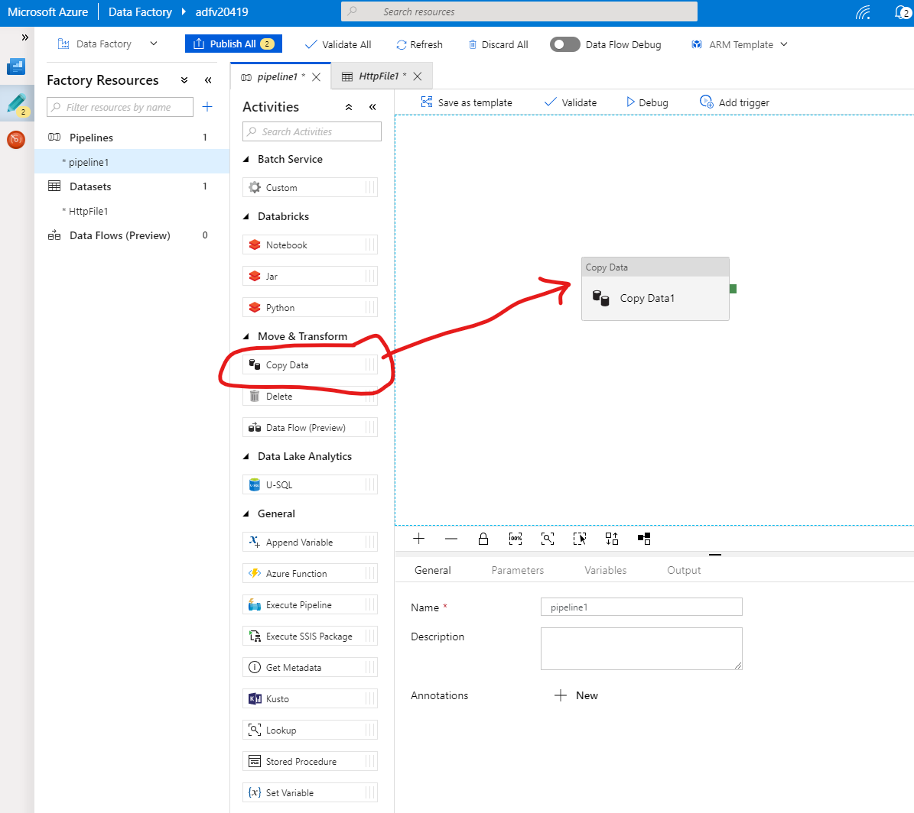

1. Click on the **Copy Data1** activity and click **+ New** from the **Source** tab to configure a new linked service

    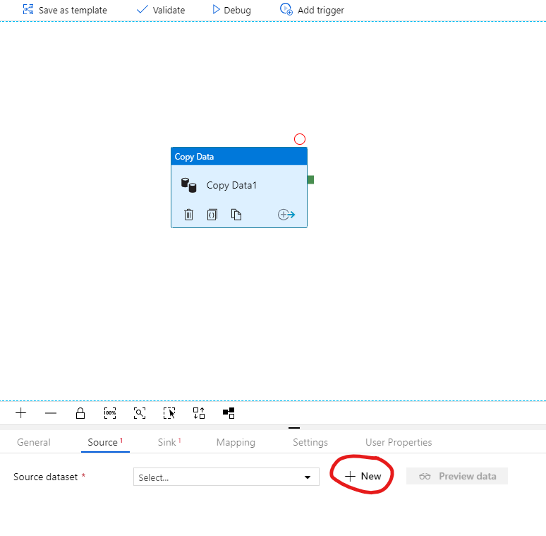

1. In the new Dataset pane, find **HTTP** and click **Continue**

    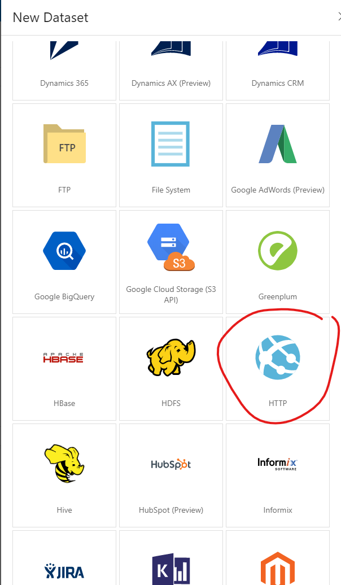

1. In the HTTP Dataset editor, click on the **Connection** tab, click the **+ New** button, and configure the file settings

    - Base URL: *https://raw.githubusercontent.com/Azure/usql/master/Examples/Samples/Data/json/radiowebsite/small_radio_json.json*
    - Authentication type: *Anonymous*

    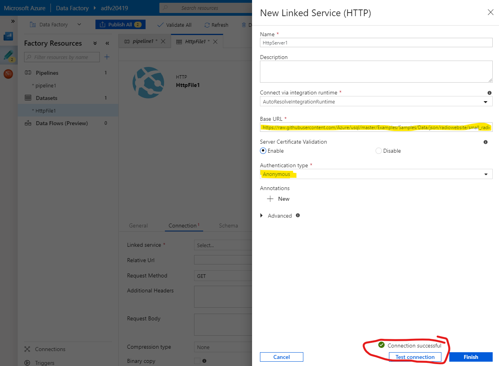

1. Click **Test connection** 

1. Click **Finish**

1. Back in the HTTP Dataset editor Connection tab, ensure **File format** is set to **JSON format**

    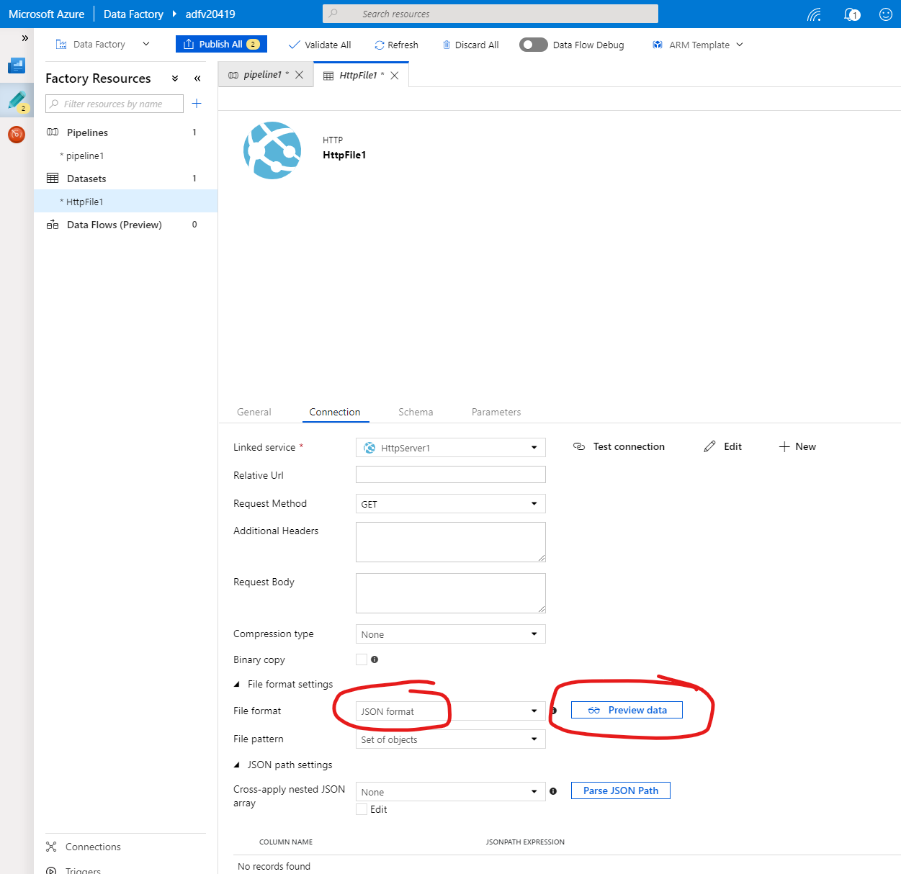

1. You can preview the data

    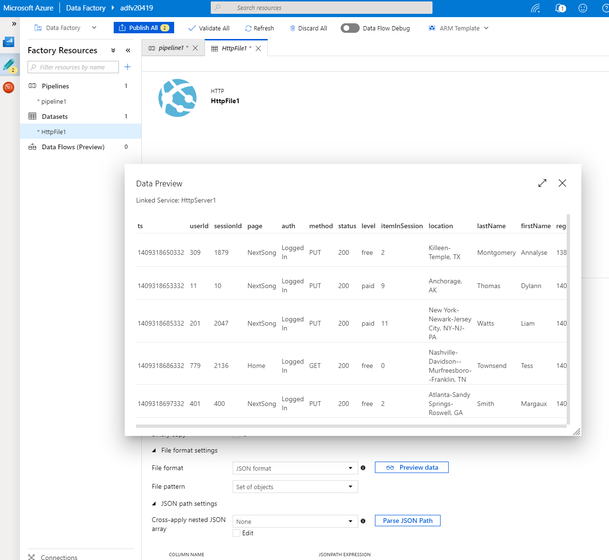

1. Back in the pipeline editor, click on the **Copy Data** activity, click on **Sink**, and click **+ New** to configure.

    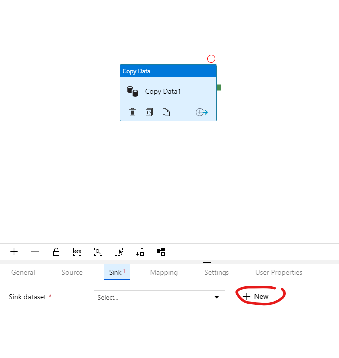

1. 1. In the new Dataset pane, find **Azure Data Lake Storage Gen2** and click **Continue**

    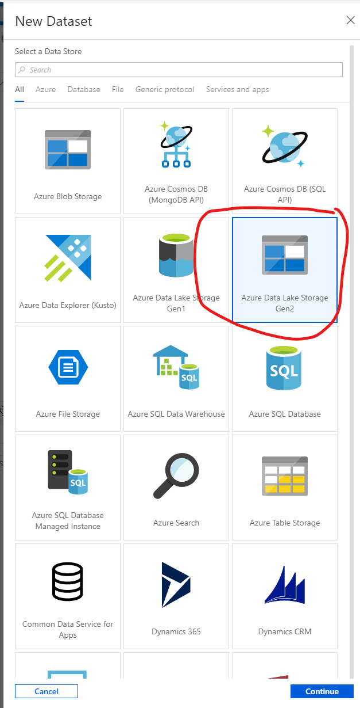

1. In the Azure Data Lake Storage Gen2 Dataset editor, click on the **Connection** tab, and click the **+ New** button.

    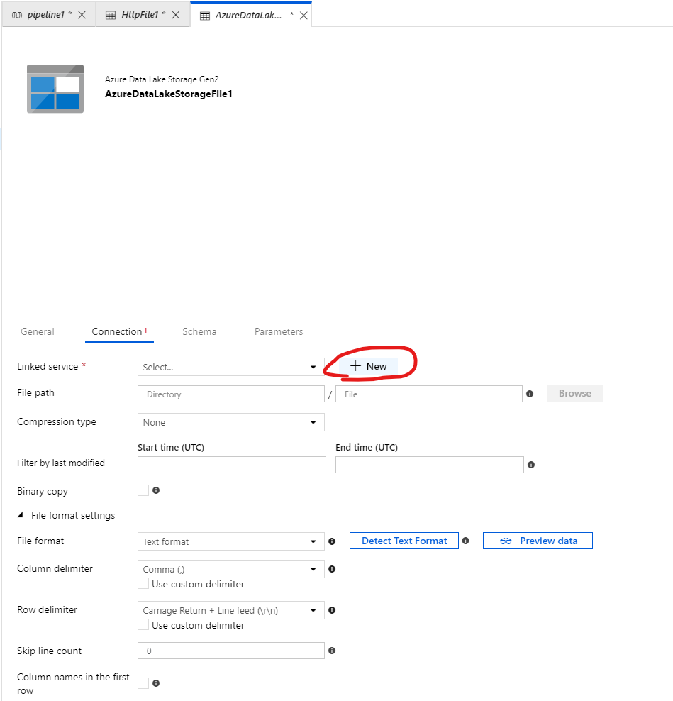

1. In the linked service settings, select your ADLS account from your subscription, test the connection, and click **Finish**.

    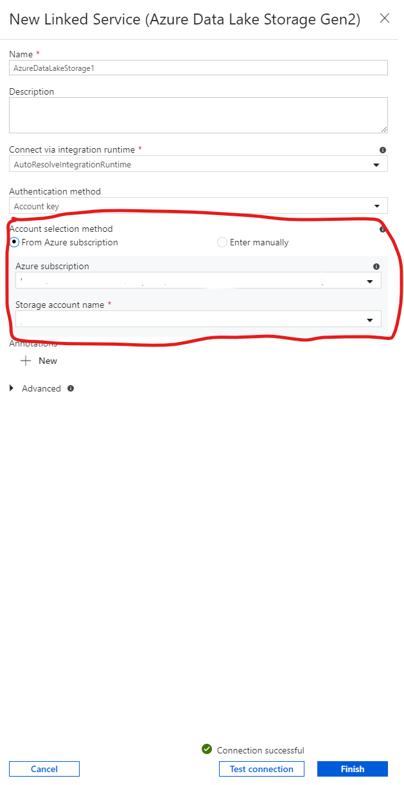

1. In the connection tab, enter the **File path** and filename

    > **NOTE:** The file path you enter will be the name of the file system in ADLS. Make sure you copy this value to notepad for later use.

    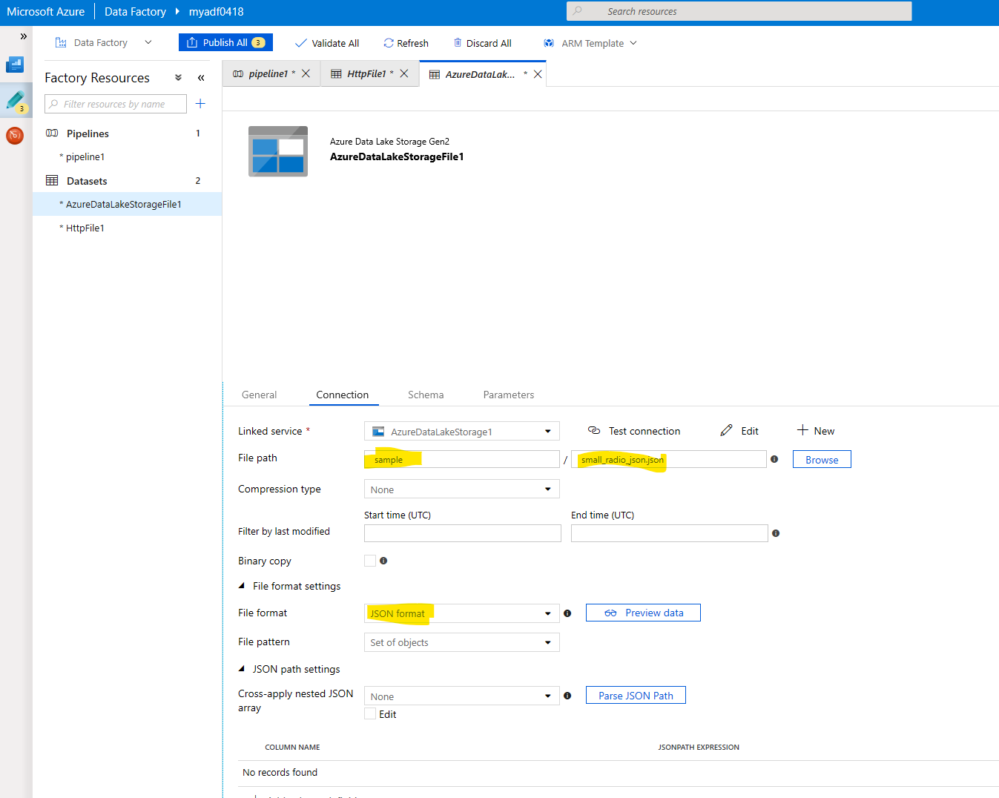

1. Click the **Publish** button to save the pipeline.

    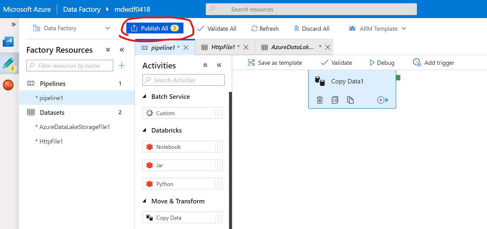

1. Click the **Debug** button to run the copy activity.

    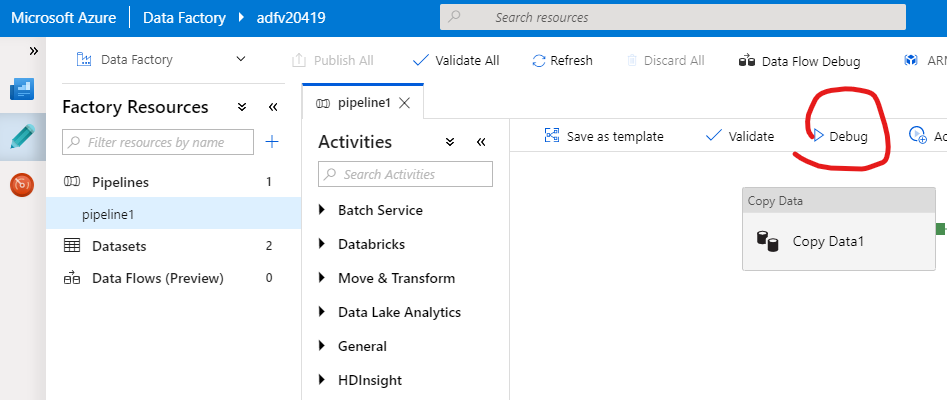

## Next task: [Create Azure Databricks](../azure-databricks/provision-azure-databricks.md)