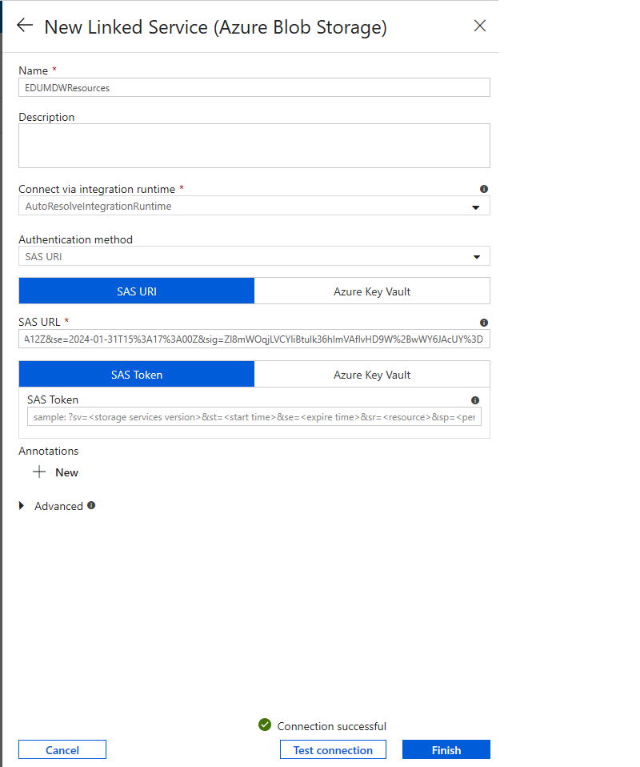

# Build copy pipeline using Azure Data Factory

## Pre-requisite task: [Create Azure Data Factory V2](provision-azure-data-factory-v2.md)

## Task: Create Linked Services Connections
In this section you will create a linked service connection to a shared storage accounnt called EDUMDWResources hosted in an external Azure subscription. This storage account hosts the NYC Taxi data files you will copy to your data lake. As this storage account sits in an external subscription you will connect to it using a SAS URL token.


1.	Open the **Azure Data Factory** portal and click the **Author option *(pencil icon)*** on the left-hand side panel. Under **Connections** tab, click **Linked Services** and then click **+ New** to create a new linked service connection.

        

2.	On the **New Linked Service** blade, type “Azure Blob Storage” in the search box to find the **Azure Blob Storage** linked service. Click **Continue**.
    
     

3.	On the **New Linked Service (Azure Blob Storage)** blade, enter the following details:
    <br>- **Name**: EDUMDWResources
    <br>- **Connect via integration runtime**: AutoResolveIntegrationRuntime
    <br>- **Authentication method**: SAS URI
    <br>- **SAS URL**: 
    ```
	https://eduusdevpoc.blob.core.windows.net/?sv=2019-02-02&ss=bq&srt=sco&sp=rw&se=2020-08-08T16:40:26Z&st=2019-10-	29T08:40:26Z&spr=https,http&sig=1Noup13hr3eI2uZdT6to9esTDCfzNHmcpliLINRMF20%3D
    ```
4.	Click **Test connection** to make sure you entered the correct connection details and then click **Finish**.

	 

8.	Repeat the process once again to create an **Azure Blob Storage** linked service connection.

    

9.	On the **New Linked Service (Azure Blob Storage)** blade, enter the following details:
    <br>- **Name**: MDWDataLake
    <br>- **Connect via integration runtime**: AutoResolveIntegrationRuntime
    <br>- **Authentication method**: Account key
    <br>- **Account selection method**: From Azure subscription
    <br>- **Azure subscription**: *<your subscription>*
    <br>- **Storage account name**: edumdwstorage+YourInitials*

10.	Click **Test connection** to make sure you entered the correct connection details and then click **Finish**.

    


5.	Repeat the process to create an **Azure SQL Data Warehouse** linked service connection.

    

6.	On the New Linked Service (Azure SQL Data Warehouse) blade, enter the following details:
    <br>- **Name**: MDWVirtualSQLServer_MDWASQLDW
    <br>- **Connect via integration runtime**: AutoResolveIntegrationRuntime
    <br>- **Account selection method**: From Azure subscription
    <br>- **Azure subscription**: *<your subscription>*
    <br>- **Server Name**: edumdwsqlserver+*YourInitials*
    <br>- **Database Name**: EDUMDWDataWarehouse
    <br>- **Authentication** Type: SQL Authentication 
    <br>- **User** Name: EduMdwAdmin
    <br>- **Password**: P@$$word123
7.	Click **Test connection** to make sure you entered the correct connection details and then click **Finish**.

    

11.	You should now see 3 linked services connections that will be used as source, destination and staging.

    
  
## Task: Create Source and Destination Data Sets
In this section you are going to create 6 datasets that will be used by your data pipeline:

Dataset | Description
--------|---------------
**EduMDWReouuces_NYCTaxiData**| References EduMDWResources shared storage account container that contains source data files.
**EDUMDMResources_NYCTaxiLookup**| References EduMDWResources shared storage account that contains a .json file with all taxi location codes and names.
**EDUMDWDataWarehouse_StagingNYCTaxiData**| References the table Staging.NYCTaxiData in the Azure SQL Data Warehouse database EDUMDWDataWarehouse.
**MDWDataLake_NYCDataLookup**| References your edumdwstorage+*YourInitials* storage account. It acts as the destination for the files copied from EMDWDataLAke_NYCDataLookup. 
**MDWDataLake_NYCTaxiData_Binary**| References your edumdwstorage+*YourInitials* storage account. It acts as the destination for the files copied from EduMDWResources_NYCTaxiData. 
**MDWDataLake_NYCTaxiData_CSV**| References your edumdwstorage+*YourInitials* storage account. It functions as a data source when copying data to EDUMDWDataWarehouse_StagingNYCTaxiData.


1.	Open the **Azure Data Factory** portal and click the **Author *(pencil icon)*** option on the left-hand side panel. Under **Factory Resources** tab, click the ellipsis **(…)** next to **Datasets** and then click **Add Dataset** to create a new dataset.

    

2.	Type “Azure Blob Storage” in the search box and select **Azure Blob Storage**. Click **Continue**.

    

3.	On the **Select Format** blade, select **Binary** and click **Continue**.

    

4.	On the **Set Properties** blade, enter the following details:
    <br>- **Name**: EduMDWResources_NYCTaxiData
    <br>- **Linked service**: EduMDWResources
    <br>- **File Path**: **Container**: nyctaxidata, **Directory**: [blank], **File**: [blank]
    
    

    Alternatively you can copy and paste the Dataset JSON definition below:

    ```json
    {
    "name": "EduMDWResources_NYCTaxiData",
    "properties": {
        "linkedServiceName": {
            "referenceName": "EDUMDWResources",
            "type": "LinkedServiceReference"
        },
        "annotations": [],
        "type": "Binary",
        "typeProperties": {
            "location": {
                "type": "AzureBlobStorageLocation",
                "container": "nyctaxidata"
            }
        }
    },
    "type": "Microsoft.DataFactory/factories/datasets"}
    ```
5.	Leave remaining fields with default values.

   

6.	Repeat the process to create another Azure Storage Binary dataset, this time referencing the NYCTaxiData container in your MDWDataLake storage account. This dataset acts as the destination for the NYC taxi data files you will copy from the previous dataset.

7.	Type “Azure Blob Storage” in the search box and select **Azure Blob Storage**. Click **Continue**.

    

8.	On the **Select Format** blade, select **Binary** and click **Continue**.

    

9.	On the **Set Properties** blade, enter the following details:
    <br>- **Name**: MDWDataLake_NYCTaxiData_Binary
    <br>- **Linked Service**: MDWDataLake
    <br>- **File Path**: **Container**: nyctaxidata, **Directory**: [blank], **File**: [blank]

    

    Click **Continue**.    

    Alternatively you can copy and paste the Dataset JSON definition below:

    ```json
    {
        "name": "MDWDataLake_NYCTaxiData_Binary",
        "properties": {
            "linkedServiceName": {
                "referenceName": "MDWDataLake",
                "type": "LinkedServiceReference"
            },
            "annotations": [],
            "type": "Binary",
            "typeProperties": {
                "location": {
                    "type": "AzureBlobStorageLocation",
                    "container": "nyctaxidata"
                }
            }
        }
    }
    ```
10.	Leave remaining fields with default values.

    

11.	Repeat the process to create a new Azure Storage CSV dataset referencing the NYCTaxiData container in your MDWDataLake storage account. This dataset acts as the data source of NYC taxi records (CSV) you will copy to your Azure SQL Data Warehouse.

12.	Type “Azure Blob Storage” in the search box and select **Azure Blob Storage**. Click **Continue**.

    

13.	On the **Select Format** blade, select **DelimitedText** and click **Continue**.

    

14.	On the **Set Properties** blade, enter the following details:
    <br>- **Name**: MDWDataLake_NYCTaxiData_CSV
    <br>- **Linked Service**: MDWDataLake
    <br>- **File Path**: **Container**: nyctaxidata, **Directory**: [blank], **File Path**: [blank]
    <br>- **First row as header**: Checked
    <br>- **Import schema**: None

    

    Click **Continue**.

15.	On the dataset properties, set the following property values:
    <br>- **Connection > Escape character**: Backlash (\)
    <br>- **Connection > Quote character**: Double quote (")

    Leave remaining fields with default values.

    

    Alternatively you can copy and paste the Dataset JSON definition below:

    ```json
       {
        "name": "MDWDataLake_NYCTaxiData_CSV",
        "properties": {
            "linkedServiceName": {
                "referenceName": "MDWDataLake",
                "type": "LinkedServiceReference"
            },
            "annotations": [],
            "type": "DelimitedText",
            "typeProperties": {
                "location": {
                    "type": "AzureBlobStorageLocation",
                    "container": "nyctaxidata"
                },
                "columnDelimiter": ",",
                "escapeChar": "\\",
                "quoteChar": "\""
            },
            "schema": []
        },
        "type": "Microsoft.DataFactory/factories/datasets"
    }
    ```
16.	Repeat the process to create a new Azure Blob json dataset, this time referencing the NYCTaxiLookup container in your MDWResources storage account. 

17.	Type “Azure Blob Storage” in the search box and select **Azure Blob Storage**. Click **Continue**.

    

18.	On the **Select Format** blade, select **JSON** and click **Continue**.

    

19.	On the **Set Properties** blade, enter the following details:
    <br>- **Name**: EDUMDMResources_NYCTaxiLookup
    <br>- **Linked Service**: EDUMDWResources
    <br>- **File Path**: **Container**:nyctaxilookup, **Directory*: [blank], **File**: [blank]
    <br>- **First row as header**: Checked
    <br>- **Import schema**: None.

    

20.	Leave remaining fields with default values.  

    Alternatively you can copy and paste the Dataset JSON definition below:

    ```json
           {
    "name": "EDUMDMResources_NYCTaxiLookup",
    "properties": {
        "linkedServiceName": {
            "referenceName": "EDUMDWResources",
            "type": "LinkedServiceReference"
        },
        "annotations": [],
        "type": "Json",
        "typeProperties": {
            "location": {
                "type": "AzureBlobStorageLocation",
                "fileName": "taxi_zone_lookup.json",
                "container": "nyctaxilookup"
            }
        },
        "schema": {
            "type": "object",
            "properties": {
                "LocationId": {
                    "type": "integer"
                },
                "Borough": {
                    "type": "string"
                },
                "Zone": {
                    "type": "string"
                },
                "service_zone": {
                    "type": "string"
                }
            }
        }
    },
    "type": "Microsoft.DataFactory/factories/datasets"}
    ```

21.	Repeat the process to create a new Azure Blob json dataset, this time referencing the NYCTaxiLookup container in your MDWResources storage account. 

22.	Type “Azure Blob Storage” in the search box and select **Azure Blob Storage**. Click **Continue**.

    

23.	On the **Select Format** blade, select **JSON** and click **Continue**.

    

24.	On the **Set Properties** blade, enter the following details:
    <br>- **Name**: MDWDataLake_NYCDataLookup
    <br>- **Linked Service**: MDWDataLake
    <br>- **File Path**: **Container**:nyctaxilookup, **Directory*: [blank], **File**: [blank]
    <br>- **First row as header**: Checked
    <br>- **Import schema**: None.

    

25.	Leave remaining fields with default values.  

    Alternatively you can copy and paste the Dataset JSON definition below:

    ```json
        {
    "name": "MDWDataLake_NYCDataLookup",
    "properties": {
        "linkedServiceName": {
            "referenceName": "MDWDataLake",
            "type": "LinkedServiceReference"
        },
        "annotations": [],
        "type": "Json",
        "typeProperties": {
            "location": {
                "type": "AzureBlobStorageLocation",
                "container": "nyclocationlookup"
            }
        }
    },
    "type": "Microsoft.DataFactory/factories/datasets"}
    ```

26.	Repeat the process to create another dataset, this time referencing the Staging.NYCTaxiData in your Azure SQL Data Warehouse database. 
27.	Type “Azure SQL Data Warehouse” in the search box and select **Azure SQL Data Warehouse**. Click **Continue**.

    

28.	On the Set Properties blade, enter the following details:
    <br>- **Name**: MDWDataWarehouse_StagingNYCTaxiData
    <br>- **Linked Service**: MDWSQLVirtualServer_MDWDataWarehouse
    <br>- **Table**: [Staging].[NYCTaxiData]

    Alternatively you can copy and paste the Dataset JSON definition below:

    ```json
    {
    "name": "MDWDataWarehouse_StagingNYCTaxiData",
    "properties": {
        "linkedServiceName": {
            "referenceName": "MDWSQLVirtualServer_MDWDataWarehouse",
            "type": "LinkedServiceReference"
        },
        "type": "AzureSqlDWTable",
        "typeProperties": {
            "tableName": "[Staging].[NYCTaxiData]"
        }
    },
    "type": "Microsoft.DataFactory/factories/datasets"    }
    ```

29.	Leave remaining fields with default values.

    

30.	Publish your dataset changes by clicking the **Publish all** button.

    

## Task Create the initial Pipeline
In this section you create a data factory pipeline to copy data in the following sequence:

1. Copy NYC Taxi CSV Data files from shared storage account **EDUMDWResources** to your the **nyctaxidata** container in your **edumdwdatalake** storage account;
1. Copy data from the files sitting in your data lake to a staging table in your SQL Data Warehouse;
1. Execute a stored procedure in your SQL Data Warehouse to generate a daily summary and save it in a new table used for Power BI reporting.

___
**IMPORTANT**: You can either follow the steps in this section to create the pipeline or you can copy and paste the pipeline JSON code below:

<details>
<summary>Click to expand pipeline JSON code</summary>
<p>

```json
{
    "name": "Copy NYC Taxi Data",
    "properties": {
        "activities": [
            {
                "name": "CopyTaxiDataFiles",
                "type": "Copy",
                "dependsOn": [],
                "policy": {
                    "timeout": "7.00:00:00",
                    "retry": 0,
                    "retryIntervalInSeconds": 30,
                    "secureOutput": false,
                    "secureInput": false
                },
                "userProperties": [],
                "typeProperties": {
                    "source": {
                        "type": "BinarySource",
                        "storeSettings": {
                            "type": "AzureBlobStorageReadSettings",
                            "recursive": true
                        }
                    },
                    "sink": {
                        "type": "BinarySink",
                        "storeSettings": {
                            "type": "AzureBlobStorageWriteSettings",
                            "copyBehavior": "PreserveHierarchy"
                        }
                    },
                    "enableStaging": false
                },
                "inputs": [
                    {
                        "referenceName": "EduMDWResources_NYCTaxiData",
                        "type": "DatasetReference"
                    }
                ],
                "outputs": [
                    {
                        "referenceName": "MDWDataLake_NYCTaxiData_Binary",
                        "type": "DatasetReference"
                    }
                ]
            },
            {
                "name": "CopyTaxiDataToDW",
                "type": "Copy",
                "dependsOn": [
                    {
                        "activity": "CopyTaxiDataFiles",
                        "dependencyConditions": [
                            "Succeeded"
                        ]
                    }
                ],
                "policy": {
                    "timeout": "7.00:00:00",
                    "retry": 0,
                    "retryIntervalInSeconds": 30,
                    "secureOutput": false,
                    "secureInput": false
                },
                "userProperties": [],
                "typeProperties": {
                    "source": {
                        "type": "DelimitedTextSource",
                        "storeSettings": {
                            "type": "AzureBlobStorageReadSettings",
                            "recursive": true,
                            "wildcardFileName": "*.*"
                        },
                        "formatSettings": {
                            "type": "DelimitedTextReadSettings"
                        }
                    },
                    "sink": {
                        "type": "SqlDWSink",
                        "allowPolyBase": true,
                        "preCopyScript": "truncate table Staging.NYCTaxiData",
                        "polyBaseSettings": {
                            "rejectValue": 0,
                            "rejectType": "value",
                            "useTypeDefault": true
                        },
                        "disableMetricsCollection": false
                    },
                    "enableStaging": true,
                    "stagingSettings": {
                        "linkedServiceName": {
                            "referenceName": "MDWDataLake",
                            "type": "LinkedServiceReference"
                        },
                        "path": "polybase"
                    },
                    "translator": {
                        "type": "TabularTranslator",
                        "mappings": [
                            {
                                "source": {
                                    "type": "Int32",
                                    "ordinal": 1
                                },
                                "sink": {
                                    "name": "VendorID",
                                    "type": "Int32"
                                }
                            },
                            {
                                "source": {
                                    "type": "DateTime",
                                    "ordinal": 2
                                },
                                "sink": {
                                    "name": "tpep_pickup_datetime",
                                    "type": "DateTime"
                                }
                            },
                            {
                                "source": {
                                    "type": "DateTime",
                                    "ordinal": 3
                                },
                                "sink": {
                                    "name": "tpep_dropoff_datetime",
                                    "type": "DateTime"
                                }
                            },
                            {
                                "source": {
                                    "type": "Int32",
                                    "ordinal": 4
                                },
                                "sink": {
                                    "name": "passenger_count",
                                    "type": "Int16"
                                }
                            },
                            {
                                "source": {
                                    "type": "Decimal",
                                    "ordinal": 5
                                },
                                "sink": {
                                    "name": "trip_distance",
                                    "type": "Decimal"
                                }
                            },
                            {
                                "source": {
                                    "type": "Int32",
                                    "ordinal": 6
                                },
                                "sink": {
                                    "name": "RatecodeID",
                                    "type": "Int16"
                                }
                            },
                            {
                                "source": {
                                    "type": "String",
                                    "ordinal": 7
                                },
                                "sink": {
                                    "name": "store_and_fwd_flag",
                                    "type": "String"
                                }
                            },
                            {
                                "source": {
                                    "type": "Int16",
                                    "ordinal": 8
                                },
                                "sink": {
                                    "name": "PULocationID",
                                    "type": "Int32"
                                }
                            },
                            {
                                "source": {
                                    "type": "String",
                                    "ordinal": 9
                                },
                                "sink": {
                                    "name": "DOLocationID",
                                    "type": "Int32"
                                }
                            },
                            {
                                "source": {
                                    "type": "Int16",
                                    "ordinal": 10
                                },
                                "sink": {
                                    "name": "payment_type",
                                    "type": "Int16"
                                }
                            },
                            {
                                "source": {
                                    "type": "Decimal",
                                    "ordinal": 11
                                },
                                "sink": {
                                    "name": "fare_amount",
                                    "type": "Decimal"
                                }
                            },
                            {
                                "source": {
                                    "type": "Decimal",
                                    "ordinal": 12
                                },
                                "sink": {
                                    "name": "extra",
                                    "type": "Decimal"
                                }
                            },
                            {
                                "source": {
                                    "type": "Decimal",
                                    "ordinal": 13
                                },
                                "sink": {
                                    "name": "mta_tax",
                                    "type": "Decimal"
                                }
                            },
                            {
                                "source": {
                                    "type": "Decimal",
                                    "ordinal": 14
                                },
                                "sink": {
                                    "name": "tip_amount",
                                    "type": "Decimal"
                                }
                            },
                            {
                                "source": {
                                    "type": "Decimal",
                                    "ordinal": 15
                                },
                                "sink": {
                                    "name": "tolls_amount",
                                    "type": "Decimal"
                                }
                            },
                            {
                                "source": {
                                    "type": "Decimal",
                                    "ordinal": 16
                                },
                                "sink": {
                                    "name": "improvement_surcharge",
                                    "type": "Decimal"
                                }
                            },
                            {
                                "source": {
                                    "type": "Decimal",
                                    "ordinal": 17
                                },
                                "sink": {
                                    "name": "total_amount",
                                    "type": "Decimal"
                                }
                            }
                        ]
                    }
                },
                "inputs": [
                    {
                        "referenceName": "MDWDataLake_NYCTaxiData_CSV",
                        "type": "DatasetReference"
                    }
                ],
                "outputs": [
                    {
                        "referenceName": "MDWDataWarehouse_StagingNYCTaxiData",
                        "type": "DatasetReference"
                    }
                ]
            },
            {
                "name": "LoadTaxiDataSummary",
                "type": "SqlServerStoredProcedure",
                "dependsOn": [
                    {
                        "activity": "CopyTaxiDataToDW",
                        "dependencyConditions": [
                            "Succeeded"
                        ]
                    }
                ],
                "policy": {
                    "timeout": "7.00:00:00",
                    "retry": 0,
                    "retryIntervalInSeconds": 30,
                    "secureOutput": false,
                    "secureInput": false
                },
                "userProperties": [],
                "typeProperties": {
                    "storedProcedureName": "[Staging].[spNYCLoadTaxiDataSummary]"
                },
                "linkedServiceName": {
                    "referenceName": "MDWVirtualSQLServer_MDWASQLDW",
                    "type": "LinkedServiceReference"
                }
            },
            {
                "name": "CopyTaxiLookupToStorage",
                "type": "Copy",
                "dependsOn": [],
                "policy": {
                    "timeout": "7.00:00:00",
                    "retry": 0,
                    "retryIntervalInSeconds": 30,
                    "secureOutput": false,
                    "secureInput": false
                },
                "userProperties": [],
                "typeProperties": {
                    "source": {
                        "type": "JsonSource",
                        "storeSettings": {
                            "type": "AzureBlobStorageReadSettings",
                            "recursive": true
                        }
                    },
                    "sink": {
                        "type": "JsonSink",
                        "storeSettings": {
                            "type": "AzureBlobStorageWriteSettings"
                        },
                        "formatSettings": {
                            "type": "JsonWriteSettings",
                            "quoteAllText": true
                        }
                    },
                    "enableStaging": false
                },
                "inputs": [
                    {
                        "referenceName": "EDUMDMResources_NYCTaxiLookup",
                        "type": "DatasetReference"
                    }
                ],
                "outputs": [
                    {
                        "referenceName": "MDWDataLake_NYCDataLookup",
                        "type": "DatasetReference"
                    }
                ]
            }
        ],
        "annotations": []
    },
    "type": "Microsoft.DataFactory/factories/pipelines"
}
```
</details>
<br>

___

1.	Open the **Azure Data Factory** portal and click the **Author *(pencil icon)*** option on the left-hand side panel. Under the **Factory Resources** tab, click the ellipsis **(…)** next to Pipelines and then click **Add Pipeline** to create a new dataset.
1.	On the New Pipeline tab, enter the following details:
    <br>- **General > Name**: Copy NYC Taxi Data
1.	Leave remaining fields with default values.

    

1.	From the Activities panel, type “Copy Data” in the search box. Drag the Copy Data activity on to the design surface. This copy activity will copy data files from MDWResources to MDWDatalake.
1.	Select the Copy Data activity and enter the following details:
    <br>- **General > Name**: CopyTaxiDataFiles
    <br>- **Source > Source dataset**: EDUMDWResources_NYCTaxiData
    <br>- **Sink > Sink dataset**: MDWDataLake_NYCTaxiData_Binary
    <br>- **Sink > Copy Behavior**: Preserve Hierarchy
1.	Leave remaining fields with default values.

    
    

1.	Repeat the process to create another Copy Data Activity, this time to copy data from the files in your data lake to your SQL Data Warehouse.
1.	From the Activities panel, type “Copy Data” in the search box. Drag the Copy Data activity on to the design surface.
1.	Select the Copy Data activity and enter the following details:
    <br>- **General > Name**: CopyTaxiDataToDW
    <br>- **Source > Source dataset**: MDWDataLake_NYCTaxiData_CSV
    <br>- **Sink > Sink dataset**: MDWDataWarehouse_StagingNYCTaxiData
    <br>- **Sink > Pre Copy Script**: 
    ```sql
    truncate table Staging.NYCTaxiData
    ```
1.	Leave remaining fields with default values.
    
    
    

1.	Create a **Success *(green)*** precedence constraint between CopyTaxiDataFiles and CopyTaxiDataToDW. You can do it by dragging the green connector from CopyTaxiDataFiles and landing the arrow onto CopyTaxiDataToDW.

    

1.	Repeat the process to create another Copy Data Activity, this time to copy taxi location lookup data from MDWResources to your storage account.
1.	From the Activities panel, type “Copy Data” in the search box. Drag the Copy Data activity on to the design surface.
1.	Select the Copy Data activity and enter the following details:
    <br>- **General > Name**: CopyTaxiLookupToStorage
    <br>- **Source > Source dataset**: EDUMDMResources_NYCTaxiLookup
    <br>- **Sink > Sink dataset**: MDWDataLake_NYCDataLookup
    
1.	Leave remaining fields with default values.

    
    
 
1. Click on the settings blade
    <br> - Scrool down and check the **Enable Staging** check box
    <br> - **Staging Account**: MDWDataLake
   <br> - **Stogate Path**:Polybase 

 

1.	From the Activities panel, type “Stored Procedure” in the search box. Drag the Stored Procedure activity onto the design surface. This activity will execute the Staging.spNYCLoadTaxiDataSummary to generate aggregated taxi ride information.
1.	Select the Stored Procedure activity and enter the following details:
    <br>- **General > Name**: LoadTaxiDataSummary
    <br>- **SQL account > Linked service**: MDWSQLVirtualServer_MDWDataWarehouse
    <br>- **Stored procedure > Stored procedure name**: [Staging].[spNYCLoadTaxiDataSummary]
1.	Leave remaining fields with default values.

    
    

1.	Create **Success *(green)*** from CopyDataToDW to LoadTaxiDataSummary.

    

2.	Publish your pipeline changes by clicking the **Publish all** button.

    

## Next task: [Create Azure Databricks](../azure-databricks/provision-azure-databricks.md)
