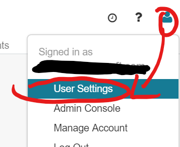
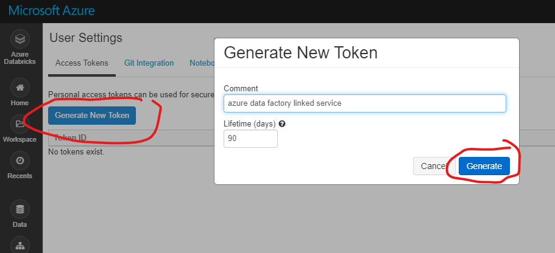
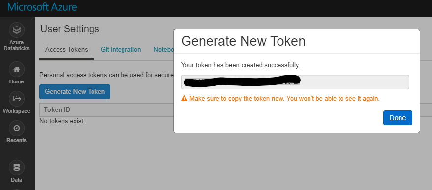
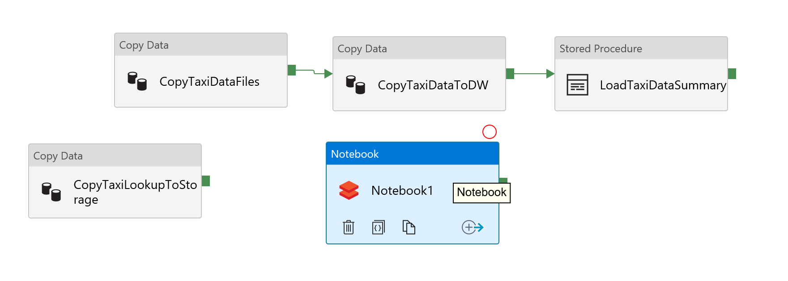
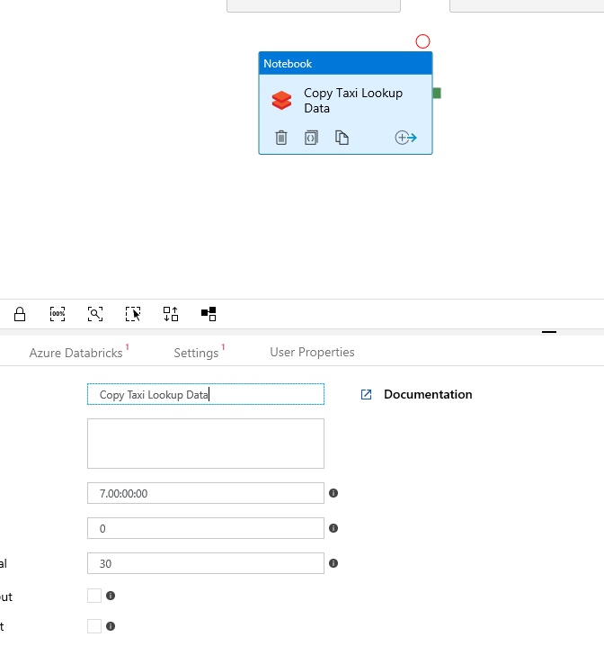
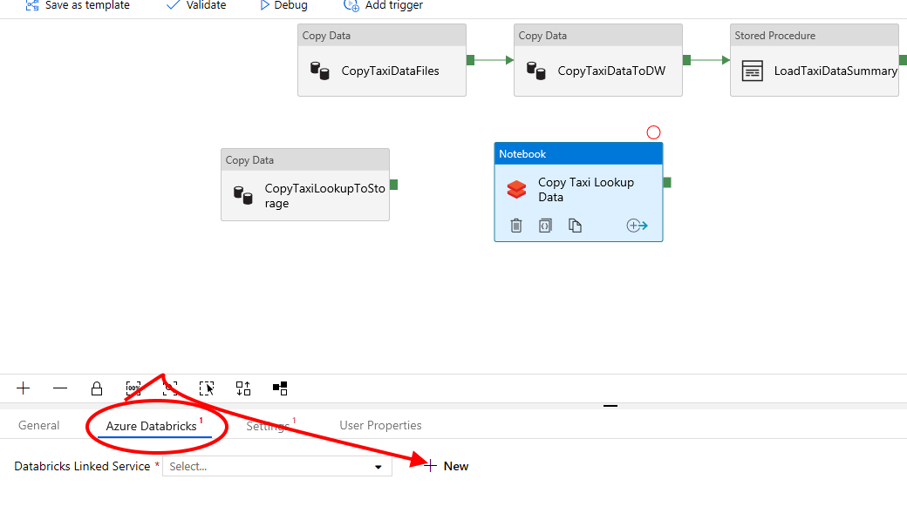
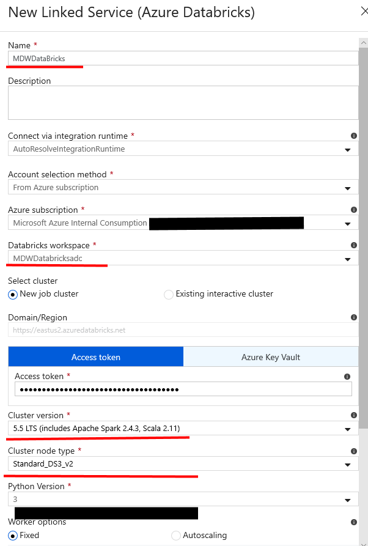
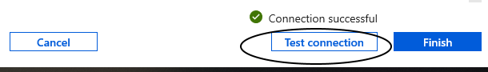
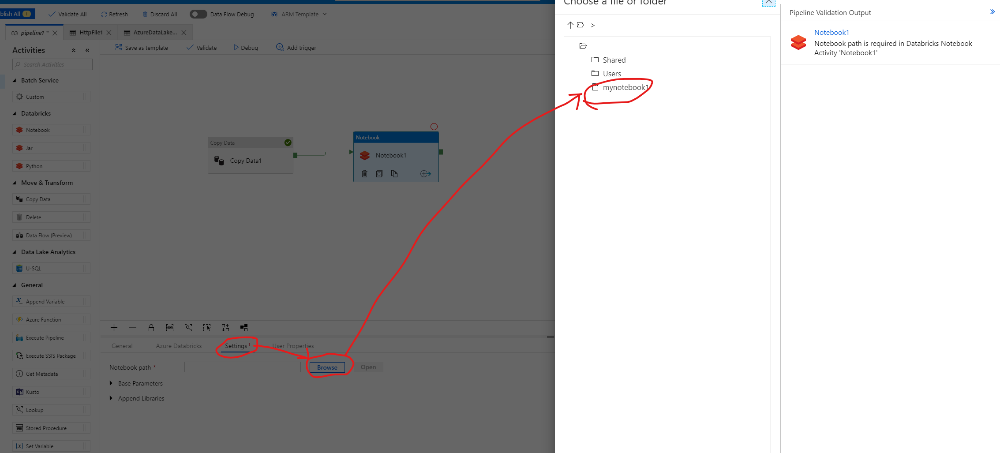
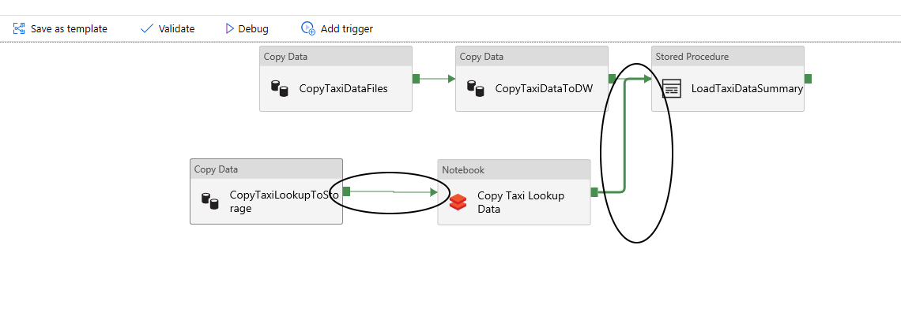

# Add Databricks notebook to pipeline

## Pre-requisite tasks: 
 
 - [Create Azure Data Factory V2 pipeline](copy-file-into-adls-gen2.md)

 - [Develop Azure Databricks notebook](../azure-databricks/develop-databricks-notebook.md)

## Task: Add Azure Databricks notebook activity to pipeline

1. In Azure Databricks workspace, click the user icon, then click **User settings**.

    

1. Click **Generate New Token**, enter a comment, and click **Generate**.

    

1. Copy the new token to notepad for later use.

    > **NOTE:** YOU ONLY HAVE ONE OPPORTUNITY TO SAVE THIS VALUE.

    

1. In the Azure Data Factory pipeline workspace, drag and drop the **Databricks Notebook** activity.

    

1. Name the activity **Copy Taxi Lookup Data** 
   
	

1. Click on the notebook activity, click the **Azure Databricks** tab, then **+ New** to configure the linked service.

    

1. Select **From subscription**, choose your subscription, select **Access token**, select **New job cluster**, enter your Databricks access token, configure the Spark cluster, click **Test connection**, then click **Finish**. 

    - Cluster version: *Select **5.5 LTS (includes Apache Spark 2.4.3, Scala 2.11)***
    
    - Cluster node type: *Select **Standard_DS3_V2***
    
    - Python Version: *3*
    
    - Worker options: *1*

    > **NOTE:** New job cluster will provision new clusters for the pipeline activity then terminate as soon as the activity is complete.

    
    

1. Click on the **Settings** tab and configure the notebook path

    

1. Connect the copy and notebook activities.

    

1. Publish the pipeline

    > **NOTE**: Make sure your data warehouse is running before executing this command.

1.	Publish your pipeline changes by clicking the **Publish all** button.

    

1.	To execute the pipeline, click on **Add trigger** menu and then **Trigger Now**.
1.	On the **Pipeline Run** blade, click **Finish**.

    

1.	To monitor the execution of your pipeline, click on the **Monitor** menu on the left-hand side panel.
1.	You should be able to see the Status of your pipeline execution on the right-hand side panel.

    

1.	Click the **View Activity Runs** button for detailed information about each activity execution in the pipeline. The whole execution should last between 7-8 minutes.

    
    

## Task: Visualize Data Using Power BI    
 1.  If you have not done so, [download Power BI Desktop]
     [Download sample report](media/PowerBi/MDWDataVisualization.pbit)
     Open the downloaded report

	 

     - **Server name**: edumdwsqlserver+YOURINITIALS.database.windows.net

     - **Authentication**: Database
     - **User Name**: EduMdwAdmin
     - **Password**: P@$$word123

    This the report view

   
       
    

## Next task: [Stream Cognitive Services Real Time](../azure-logic-app/steam-ai-tweeter.md)

[download Power BI Desktop]:https://www.microsoft.com/en-us/download/details.aspx?id=45331

