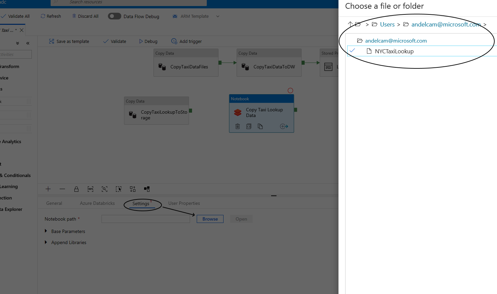

# Add Databricks notebook to pipeline

## Pre-requisite tasks: 
 
 - [Create Azure Data Factory V2 pipeline](copy-file-into-alds-gen2.md)

 - [Develop Azure Databricks notebook](../azure-databricks/develop-databricks.notebook.md)

## Task: Add Azure Databricks notebook activity to pipeline

1. In Azure Databricks workspace, click the user icon, then click **User settings**.

    

1. Click **Generate New Token**, enter a comment, and click **Generate**.

    

1. Copy the new token to notepad for later use.

    > **NOTE:** YOU ONLY HAVE ONE OPPORTUNITY TO SAVE THIS VALUE.

    

1. In the Azure Data Factory pipeline worksare, drag and drop the **Databricks Notebook** activity.

    

1. Click on the notebook activity, click **Azure Databricks**, then **+ New** to configure the linked service.

    

1. Select **From subscription**, choose your subscription, select **Access token**, select **New job cluster**, enter your Databricks access token, configure the Spark cluster, test the connection, and click **Finish**.

    > **NOTE:** New job cluster will provision new clusters for the pipeline activity then terminate as soon as the activity is complete.

    

1. Click on the **Settings** tab and configure the notebook path

    

1. Connect the copy and notebook activities.

    

1. Publish the pipeline and click debug to run.

## Next task: [Verify data]()