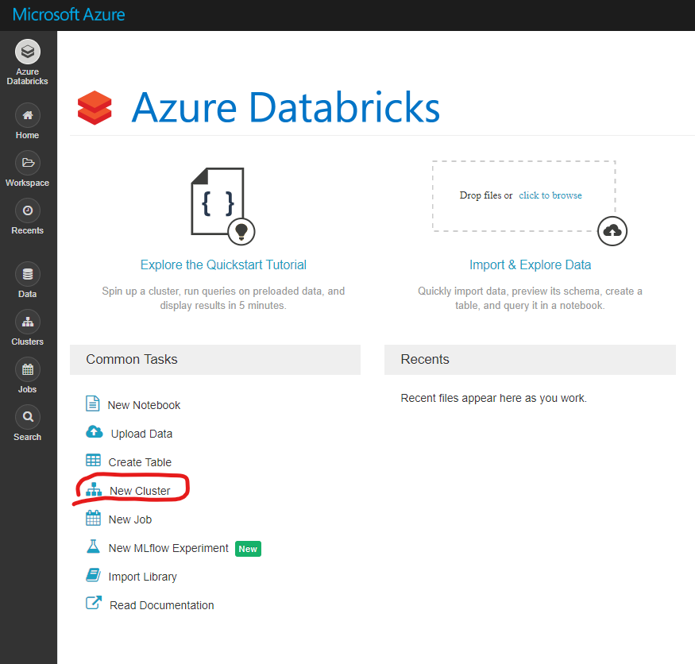
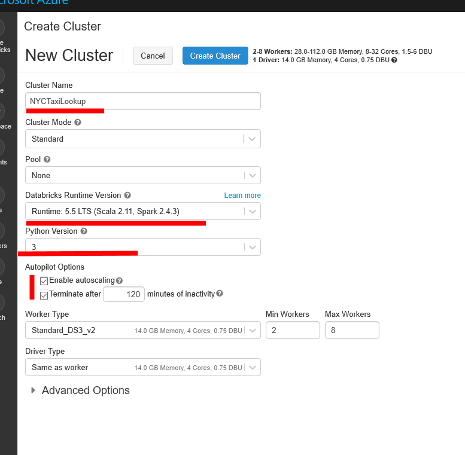

# Create Spark Cluster

## Pre-requisite task: [Create Azure Databricks](azure-databricks/provision-azure-databricks.md)

## Task: Create new Spark cluster

1. In the Databricks home page, click the **New Cluster** link under **Common Tasks**

    
    
1. Enter a cluster name, uncheck **Enable autoscaling**, ensure **Terminate after** is checked and reduce the number of workers to **2**. You can default the rest of the settings. Click **Create Cluster**.

    

1. Wait for the cluster to be created.

    

## Next task: [Create workspace](create-workspace.md)