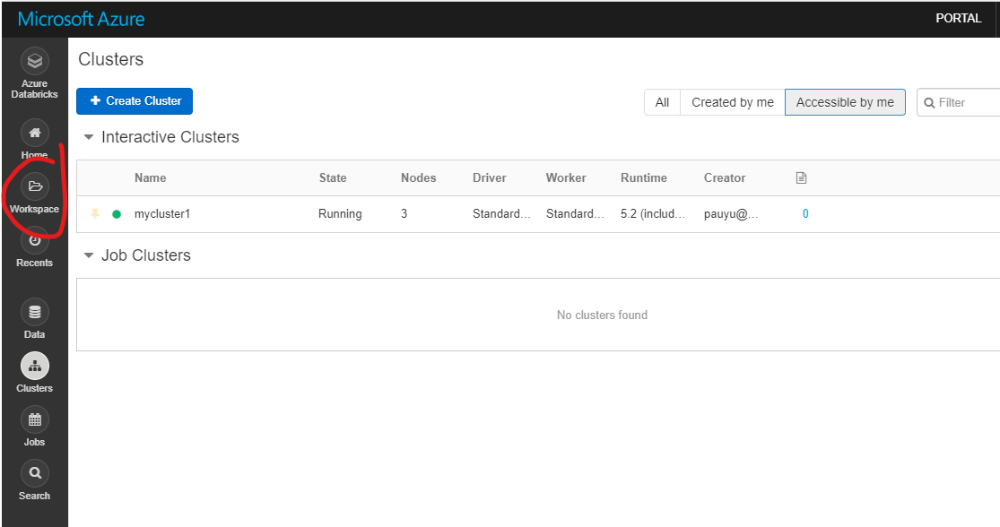
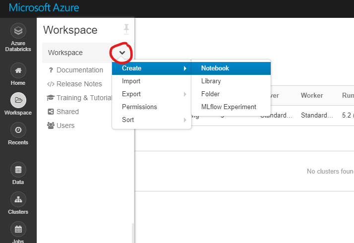
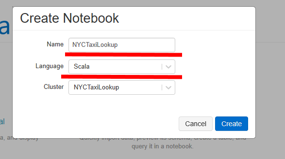

# Create Workspace

## Pre-requisite task: [Create Azure Databricks](azure-databricks/provision-azure-databricks.md)

## Task: Create new Azure Databricks workspace

1. In the Databricks navigation pane (on the left), click on the **Workspace** button

    

1. In the Workspace pane, click the *down* arrow to expand the menu, then navigate to **Create** and **Notebook**

    

1. Enter notebook name and click **Create**

    

## Next task: [Develop Azure Databricks notebook](develop-databricks-notebook.md)