# Add AI to your Big Data Pipeline with Cognitive Services

## Pre-requisite task: [Provision Azure Databricks](provision-azure-databricks.md)

## Task: Provision Azure Congnitive Services

1. In the [Azure Portal](https://portal.azure.com), click **+Create a resource** link at top left of the page

1. In the Azure Marketplace search bar, type **cognitive services** and click on **cognitive services** that appears in the drop down list

    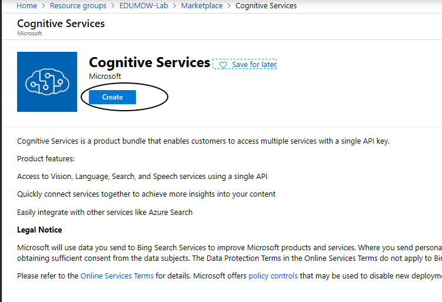

1. Configure service
  
    <br> - **Name**: mdwVisionServices
    <br> - **Location**: Your Location
    <br> - **Pricing Tier**: S0
    <br> - **Resource Group**: EDUMDW-Lab

 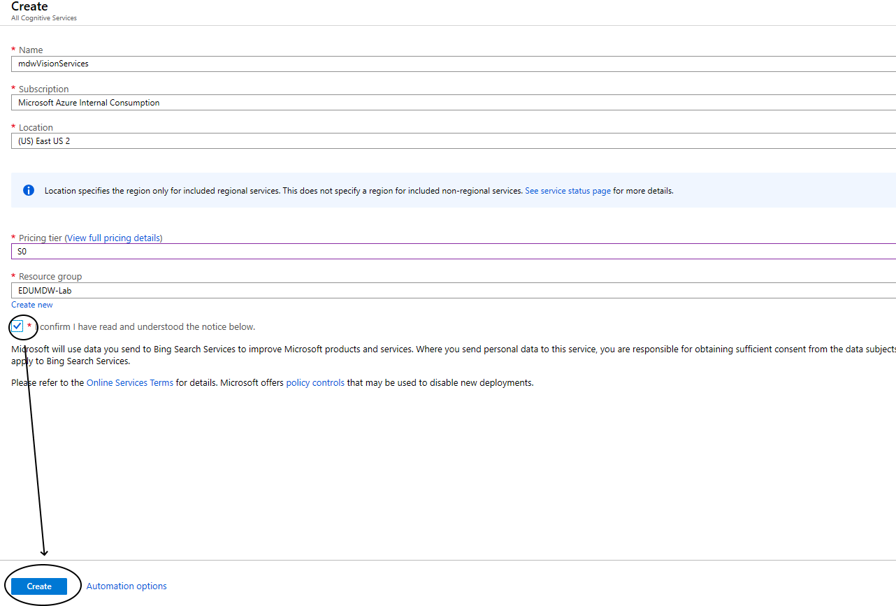


## Task: Provision Azure Cosmos DB

1. In the [Azure Portal](https://portal.azure.com), click **+Create a resource** link at top left of the page

1. In the Azure Marketplace search bar, type **cosmos db** and click on **cognitive services** that appears in the drop down list

    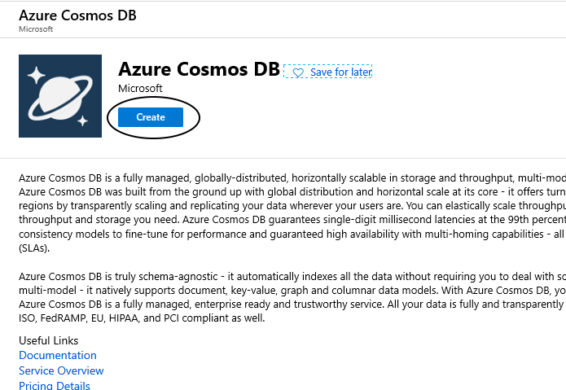

1. Configure service
  
    <br> - **Name**: mdwcosmosdb+YourInitials
    <br> - **Location**: Your Location   
    <br> - **Resource Group**: EDUMDW-Lab
    <br> - **API**: (Core SQL)

     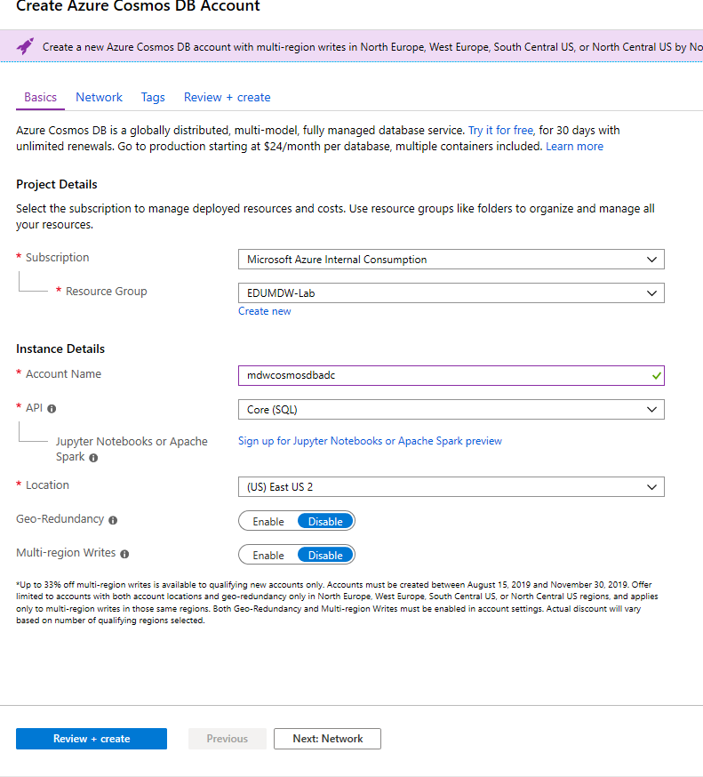

1. Once your resource is completed, go to the resource

    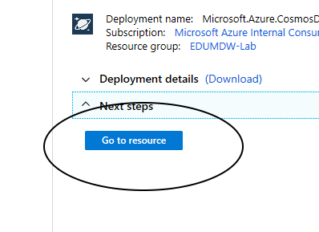

1.- Click on the **Overview** blade, then **+ Container**
  
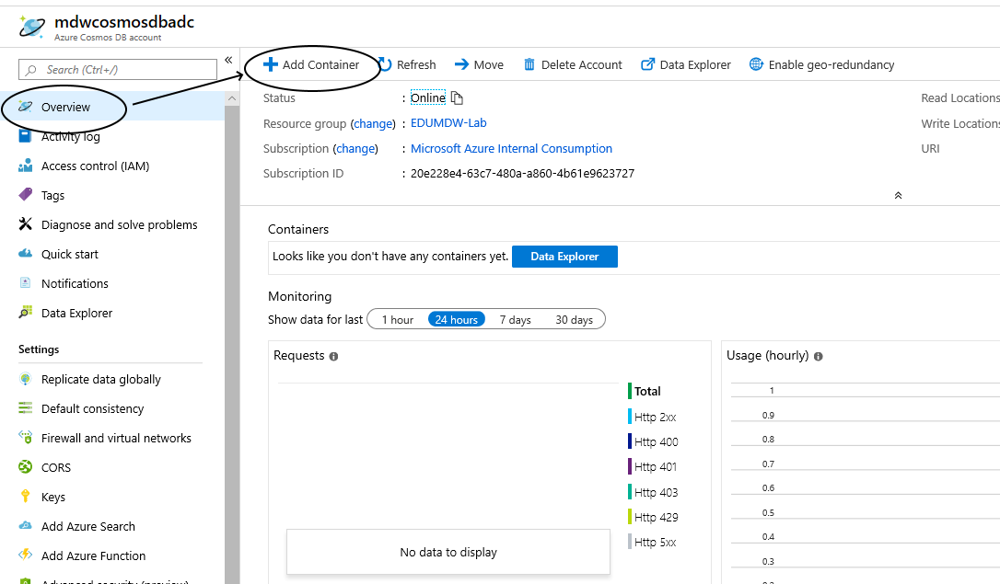

1. Enter the following information

   <br>- **Database id > Create new**: NYC
    <br>- **Container id**: ImageMetadata
    <br>- **Partition key**: /requestId
    <br>- **Throughput**: 400
    <br>- **Unique keys**: /requestId

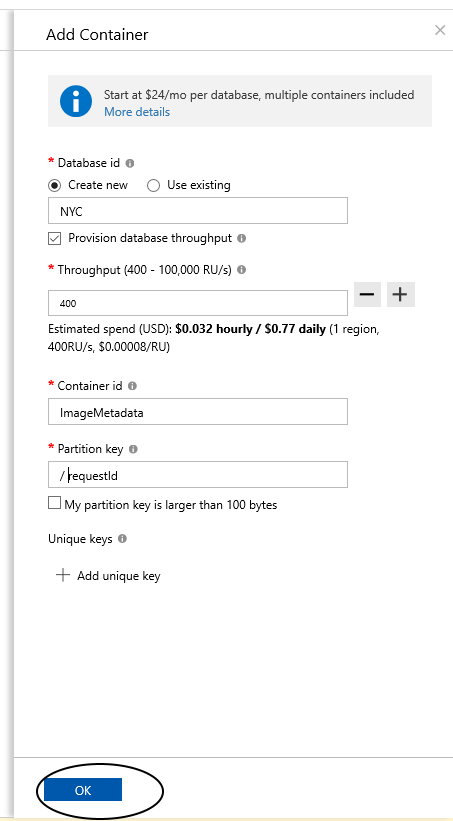

1.	Click **OK** to create the container

## Import Databricks Notebook to Invoke Computer Vision Cognitive Services API
In this section you will import a Databricks notebook to your workspace and fill out the missing details about your Computer Vision API and your Data Lake account. This notebook will be executed from an Azure Data Factory pipeline and it will invoke the Computer Vision API to generate metadata about the images and save the result back to your data lake.

1.	On the Azure Databricks portal, click the **Workspace** button on the left-hand side menu. 
1.	On the **Workspace** blade, click your username under the **Users** menu.
1.	On the **Users** blade, click the arrow next to your user name and then **Import**.

   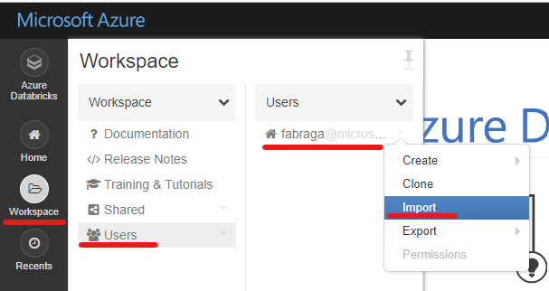

1.	On the **Import Notebooks** pop up window, select **Import from: URL**. Copy and paste the URL below in the box:

```url
https://github.com/fabragaMS/ADPE2E/raw/master/Lab/Lab4/NYCImageMetadata-Lab.dbc
```

5.	Click **Import**.

6.	On the NYCImageMetadata-Lab notebook, go to Cmd 2 cell **Define function to invoke Computer Vision API**. You will need to change the function code to include the Computer Vision API details.

    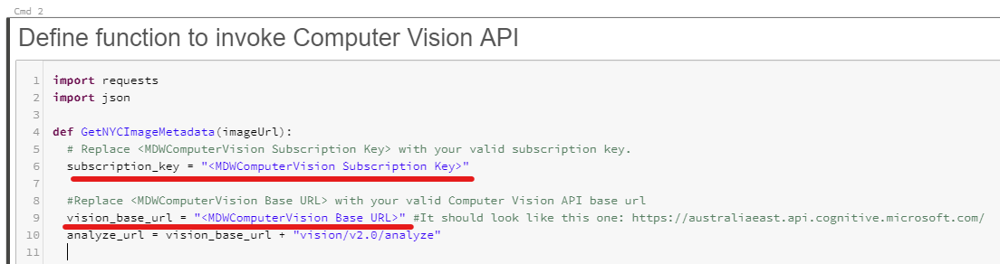

7.	From the Azure Portal, retrieve the MDWComputerVision subscription key and base endpoint URL.

    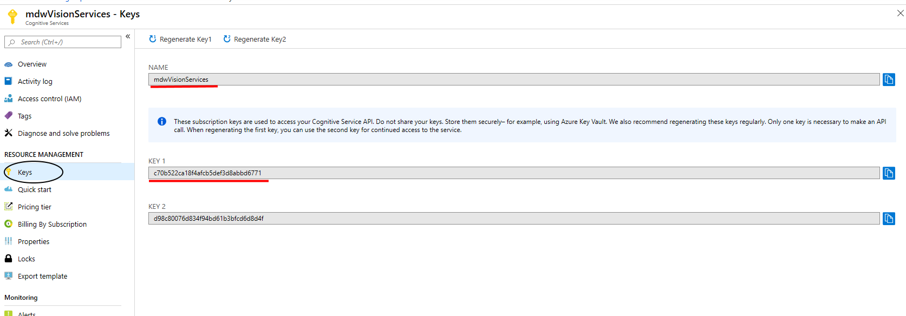
    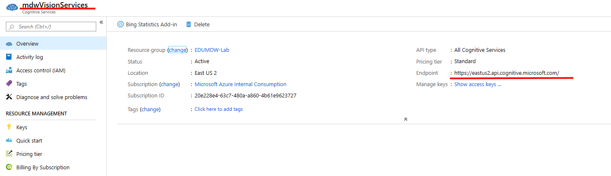

8.	Copy and paste the Key and Endpoint values back in the Databricks notebook.

    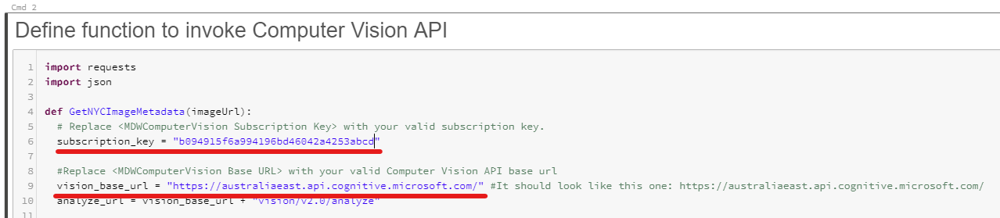

9.	On the NYCImageMetadata-Lab notebook, go to Cmd 3 cell **Define function to mount NYC Image Metadata Container**. You will need to change the function code to include your storate account details.

10.	In the **storage account anme** variable assignment replace *&lt;EduMDWStorageAccount storage account name&gt;* with **edumdwstorage*+YourInitials***.

    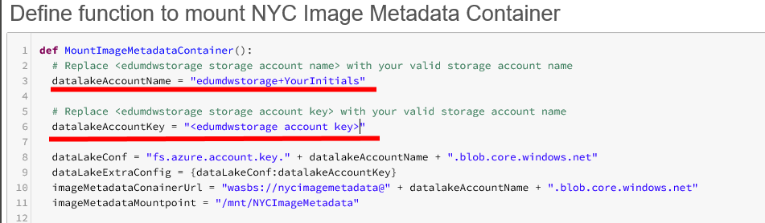

11.	From the Azure Portal, retrieve the **edumdwstorage+YourInitials** access key.

    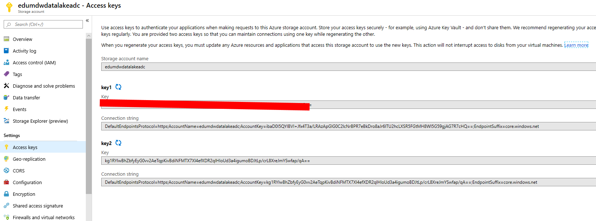

12.	Copy and paste the Access Key Databricks notebook. Replace *&lt;EduMDWDStorage storage account key&gt;* with the Access Key you got from the previous step.

    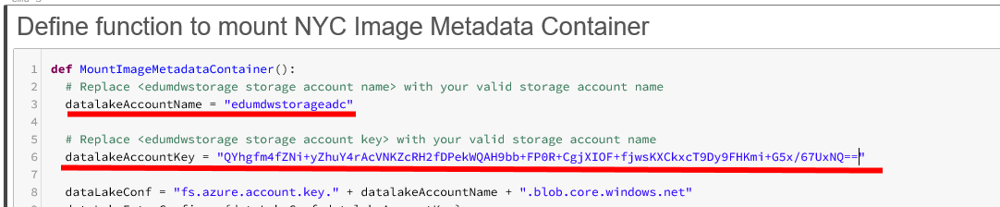

13.	Attach the notebook to your previously created **MDWDatabricksCluster** cluster.

    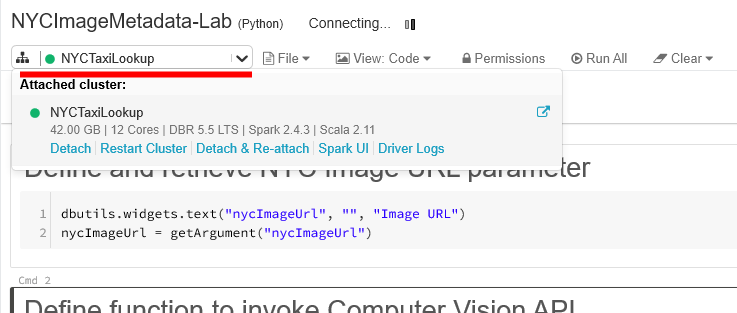

14.	Review the notebook code.

15.	If you want to test it, you can copy any publicly available image URL and paste it in the Image URL notebook parameter. You can use any of the following image URLs in the list as examples:
16. 
Test URLS
<br> - https://petlifetoday.com/wp-content/uploads/2018/06/wireless-dog-fence.jpg
<br> - https://static.pexels.com/photos/4204/nature-lawn-blur-flower.jpg
<br> - https://image.redbull.com/rbcom/052/2017-05-22/89eef344-d24f-4520-8680-8b8f7508b264/0012/0/0/0/2428/3642/800/1/best-beginner-motocross-bikes-ktm-250-sx-f.jpg
<br> - http://www.kiplinger.com/slideshow/investing/T024-S001-the-best-emerging-markets-stocks-for-2019/images/intro.jpg

16.	Click Run All to execute the notebook.

    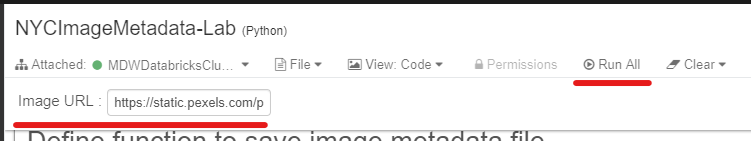

17.	After a successful execution you will notice that a new JSON file has been saved in the **NYCImageMetadata** container in your Data Lake. 

    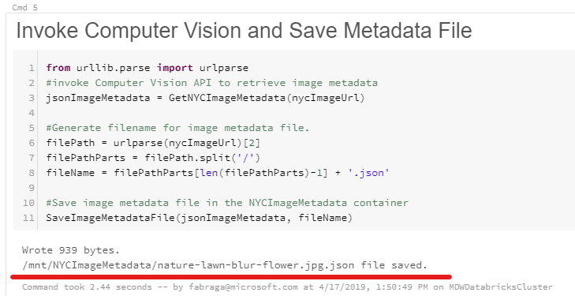

18.	Navigate to Azure Portal and check the contents of the **nycimagemetadata** container in your **EDUMDWStorage*+YourInitials*** storage account.

19.	Download the file generated to inspect its contents.

20.	**IMPORTANT**: Delete this test file before moving to next steps of this exercise.

    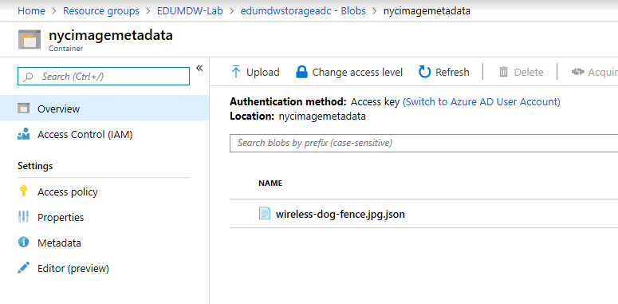


