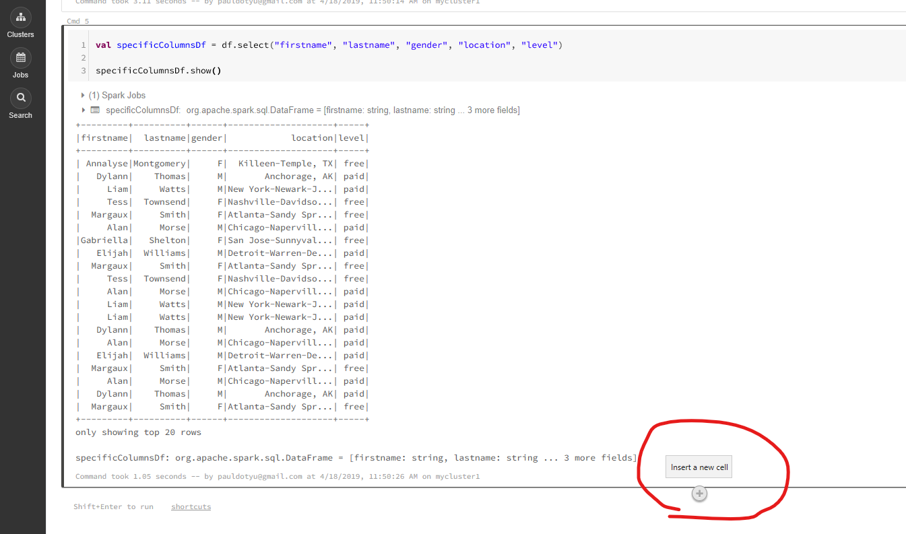
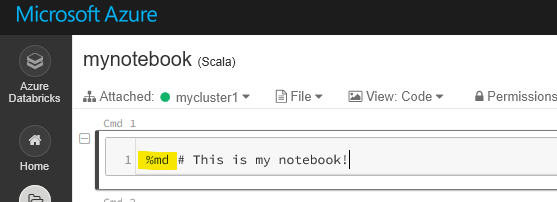
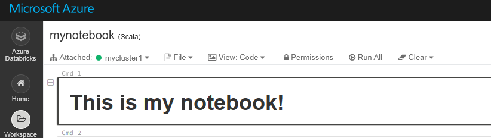

# Develop Azure Databricks notebook

## Pre-requisite tasks: 
 
 - [Create SQL Data Warehouse](../azure-sql-datawarehouse/provision-azure-sql-data-warehouse.md)

 - [Create workspace](provision-azure-sql-data-warehouse.md)

## Task: Transform data using Azure Databricks notebook

> **NOTE:** See reference links below for notebook and markdown syntax guidance.

1. Click on the **Workspace** button in the navigation page and click on your notebook.

    

1. In the notebook, enter the following bits of code into new cells and click the play button and **Run Cell** to execute the command against your Spark cluster.

    > **NOTE:** You'll need to be sure your notebook is attached to your cluster. You can check in the upper left corner of the notebook pane directly under the notebook name. If the notebook states **Detached** you can click the drop down to select a cluster to run against. 

    

1. For each command listed below, you can enter them into new cells. To create a new cell, hover your mouse over the bottom edge of the cell to enable the **plus** icon. Clicking this will allow you to add a new cell.

    

1. You can also add **markdown** to your cells to document the data transformation steps taken along the way. To add markdown, simply begin the cell contents with `%md` and enter your markdown.

    

    

1. Proceed to enter the following code in new cells and run along the way to view the data:

    - ### Configure Spark to authenticate against ALDS using SPN and Tenant details. 
    
        > These are values you documented in [Task 4: Create Azure Service Principal](../azure-ad-service-principal/create-service-principal.md)

        ```
        spark.conf.set("fs.azure.account.auth.type.<ENTER_YOUR_ALDS_STORAGE_ACCOUNT_NAME>.dfs.core.windows.net", "OAuth")
        spark.conf.set("fs.azure.account.oauth.provider.type.<ENTER_YOUR_ALDS_STORAGE_ACCOUNT_NAME>.dfs.core.windows.net", "org.apache.hadoop.fs.azurebfs.oauth2.ClientCredsTokenProvider")
        spark.conf.set("fs.azure.account.oauth2.client.id.<ENTER_YOUR_ALDS_STORAGE_ACCOUNT_NAME>.dfs.core.windows.net", "<ENTER_YOUR_SPN_APPLICATION_ID>")
        spark.conf.set("fs.azure.account.oauth2.client.secret.<ENTER_YOUR_ALDS_STORAGE_ACCOUNT_NAME>.dfs.core.windows.net", "<ENTER_YOUR_SPN_APPLICATION_SECRET>")
        spark.conf.set("fs.azure.account.oauth2.client.endpoint.<ENTER_YOUR_ALDS_STORAGE_ACCOUNT_NAME>.dfs.core.windows.net", "https://login.microsoftonline.com/<ENTER_YOUR_TENANT_ID>/oauth2/token")
        ```

    - ### Read JSON file using Azure Blob Filesystem (ABFS) driver. 
    
        > File system is what you entered in the file path text box while configuring the sink in [Task 7: Build copy pipeline using Azure Data Factory](../azure-data-factory-v2/copy-file-into-adls-gen2.md)

        ```
        val df = spark.read.json("abfss://<ENTER_YOUR_FILE_SYSTEM_NAME>@<ENTER_YOUR_ALDS_STORAGE_ACCOUNT_NAME>.dfs.core.windows.net/small_radio_json.json")
        ```

    - ### Display the data.

        ```
        df.show()
        ```

    - ### Load only specific columns.

        ```
        val specificColumnsDf = df.select("firstname", "lastname", "gender", "location", "level")
        
        specificColumnsDf.show()
        ```

    - ### Rename a column.

        ```
        val renamedColumnsDF = specificColumnsDf.withColumnRenamed("level", "subscription_type")
        
        renamedColumnsDF.show()
        ```
    - ### Configure access to storage account for temporary storage. 
    
        > These are values you documented in [Task 2: Create Azure Blob Storage](../azure-storage/provision-azure-storage-account.md)

        ```
        val blobStorage = "<ENTER_YOUR_BLOB_STORAGE_ACCOUNT_NAME>.blob.core.windows.net"
        val blobContainer = "<ENTER_YOUR_BLOB_CONTAINER_NAME>"
        val blobAccessKey =  "<ENTER_YOUR_BLOB_STORAGE_ACCOUNT_KEY>"
        ``` 

    - ### Configure temporary directory using Windows Azure Storage Blob (WASB) driver.

        ```
        val tempDir = "wasbs://" + blobContainer + "@" + blobStorage +"/tempDirs"
        ```
    
    - ### Configure account access.

        ```
        val acntInfo = "fs.azure.account.key."+ blobStorage
        
        sc.hadoopConfiguration.set(acntInfo, blobAccessKey)
        ```

    - ### Configure access to SQL Datawarehouse. 
    
        > These are the values you documented in [Task 5: Create Azure SQL Data Warehouse](../azure-sql-datawarehouse/provision-azure-sql-data-warehouse.md)

        ```
        val dwDatabase = "<ENTER_YOUR_DW_SERVER_NAME>"
        val dwServer = "<ENTER_YOUR_DW_SERVER_NAME>.database.windows.net"
        val dwUser = "<ENTER_DB_USERNAME>"
        val dwPass = "<ENTER_DB_PASSWORD>"
        val dwJdbcPort =  "1433"
        val dwJdbcExtraOptions = "encrypt=true;trustServerCertificate=true;hostNameInCertificate=*.database.windows.net;loginTimeout=30;"
        val sqlDwUrl = "jdbc:sqlserver://" + dwServer + ":" + dwJdbcPort + ";database=" + dwDatabase + ";user=" + dwUser+";password=" + dwPass + ";$dwJdbcExtraOptions"
        val sqlDwUrlSmall = "jdbc:sqlserver://" + dwServer + ":" + dwJdbcPort + ";database=" + dwDatabase + ";user=" + dwUser+";password=" + dwPass
        ```

    - ### Load transformed data into SQL Datawarehouse.

        > **NOTE**: Make sure your data warehouse is running before executing this command.

        ```
        spark.conf.set(
            "spark.sql.parquet.writeLegacyFormat",
            "true")

        renamedColumnsDF.write
            .format("com.databricks.spark.sqldw")
            .option("url", sqlDwUrlSmall) 
            .option("dbtable", "SampleTable")
            .option( "forward_spark_azure_storage_credentials","True")
            .option("tempdir", tempDir)
            .mode("overwrite")
            .save()
        ```

### Reference: https://docs.databricks.com/user-guide/notebooks/notebook-use.html
### Reference: https://www.markdownguide.org/basic-syntax

## Next task: [Update Azure Data Factory pipeline to transform data using Databricks](../azure-data-factory-v2/transform-data-using-databricks.md)