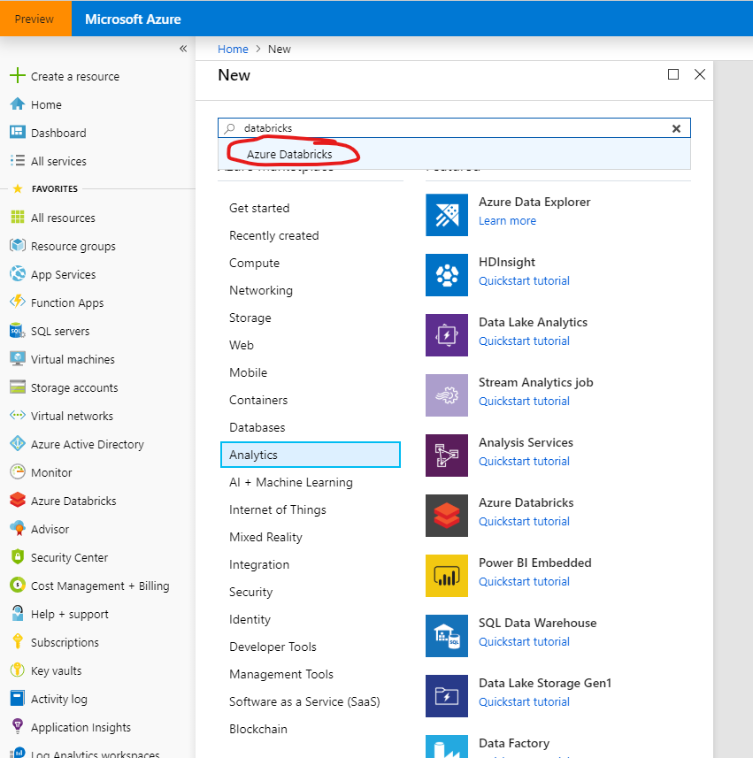
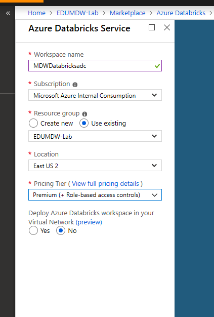
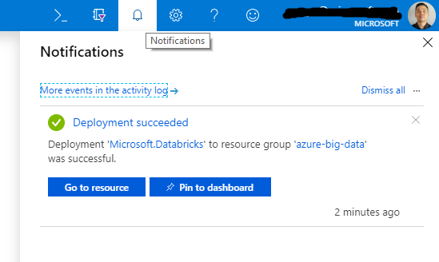
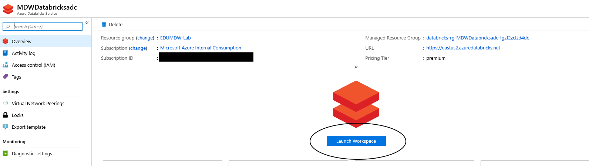

# Provision Azure Databricks

## Pre-requisite task: [Create Azure Resource Group](../azure-resource-group/create-resource-group.md)

## Task: Provision Azure Databricks service

1. In the [Azure Portal](https://portal.azure.com), click **+Create a resource** link at top left of the page

1. In the Azure Marketplace search bar, type **databricks** and click on **Azure Databricks** that appears in the drop down list

    

1. Click the **Create** button from the Azure Databricks page.

1. Enter the following and click the **Create** button:
     - **Workspace name**: MDWDatabricksYourInitials
     - **Subscription**: *Select your subscription*
     - **Resource Group**: EDUMDW-Lab
     - **Location**: *Select your location*

 
        

1. Check the **Notifications** icon in the upper right and wait until you see **Deployment succeeded** then click the **Go to resource** button.

    

1. Click on the **Launch Workspace** button to navigate to the Azure Databricks workspace. This is where ETL/ELT will take place.

    

## Next task: [Create Spark cluster](create-spark-cluster.md)