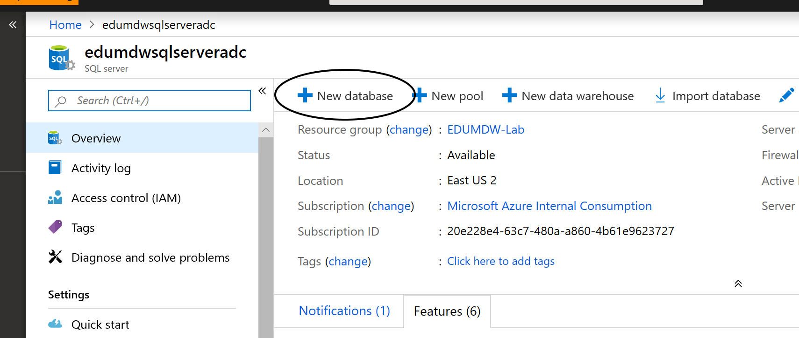

# Use Logic Apps to Read Tweeter feeds with Cognitive Services

## Pre-requisite task: [Create Azure SQL Data Warehouse](../azure-sql-datawarehouse/provision-azure-sql-data-warehouse.md)

## Task: Provision Azure Congnitive Services

1. In the [Azure Portal](https://portal.azure.com), click **+Create a resource** link at top left of the page

1. In the Azure Marketplace search bar, type **cognitive services** and click on **cognitive services** that appears in the drop down list

    

1. Configure service
  
    <br> - **Name**: mdwVisionServices
    <br> - **Location**: Your Location
    <br> - **Pricing Tier**: S0
    <br> - **Resource Group**: EDUMDW-Lab

 


## Task: Provision SQL Server Database

1. Navigate to the EduMdmSqlServer+YourInitials

1. In the top menu click on the **+ New Database**

    

1. Configure Database
  
    <br> - **Name**: tweeterDatabase
    <br> - **Select Source**: Blank database   
    
     

1. Once your resource is completed, the database will show on the list of databases for the server, click on the newly created database

    

1.-Enter your credentials
  


1. In the query window copy the following SQL statment and click Run

```sql
 CREATE TABLE [dbo].[TweeterDetails](
	[CreatedAt] [datetime] NULL,
	[SentimentScore] [float] NULL,
	[TweetText] [varchar](300) NULL,
	[TweetId] [varchar](300) NULL,
	[Location] [varchar](300) NULL
) ON [PRIMARY]
GO
```

## Task: Provision Azure Logic Apps

1. In the [Azure Portal](https://portal.azure.com), click **+Create a resource** link at top left of the page

1. In the Azure Marketplace search bar, type **logic app** and click on **Logic Apps** that appears in the drop down list

    

1. Configure service
  
    <br> - **Name**: EduMdwLocicApp+YourInitials
    <br> - **Location**: Your Location    
    <br> - **Resource Group**: EDUMDW-Lab

 

1. Once the resource is ready, click on go to resource
  
  

1. Edit the app

 

1. Select the trigger **When a new tweet is posted**

 

1. Click on connect and follow the instructions to link your tweeter account

  
  

1. Select filter to #NYC every 10 minutes

  <br> - **Search text**: #NYC
  <br> - **Interval**: 10

  

1. Click in New Step, and search for detect sentiment

  

1. Configure cognitive services account

  <br> -**Connection name**: Cognitive Services
  <br> -**Account Key**: *Cognitive Services Key**
  <br> - **Site URL**: *your coginitive services end point**

1. Once configured, select the parameters you want to use

  

  
1. Click on Add Action and select **SQL**
   
   

1. Select Insert Row (v2)

   

1. Configure your sql db connection

  <br> - **Connection name**: edumdwsqlserver
  <br> -  Select your sql server
  


1. A list of available databases on the server will be displayed, select TwitterDatabase
  
  <br> - **User Name**:EduMdwAdmin
  <br> - **Password**:P@$$word123
  
  Click create

  

1. Fill the data from the dropdown boxes
 
 

1. Select parameters from the drop down box:

 

1. Save your logic app


1. Run the logic app


## Next task: [View Data](../Power-bi/visualize-data.md)
