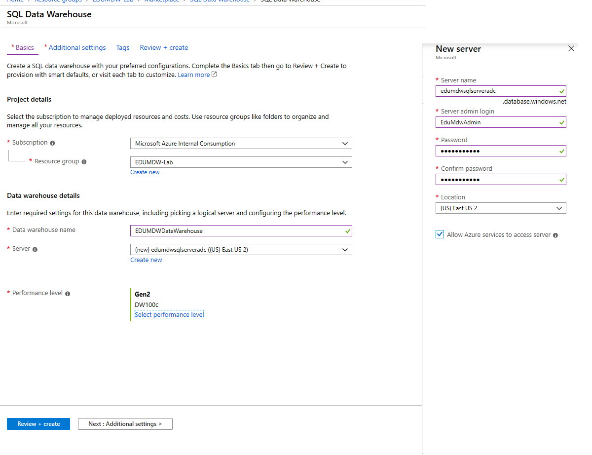
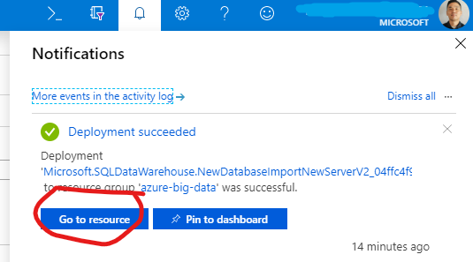
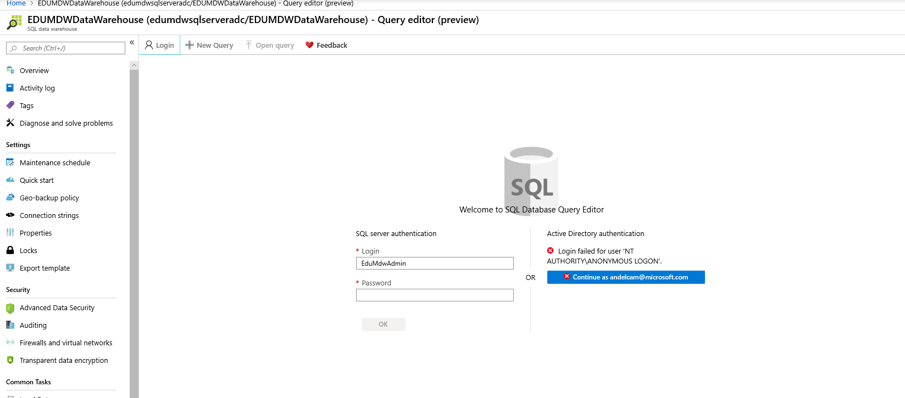
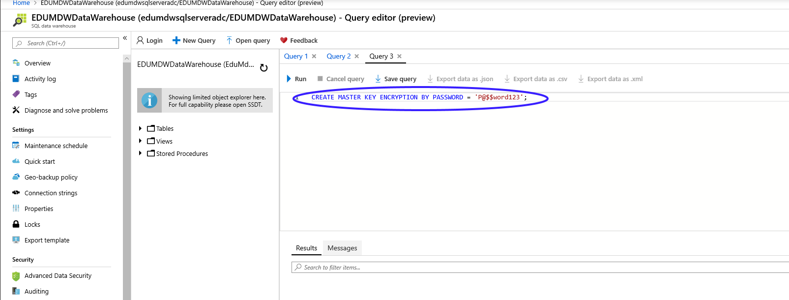
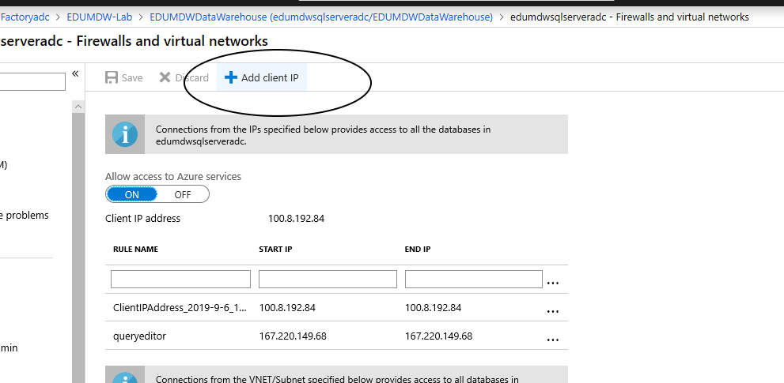
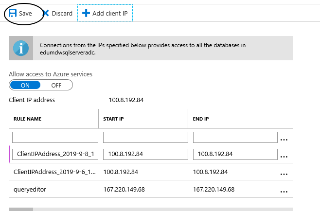
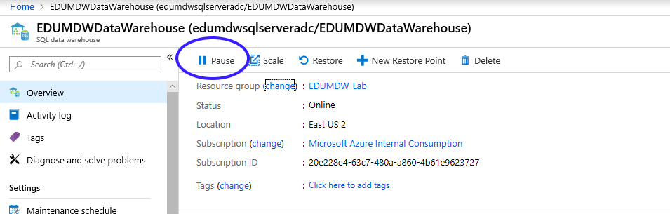

# Provision Azure SQL Data Warehouse

## Pre-requisite task: [Create Azure Resource Group](../azure-resource-group/create-resource-group.md)

## Task: Create Azure SQL Data Warehouse

### We'll be creating this resource to store our cleaned data which will be loaded from our Azure Databricks notebook.

1. In the [Azure Portal](https://portal.azure.com), click **+Create a resource** link at top left of the page.

1. In the Azure Marketplace search bar, type **data warehouse** and click on **SQL Data Warehouse** that appears in the drop down list

    

1. Click the **Create** button.

1. Enter the following and click **Create**:
    <br> - **Name**: EDUMDWDataWarehouse
    <br> - **Subscription**: *Select your subscription*
    <br> - **Resource Group**: EDUMDW-Lab
    <br> - **Select source**: *Select Blank database*
    <br> - **Server**: *Click on **Configure required settings** and click the **Create a new server** button, configure the server details then click on the **Select** button in the **New server blade**.*
    <br> - **Server name**: edumdwsqlserver+YOURINITIALS
    <br> - **User Name**: EduMdwAdmin
    <br> - **User Password**: P@$$word123
        
        

    - Click the **Create** button at the bottom of the SQL Data Warehouse blade.
    
1. Check the **Notifications** icon in the upper right and wait until you see **Deployment succeeded** then click the **Go to resource** button.

    

1. Navigate to the **Query editor** blade and login using your server credentials
      <br> - **User Name**: EduMdwAdmin
      <br> - **User Password**: P@$$word123

    

1. In the query editor, enter the following command and click the **Run** button

        CREATE MASTER KEY ENCRYPTION BY PASSWORD = 'P@$$word123';
        
    

1. Create a new round robin distributed table named Staging.NYCTaxiData. Use the script below:

```sql
create schema [Staging]
go

create schema [NYC]
go

create table [Staging].[NYCTaxiData]
(
    [VendorID] [int] NULL,
    [tpep_pickup_datetime] [datetime] NULL,
    [tpep_dropoff_datetime] [datetime] NULL,
    [passenger_count] [smallint] NULL,
    [trip_distance] [decimal](8, 2) NULL,
    [RatecodeID] [smallint] NULL,
    [store_and_fwd_flag] [char](1) NULL,
    [PULocationID] [int] NULL,
    [DOLocationID] [int] NULL,
    [payment_type] [smallint] NULL,
    [fare_amount] [decimal](10, 2) NULL,
    [extra] [decimal](10, 2) NULL,
    [mta_tax] [decimal](10, 2) NULL,
    [tip_amount] [decimal](10, 2) NULL,
    [tolls_amount] [decimal](10, 2) NULL,
    [improvement_surcharge] [decimal](10, 2) NULL,
    [total_amount] [decimal](10, 2) NULL
)
with
(
    distribution = round_robin,
    heap
)
go

```

9. Create a new table called Staging.NYCTaxiLocationLookup to host NYC taxi location lookup data. Use the script below:

```sql
create table [Staging].[NYCTaxiLocationLookup]
(
    [LocationID] [int] NULL,
    [Borough] [varchar](200) NULL,
    [Zone] [varchar](200) NULL,
    [service_zone] [varchar](200) NULL
)
with
(
    distribution = round_robin,
    clustered columnstore index
)
```

10. Create a stored procedure that will transform and aggregate data and save the result in a new table called NYC.TaxiDataSummary . Use the script below:

```sql
create procedure Staging.spNYCLoadTaxiDataSummary
as
    --Drop and re-create Staging.idx_NYCTaxiData index
    if (exists(select top 1 1 from sys.indexes where name = 'idx_NYCTaxiData' and object_id = object_id('Staging.NYCTaxiData')))
        drop index idx_NYCTaxiData on Staging.NYCTaxiData 
    
    create index idx_NYCTaxiData on Staging.NYCTaxiData(tpep_pickup_datetime, PULocationID, payment_type, passenger_count, trip_distance, tip_amount, fare_amount, total_amount)

    --Drop and re-create NYC.TaxiDataSummary table
    if (exists(select top 1 1 from sys.objects where name = 'TaxiDataSummary' and schema_id = schema_id('NYC') and type = 'U'))
        drop table NYC.TaxiDataSummary 

    create table NYC.TaxiDataSummary 
    with (
        distribution = round_robin
    )
    as
    select 
        cast(tpep_pickup_datetime as date) as PickUpDate
        , PickUp.Borough as PickUpBorough
        , PickUp.Zone as PickUpZone
        , case payment_type
            when 1 then 'Credit card'
            when 2 then 'Cash'
            when 3 then 'No charge'
            when 4 then 'Dispute'
            when 5 then 'Unknown'
            when 6 then 'Voided trip'
        end as PaymentType
        , count(*) as TotalTripCount
        , sum(passenger_count) as TotalPassengerCount
        , sum(trip_distance) as TotalDistanceTravelled
        , sum(tip_amount) as TotalTipAmount
        , sum(fare_amount) as TotalFareAmount
        , sum(total_amount) as TotalTripAmount
    from Staging.NYCTaxiData
        inner join Staging.NYCTaxiLocationLookup as PickUp
            on NYCTaxiData.PULocationID = PickUp.LocationID
    group by cast(tpep_pickup_datetime as date) 
        , PickUp.Borough
        , PickUp.Zone
        , payment_type

    --drop index idx_NYCTaxiData so it does not impact future loads
    drop index idx_NYCTaxiData on Staging.NYCTaxiData
go
```

11. Grant access to your computer to the SQL server

Click on the overview blade and click on the server name link

 

Click on the link show firewall settiings

 

Click in the Add Button



Click Save




12. Make sure to click on the **Pause** button to ensure you are not being billed while the not actively working with the Data Warehouse. We'll turn this on when ready.

    

## Next task: [Create Azure Data Factory V2](../azure-data-factory-v2/provision-azure-data-factory-v2.md)
