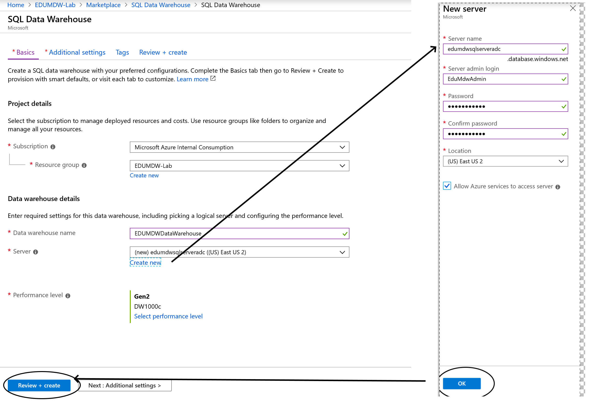
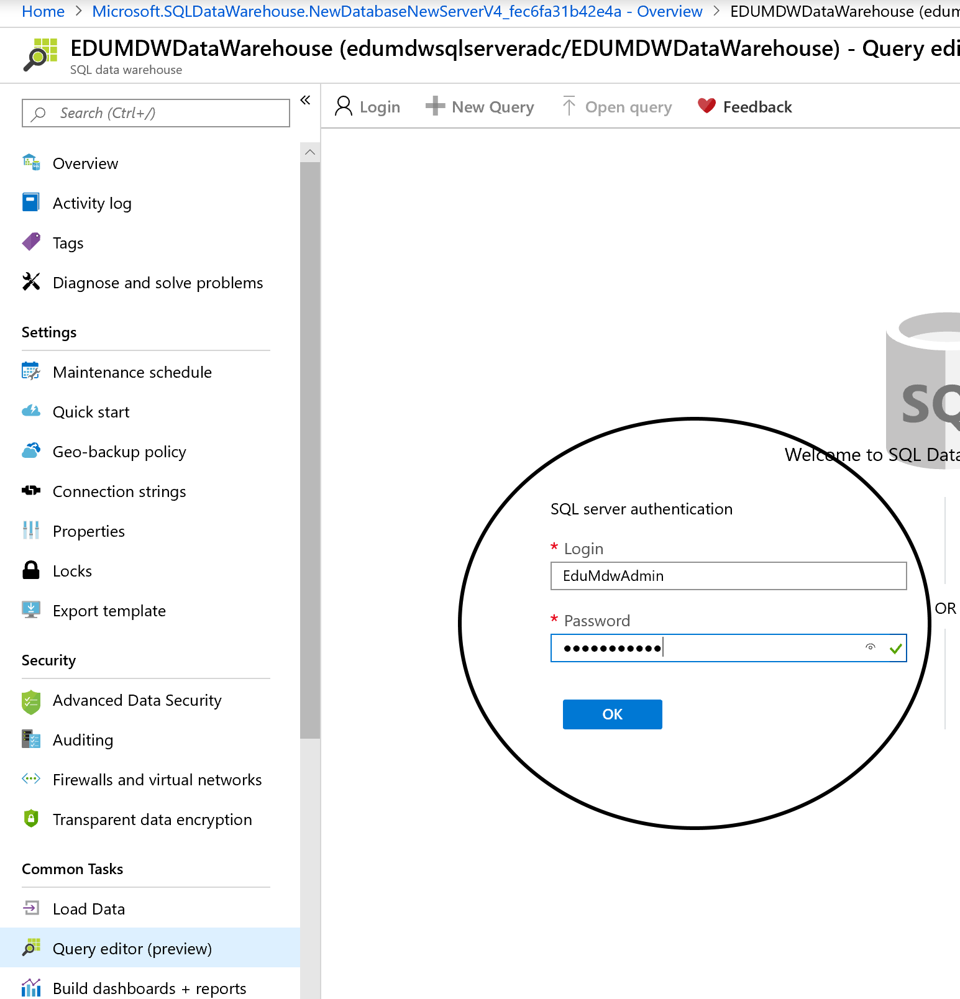
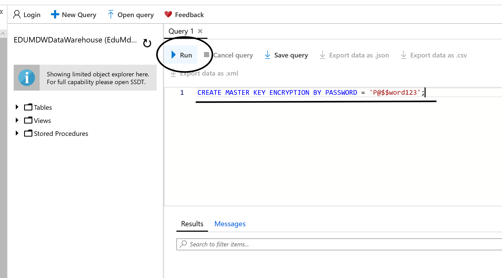

# Provision Azure SQL Data Warehouse

## Pre-requisite task: [Create Azure Resource Group](../azure-resource-group/create-resource-group.md)

## Task: Create Azure SQL Data Warehouse

### We'll be creating this resource to store our cleaned data which will be loaded from our Azure Databricks notebook.

## Task: Provision Data Warehouse & SQL Server
1. In the [Azure Portal](https://portal.azure.com), click **+Create a resource** link at top left of the page.

1. In the Azure Marketplace search bar, type **data warehouse** and click on **SQL Data Warehouse** that appears in the drop down list

    

1. Click the **Create** button.

1. Enter the following paramenters:
    <br> - **Name**: EDUMDWDataWarehouse
    <br> - **Subscription**: *Select your subscription*
    <br> - **Resource Group**: EDUMDW-Lab
    <br> - **Select source**: *Select Blank database*
    <br> - **Server**:  *Create a new server*
    <br> - **Server Name**: edumdwsqlserver+YOURINITIALS
    <br> - **Server admin login**: EduMdwAdmin
    <br> - **Password**: P@$$word123
    <br> - **Allow Azure services to access service**: Check the box       



1. Click the **Create** button at the bottom of the SQL Data Warehouse blade.
    
1. Check the **Notifications** icon in the upper right and wait until you see **Deployment succeeded** then click the **Go to resource** button.

    

## Task: Configure Server Credentials & Create Create Data Warehouse Tables & Stored Procedures

1. Navigate to the **Query editor** blade and login using your server credentials

    

1. In the query editor, enter the following command and click the **Run** button

        CREATE MASTER KEY ENCRYPTION BY PASSWORD = 'P@$$word123';
        
    

1.	On the new query window, create a new database schema named [NYC]. Use this SQL Command:

```sql
create schema [NYC]
go
```
```sql
create schema [Staging]
go

create table [Staging].[NYCTaxiData]
(
    [VendorID] [int] NULL,
    [tpep_pickup_datetime] [datetime] NULL,
    [tpep_dropoff_datetime] [datetime] NULL,
    [passenger_count] [smallint] NULL,
    [trip_distance] [decimal](8, 2) NULL,
    [RatecodeID] [smallint] NULL,
    [store_and_fwd_flag] [char](1) NULL,
    [PULocationID] [int] NULL,
    [DOLocationID] [int] NULL,
    [payment_type] [smallint] NULL,
    [fare_amount] [decimal](10, 2) NULL,
    [extra] [decimal](10, 2) NULL,
    [mta_tax] [decimal](10, 2) NULL,
    [tip_amount] [decimal](10, 2) NULL,
    [tolls_amount] [decimal](10, 2) NULL,
    [improvement_surcharge] [decimal](10, 2) NULL,
    [total_amount] [decimal](10, 2) NULL
)
with
(
    distribution = round_robin,
    heap
)
go

```

1.	Create a new table called Staging.NYCTaxiLocationLookup to host NYC taxi location lookup data. Use the script below:

```sql
create table [Staging].[NYCTaxiLocationLookup]
(
    [LocationID] [int] NULL,
    [Borough] [varchar](200) NULL,
    [Zone] [varchar](200) NULL,
    [service_zone] [varchar](200) NULL
)
with
(
    distribution = round_robin,
    clustered columnstore index
)
```

1.	Create a stored procedure that will transform and aggregate data and save the result in a new table called NYC.TaxiDataSummary . Use the script below:

```sql
create procedure Staging.spNYCLoadTaxiDataSummary
as
    --Drop and re-create Staging.idx_NYCTaxiData index
    if (exists(select top 1 1 from sys.indexes where name = 'idx_NYCTaxiData' and object_id = object_id('Staging.NYCTaxiData')))
        drop index idx_NYCTaxiData on Staging.NYCTaxiData 
    
    create index idx_NYCTaxiData on Staging.NYCTaxiData(tpep_pickup_datetime, PULocationID, payment_type, passenger_count, trip_distance, tip_amount, fare_amount, total_amount)

    --Drop and re-create NYC.TaxiDataSummary table
    if (exists(select top 1 1 from sys.objects where name = 'TaxiDataSummary' and schema_id = schema_id('NYC') and type = 'U'))
        drop table NYC.TaxiDataSummary 

    create table NYC.TaxiDataSummary 
    with (
        distribution = round_robin
    )
    as
    select 
        cast(tpep_pickup_datetime as date) as PickUpDate
        , PickUp.Borough as PickUpBorough
        , PickUp.Zone as PickUpZone
        , case payment_type
            when 1 then 'Credit card'
            when 2 then 'Cash'
            when 3 then 'No charge'
            when 4 then 'Dispute'
            when 5 then 'Unknown'
            when 6 then 'Voided trip'
        end as PaymentType
        , count(*) as TotalTripCount
        , sum(passenger_count) as TotalPassengerCount
        , sum(trip_distance) as TotalDistanceTravelled
        , sum(tip_amount) as TotalTipAmount
        , sum(fare_amount) as TotalFareAmount
        , sum(total_amount) as TotalTripAmount
    from Staging.NYCTaxiData
        inner join Staging.NYCTaxiLocationLookup as PickUp
            on NYCTaxiData.PULocationID = PickUp.LocationID
    group by cast(tpep_pickup_datetime as date) 
        , PickUp.Borough
        , PickUp.Zone
        , payment_type

    --drop index idx_NYCTaxiData so it does not impact future loads
    drop index idx_NYCTaxiData on Staging.NYCTaxiData
go
```

## Task: Pause Data Warehouse For Now
1. Make sure to click on the **Pause** button to ensure you are not being billed while the not actively working with the Data Warehouse. We'll turn this on when ready.

    

## Next task: [Create Azure Data Factory V2](../azure-data-factory-v2/provision-azure-data-factory-v2.md)
