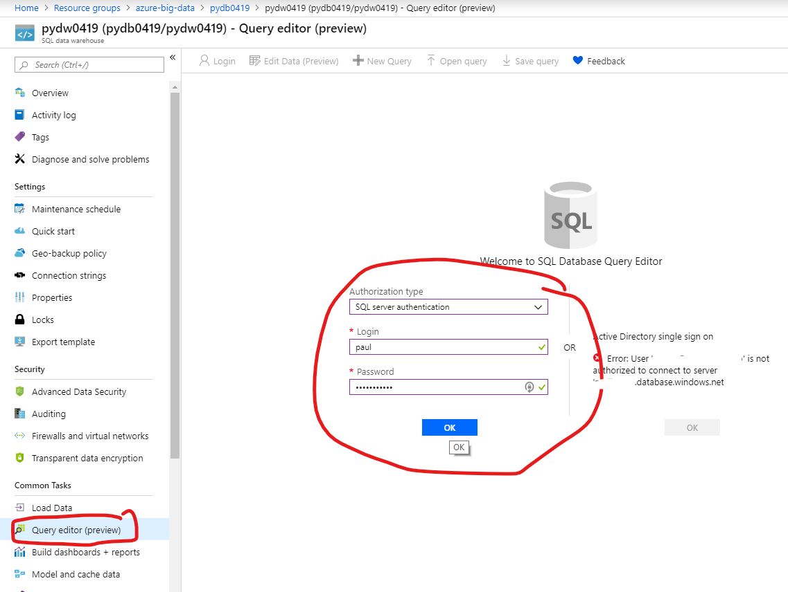
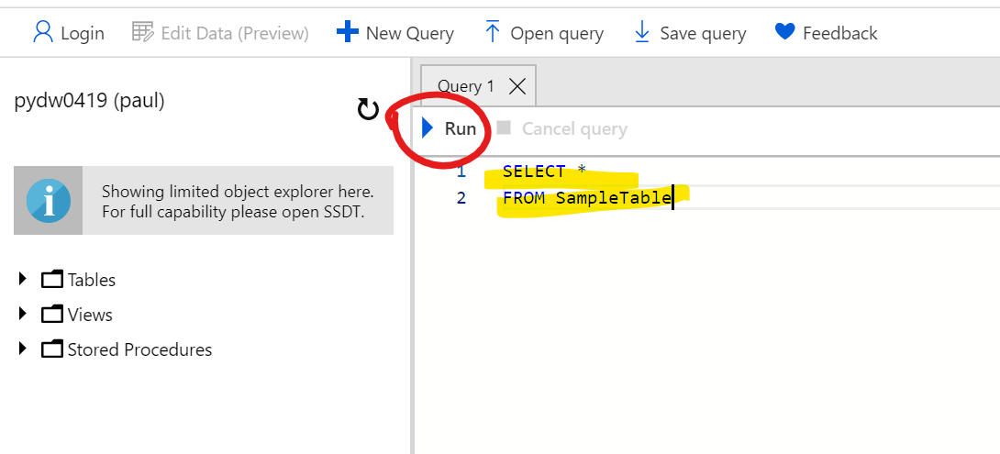

# Verify data

## Pre-requisite tasks: 

- [Develop Azure Databricks notebook](../azure-databricks/develop-databricks.notebook.md)

- [Azure Data Factory Pipeline](../azure-data-factory-v2/transform-data-using-databricks)

## Task: Verify data has landed in SQL Data Warehouse

1. In Azure Portal, navigate to your SQL Data Warehouse resource.

1. In the SQL Data Warehouse blade, click **Query editor** and log in.

        

1. In the query editor, enter the SQL query and run to verify data from JSON file has been transformed and loaded into SQL Data Warehouse.

    

## Next task: [Visualize Data]()