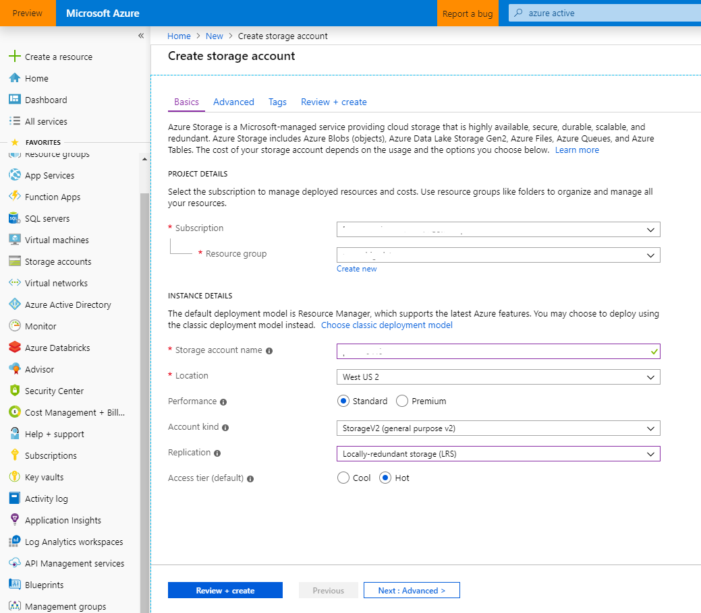

# Provision Azure Storage Account

## Pre-requisite task: [Create Azure Resource Group](../azure-resource-group/create-resource-group.md)

## Task: Create Azure Blob Storage

### We'll be creating this blob storage resource to temporarily store our data prior to loading into the data warehouse. 

1. In the [Azure Portal](https://portal.azure.com), click **+Create a resource** link at top left of the page

1. In the Azure Marketplace search bar, type **storage** and click on **Storage account** that appears in the drop down list

    

1. Click the **Create** button.

1. Enter the following and click the **Review + create** button then click **Create** once validation has passed:
    - Resource Group: *Select your resource group*
    - Name: *Enter a storage account name **(NOTE: Must be globally unique, must be lowercase and alphanumeric only)***
    - Location: *Select your location*
    - Performance: *Standard*
    - Account kind: *StorageV2 (general purpose v2)*
    - Replication: *Locally-redundant storage (LRS)*
    - Access tier (default): *Hot*

    

1. Check the **Notifications** icon in the upper right and wait until you see **Deployment succeeded** then click the **Go to resource** button.

    

1. In the Storage account blade, click on **Blobs**

    

1. In the Blobs blade, click on the **+ Container** button, enter a name, then click the **OK** button. Copy the container name to notepad for later use.

    

1. Navigate to the **Access keys** blade and copy the following values to notepad for later use:

    - Storage URL: **<YOUR_STORAGE_ACCOUNT_NAME>**.blob.core.windows.net
    - Storage Access Key: **<LOCATED_IN_ACCESS_KEYS_BLADE>**

## Next task: [Create Azure Data Lake Gen 2](../azure-data-lake-gen2/provision-azure-datalake-gen2.md)
