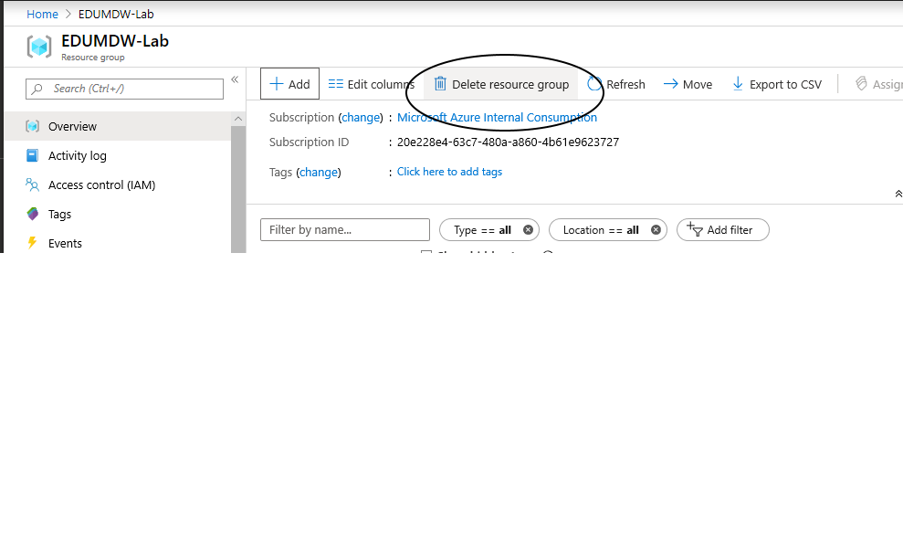
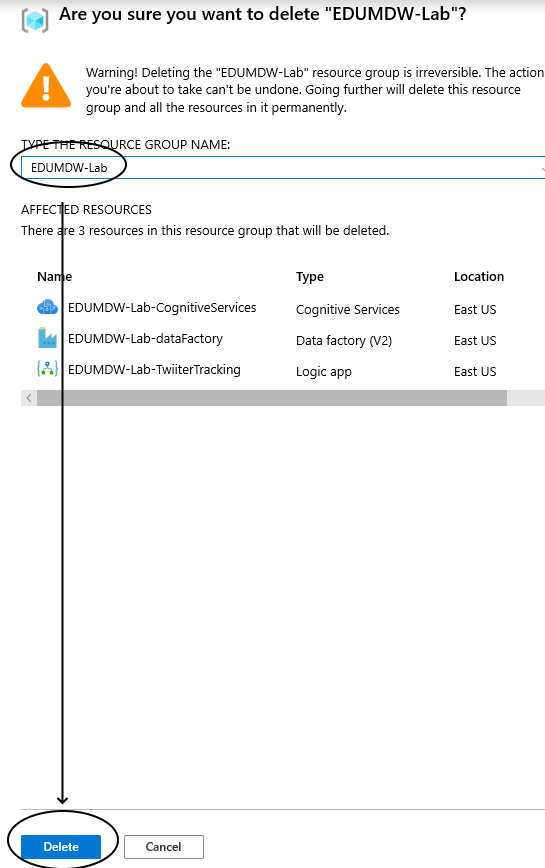

# Clean Up Your Resource Group

## Task: Delete Resource Group

1. Navigate to the EDUMDW-Lab, click on  delete resource group

    

1. In the delete resource pane, type the resource group name, then click on delete

    

## Congratulations!! you have completed this workshop.
