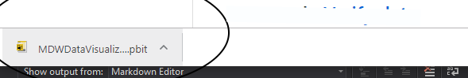
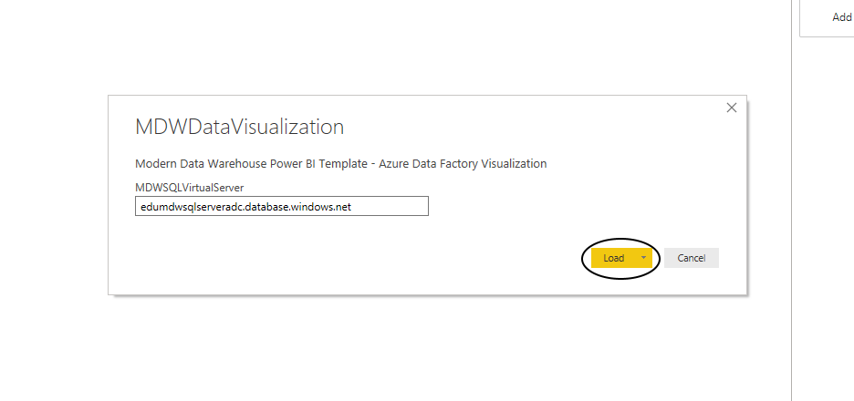
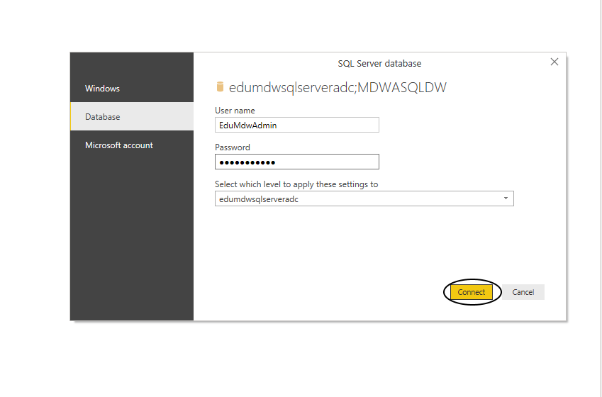
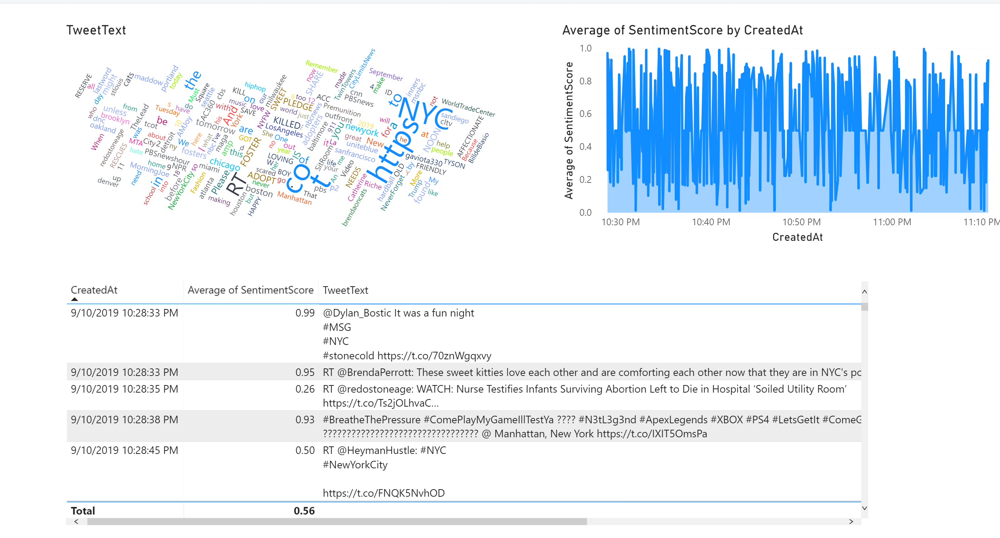
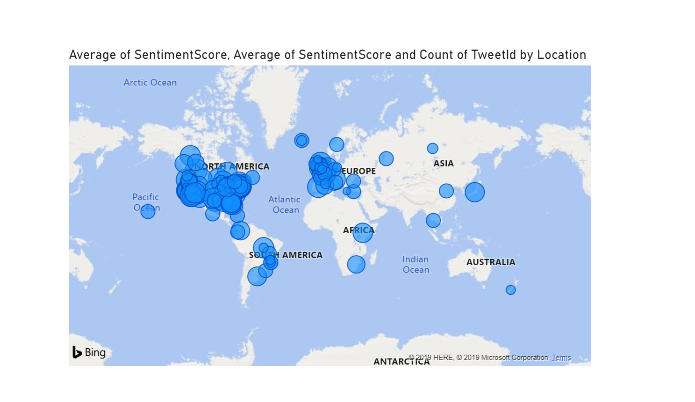

# Visualize Data with Power BI

## Pre-requisite tasks: [Use Logic Apps to Read Tweeter feeds with Cognitive Services](../azure-logic-app/steam-ai-tweeter.md)

## Task: Visualize Data Using Power BI    
 1.  If you have not done so, [download Power BI Desktop]
     [Download sample report](EduMdwTwitterReport.pbit)
     Open the downloaded report

	 

     - **Server name**: edumdwsqlserver+YOURINITIALS.database.windows.net

     - **Authentication**: Database
     - **User Name**: EduMdwAdmin
     - **Password**: P@$$word123

   This is the report view

   
   

## Congratulations, you have completed this Hands-On-Lab! 

## [Main Page](../readme.md)
