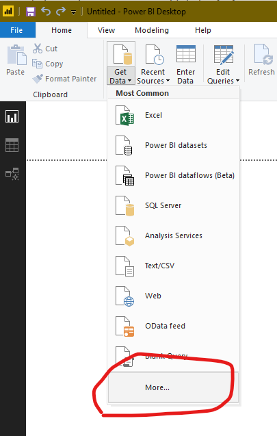
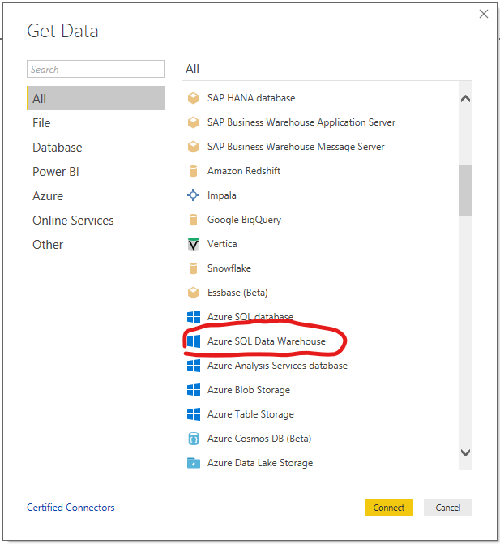
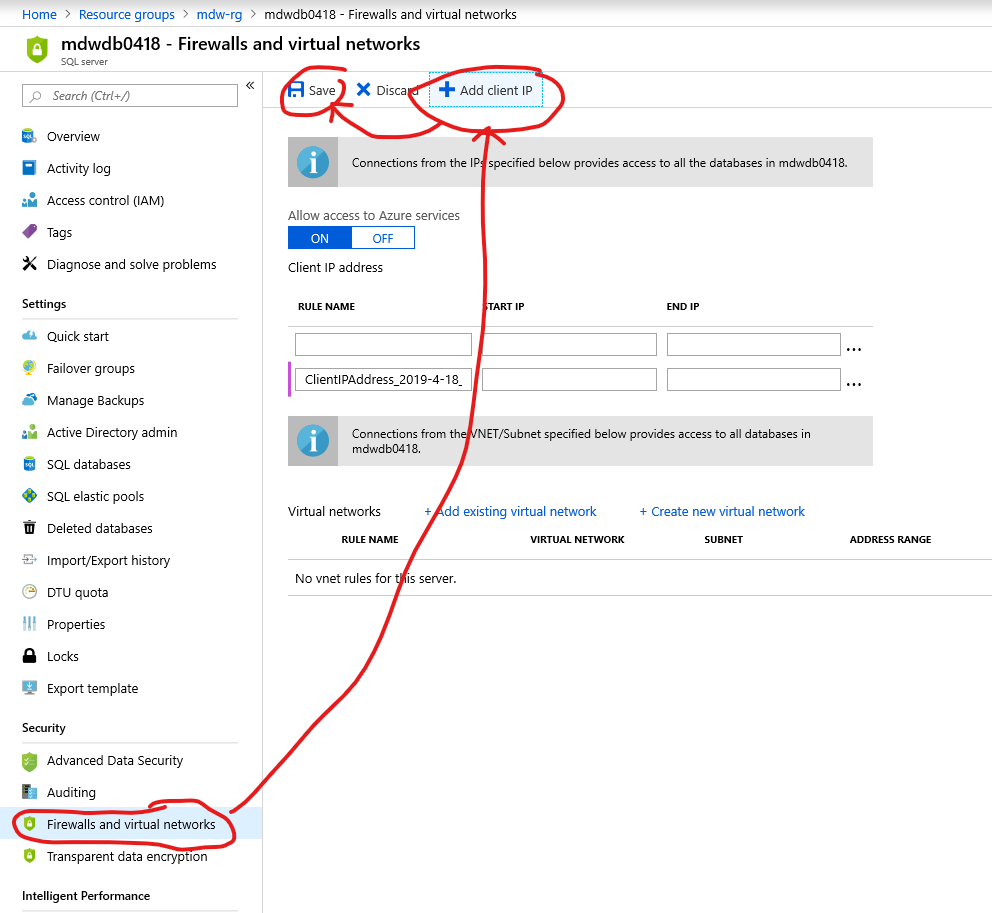
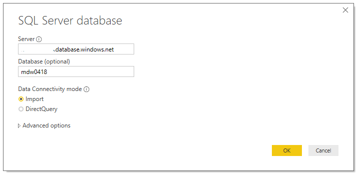
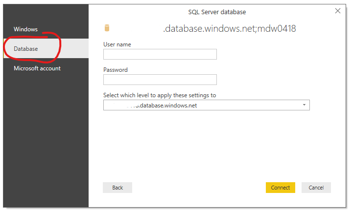
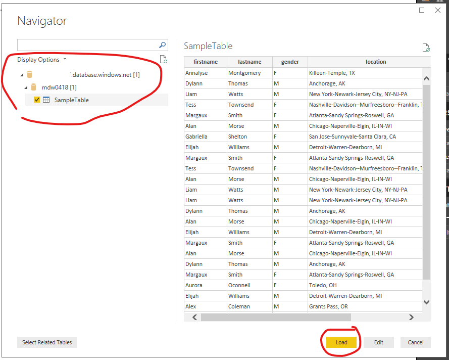
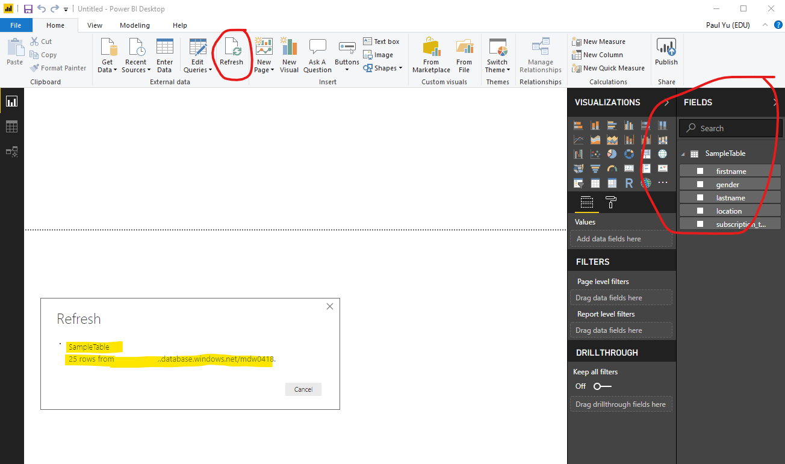
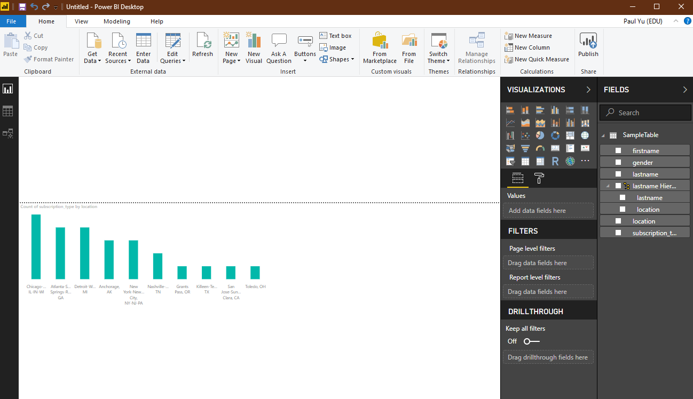

# Visualize Data with Power BI

## Pre-requisite tasks: [Task 12: Update Azure Data Factory pipeline to transform data using Databricks](../azure-data-factory-v2/transform-data-using-databricks.md)

## Task: Download, install, connect Power BI to SQL Warehouse, and visualize data

1. Download and install [Power BI](https://powerbi.microsoft.com/en-us/downloads/)

1. Open Power BI app

1. Click on the **Get Data** dropdown and click **More...**

    

1. In the **Get Data** window, click on **Azure SQL Data Warehouse** and click **Connect**.

    

1. To connect to the database from your PC, you'll need to navigate to the SQL Database server in the Azure Portal, navigate to the **Firewall and virtual networks** blade. Click on **+ Add client IP** to add your current IP address, then click **Save**.

    

1. Back in Power BI, enter your SQL Server credentails.

    

    

1. In the Navigator, select the **SampleTable** and click **Load**

    

1. Click the Refresh button and the field listing should be populated and available for use within the report.

    

1. Build reports!

    

## Congratulations, you have completed this Hands-On-Lab! 

> **NOTE:** Don't forget to delete your resource group.