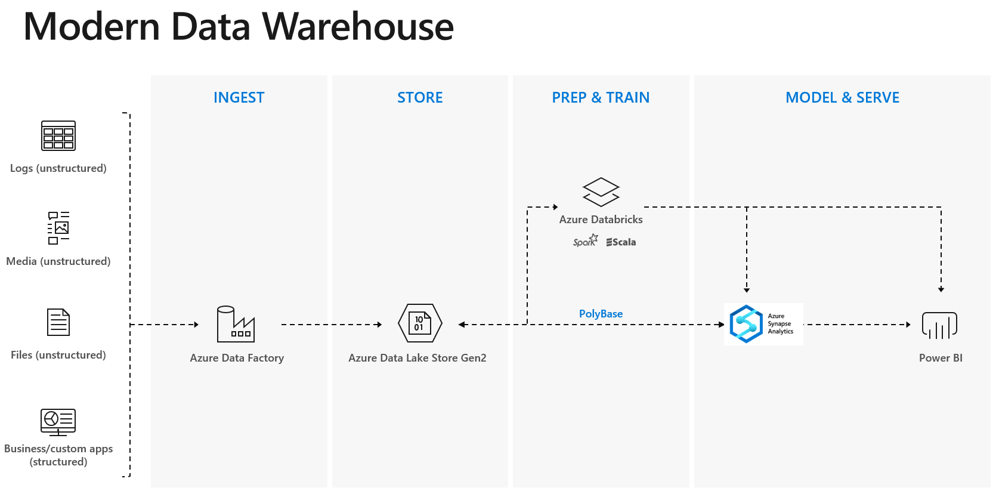
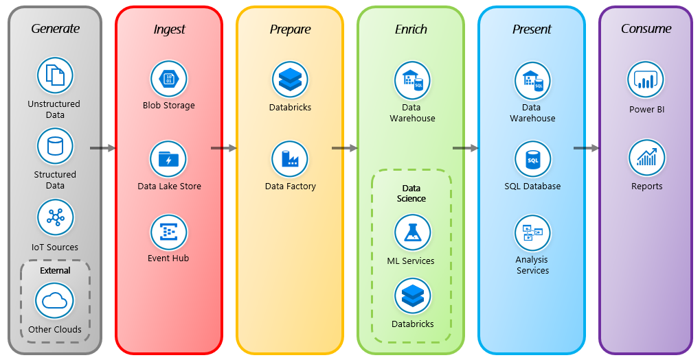

# Azure Modern Data Warehouse Workshop

This workshop will aim to get you more familiar with the tools used to build a modern data warehouse. We will use Azure Data Factory to load a file into Azure Data Lake Gen 2. From there we will transform the data inside of Azure Databricks and load into an Azure SQL Data Warehouse. Lastly, we'll use various reporting tools to connect to our data warehouse.

We will follow up this Data Stages Pattern to consume data

## Lab Prerequisites and Deployment
The following prerequisites must be completed before you start these labs:

* You must be connected to the internet;

* Use either Edge or Chrome when executing the labs. Internet Explorer may have issues when rendering the UI for specific Azure services.

* You must have a Pay-As-You-Go Azure account with administrator- or contributor-level access to your subscription. If you don’t have an account, you can sign up for an account following the instructions <a href="https://azure.microsoft.com/en-au/pricing/purchase-options/pay-as-you-go/" target="_blank">here</a>

     **IMPORTANT**: Azure free subscriptions have quota restrictions that prevent the workshop resources from being deployed successfully. Please use a Pay-As-You-Go subscription instead.

     **IMPORTANT**: When you deploy the lab resources in your own subscription you are responsible for the charges related to the use of the services provisioned. 

* Ensure users are able to create App Registrations within Azure Active AD tenant, more information <a href="https://docs.microsoft.com/en-us/azure/active-directory/develop/active-directory-how-applications-are-added" target="_blank">here</a>
  
* Ensure the following Resource providers are registered within subscription  
      • Microsoft.DataFactory
      • Microsoft.Databricks
      • Microsoft.Sql

* Power BI Desktop App 
      • Best option for Windows 10 desktops 
	  • Does not require Administrative rights to install 
      • Automatically updates when monthly Power BI Desktop updates are released
https://www.microsoft.com/en-us/p/power-bi-desktop/9ntxr16hnw1t?activetab=pivot:overviewtab
 
Power BI Desktop Installer 
https://aka.ms/pbiSingleInstaller

* [Sign in] to the Azure portal.

## Workshop Definitions:

Throughout the workshop we will be using the following pre-defined vairables:
     
  - **Resource Group**: EDUMDW-Lab
  - **Blob Storage Account**: edumdwstorage+YourInititals
  - **Azure Data Lake**: edumdwdatalake+YourInititals
  - **Service App**: edumdwlab-databricks-app
  - **SQL Server**:edumdwsqlserver+Your Initials
  - **Server Admin User**: EduMdwAdmin
  - **SQL Server User Password**: P@$$word123
  - **Azure Data Factory**:edumdwDataFactory+YourInitials
  - **Data Warehouse**:EDUMDWDataWarehouse
  - **Logic App**:EduMdwLocicApp+YourInitials

## Provision Resources

### [Task 1: Create Azure Resource Group](azure-resource-group/create-resource-group.md)

### [Task 2: Create Azure Blob Storage](azure-storage/provision-azure-storage-account.md)

### [Task 3: Create Azure Data Lake Gen 2](azure-data-lake-gen2/provision-azure-datalake-gen2.md)

### [Task 4: Create Azure Service Principal](azure-ad-service-principal/create-service-principal.md)

### [Task 5: Create Azure Synapse Analytics (Formerly SQL DW)](azure-sql-datawarehouse/provision-azure-sql-data-warehouse.md)

### [Task 6: Create Azure Data Factory V2](azure-data-factory-v2/provision-azure-data-factory-v2.md)

## Lab 1: Logic Apps & Cognitive Services 

### [Task 1: Use Logic Apps to Read Tweeter feeds with Cognitive Services](azure-logic-app/steam-ai-tweeter.md)
### [Task 2: Visualize Tweeter data](power-bi/visualize-data.md)

## Lab 2: Azure Data Factory & Databricks

### [Task 1: Build copy pipeline using Azure Data Factory](azure-data-factory-v2/copy-file-into-adls-gen2.md)

### [Task 2: Create Azure Databricks](azure-databricks/provision-azure-databricks.md)

### [Task 3: Create Azure Databricks Cluster](azure-databricks/create-spark-cluster.md)

### [Task 4: Create Azure Databricks Workspace](azure-databricks/create-workspace.md)

### [Task 5: Develop Azure Databricks notebook](azure-databricks/develop-databricks-notebook.md)

### [Task 6: Update Azure Data Factory pipeline to transform data using Databricks](azure-data-factory-v2/transform-data-using-databricks.md)

## Clean Up Resources
### [Task 1: Delete Resource Group](cleanup/readme.md)

[Sign in]:<https://portal.azure.com/>
[60 day trial]:https://signup.microsoft.com/signup?sku=a403ebcc-fae0-4ca2-8c8c-7a907fd6c235&email&ru=https%3A%2F%2Fapp.powerbi.com%3Fpbi_source%3Dweb%26redirectedFromSignup%3D1%26noSignUpCheck%3D1
[download Power BI Desktop]:https://www.microsoft.com/en-us/download/details.aspx?id=45331

