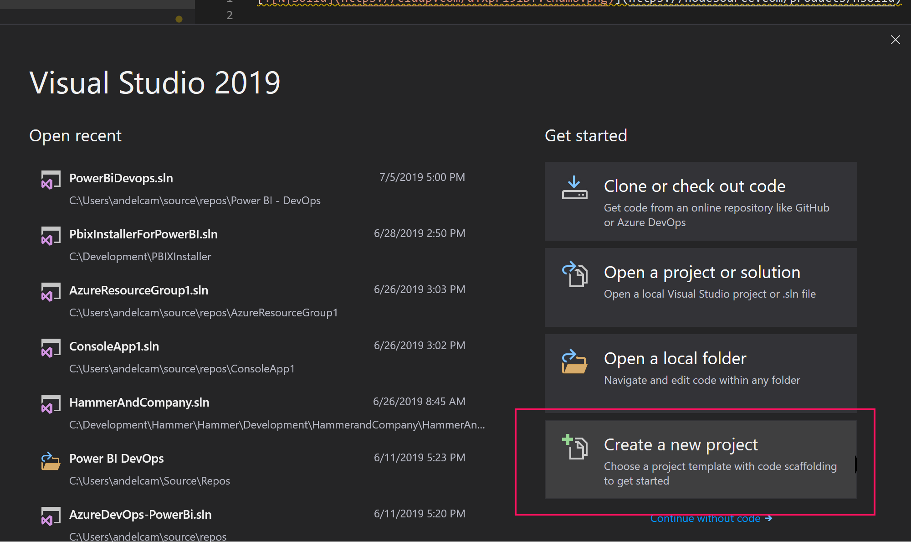
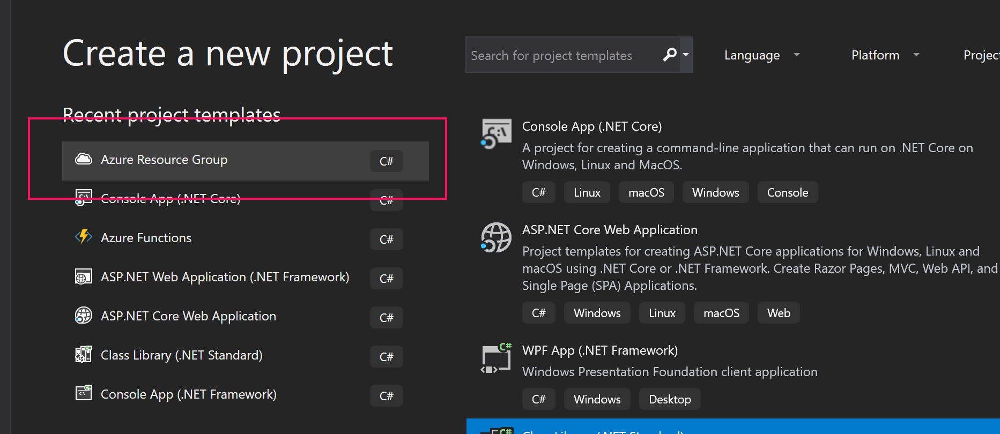
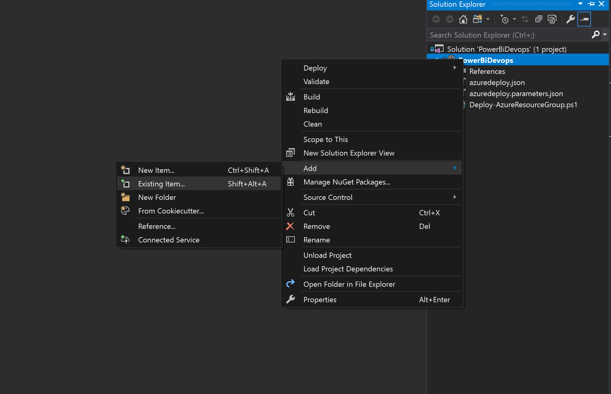

# Loading your Power BI report to a repository

There a the maximum total file size allowed to be manually uploaded of (20 MB) on Git repositories. There are 2 ways or circumvent this:

- Save your report as a Power BI Template - .pbit extension and manually load it to your repository. Using this method you need to add a refresh dataset to the release pipeline
- Load using Visual Studio or Visual Code

## Create a Visual Studio Project

You can simply go to your Azure DevOps repository and upload the file .pbix file. 

Open Visual Studio and create a new project

 

 Select Create Azure Resource Group

  

  Name the project PowerBiDevOps, now add the sample report you downloaded on the first step click [here to download it], **please unzip the file**

  

  Next: [Link VS Project to Azure DevOps]
  
[here to download it]:<https://github.com/Microsoft-USEduAzure/workshops/tree/master/powerbi-devops/sourcefiles/_dev_IPEDSEnrollmentTrends.zip>
[Link VS Project to Azure DevOps]:https://github.com/Microsoft-USEduAzure/workshops/tree/master/powerbi-devops/3-LinkVStoDevOps/ReadMe.md>
