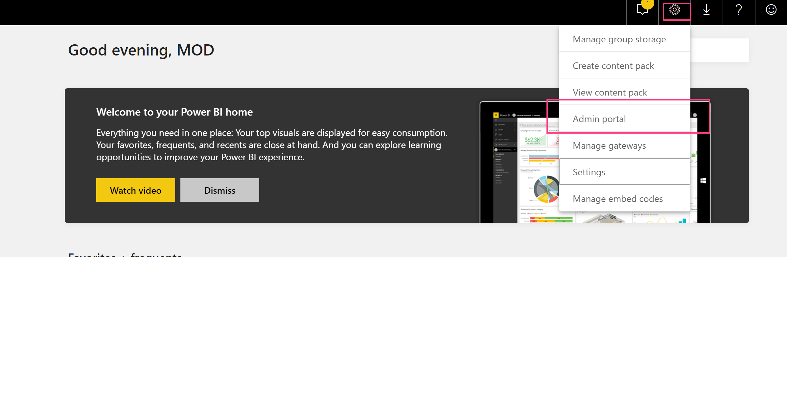
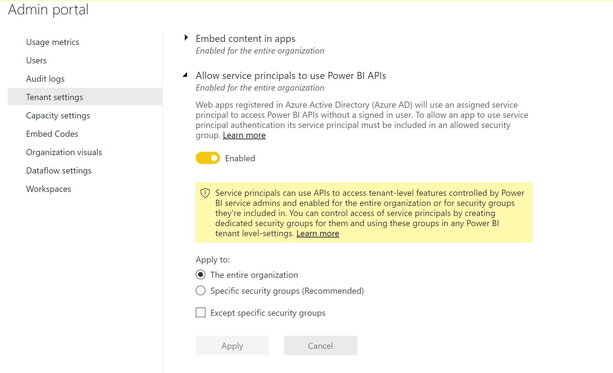
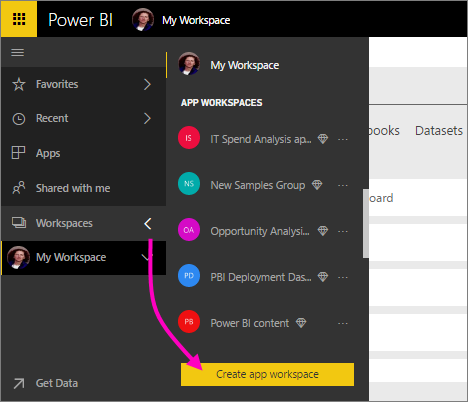
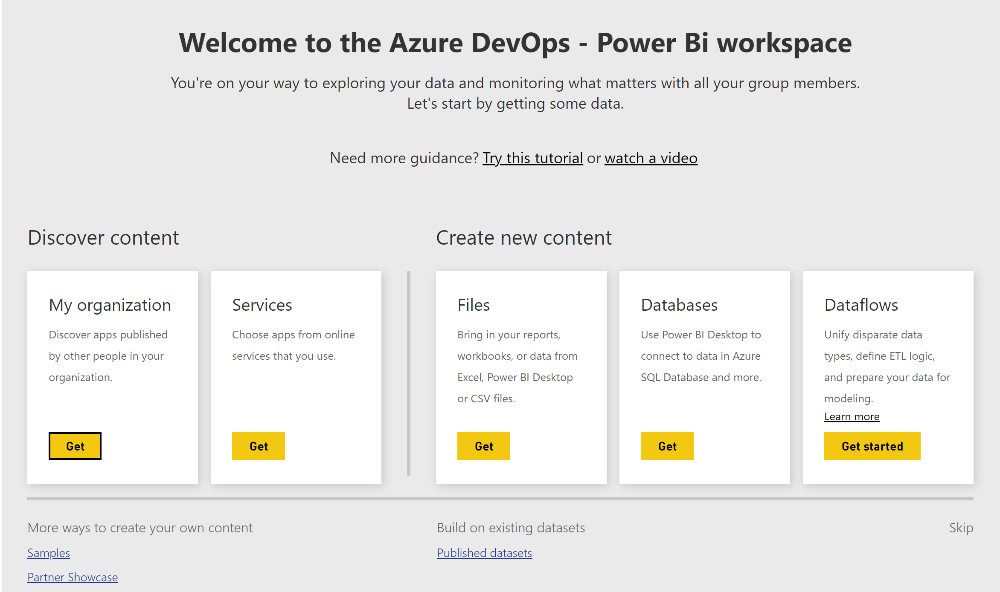

# Configure Power BI

Steps to Configure Power BI Service Principal

- Allow Service Principal for Power Bi Tenant
- Register Power BI Application

## Allow Service Principal for Power BI Tenant

Service principal can replace master user and help customers build a more robust   solution when going to production:

- Easier to create – applications can be registered automatically, and anyone with the appropriate permissions can add the new application to a security group allowed to use service principal.
- No need to purchase a Power BI Pro license for a service principal (though it is recommended to have a user with Pro license who can access Power BI portal).

[Login] into your Power BI Account, once logged in, on the top menu, click on the settings icon then select Admin Portal

Select tenant settings, scroll down to the option *Allow Service Principals to User Power BI*, enable the option.

## Register Power BI Application

Power BI is introducing a new workspace experience. Workspaces are still the place to collaborate with colleagues to create collections of dashboards, reports, and paginated reports. Then you can bundle that collection into an app and distribute it to your whole organization, or to specific people or groups.

Here's what's different. In the new workspaces, you can:

- Assign workspace roles to user groups: security groups, distribution lists, Office 365 groups, and individuals.
- Create a workspace in Power BI without creating an Office 365 group.
- Use more granular workspaces roles for more flexible permissions management in a workspace.

If you want to read more about Power Bi new worksapcess here is a link to [More documentation]

Start by creating the app workspace. Select Workspaces > Create app workspace.

### Create app workspace

You're automatically creating an upgraded workspace.

### New workspace experience

Give the workspace a name: Azure DevOps - Power Bi. If the name isn't available, edit it to come up with a unique name. Take a look at your brand new app:

Next: [Configure Application Permissions]

[Login]:https://powerbi.microsoft.com/en-us/landing/signin/
[More documentation]:https://docs.microsoft.com/en-us/power-bi/service-create-the-new-workspaces
[Configure Application Permissions]:https://github.com/Microsoft-USEduAzure/workshops/tree/master/powerbi-devops/5-ConfigureAppOnAzure/ReadMe.md>
