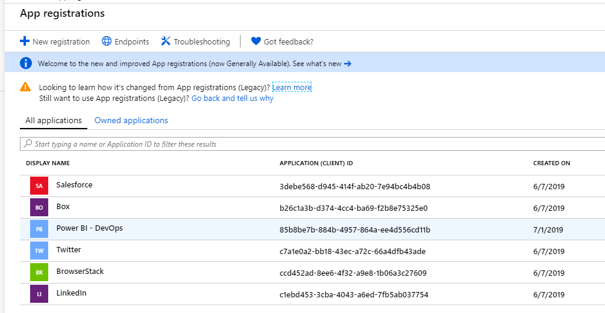
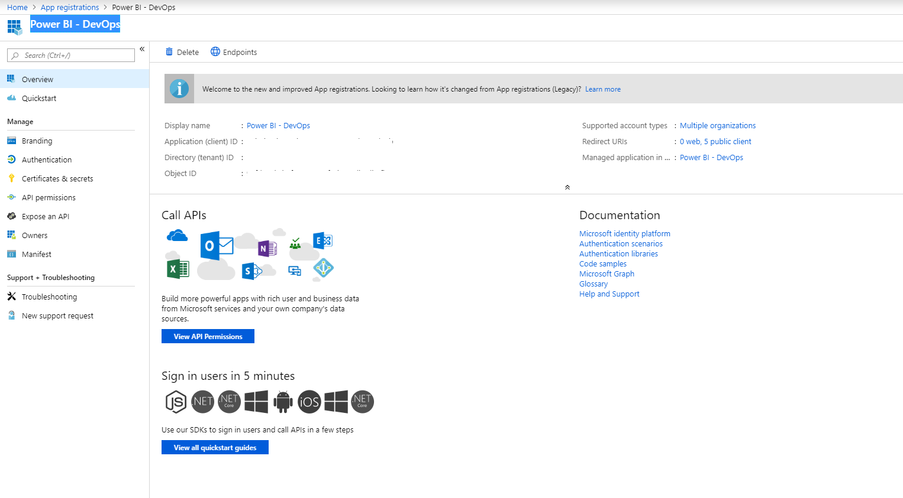
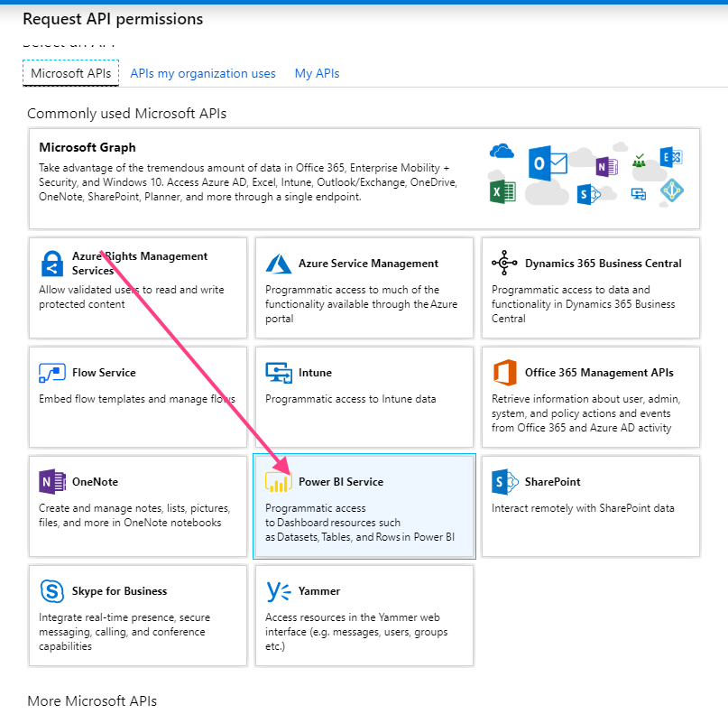
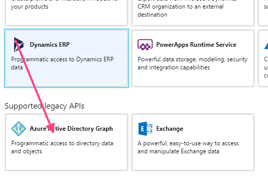
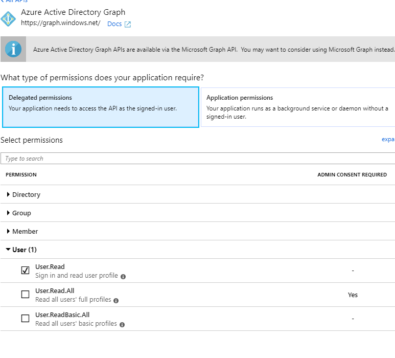
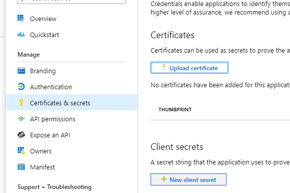

# Configure App on Azure

We are integrating Power BI and Azure DevOps, App Registrations is the communication bridge between these two applications

Steps to integrate Power BI - Azure DevOps

- Add permissions to Power BI Application on Azure Tenant
- Create Secret for application on Azure Tenant

## Add permissions to Power BI Application on Azure Tenant

[Login] to Azure Portal, on the search bar type App Registrations

### Add permissions to Power BI Service

Select Power BI - DevOps, it will bring you to the app Overview page.

Make copy of the **aplication id** & **tenant id** and put this on a text file, we will use this later.

Select API permissions > Add permissions > Power BI Service

Make sure you select all of the following delegated permissions

### Add permissions to Azure Active Directory

Click on Add permissions > Azure Active Directory Graph

Select the following permissions:

### Create an App Secret

Click  Certificates & Secrets > + New client secret

Enter a name and *copy the secret value to a text file - we will need it later*

Next: [Link App to Power BI]

[Login]:https://portal.azure.com
[Link App to Power BI]:<https://github.com/Microsoft-USEduAzure/workshops/tree/master/powerbi-devops/6-LinkAppToPowerBi/ReadMe.md>
