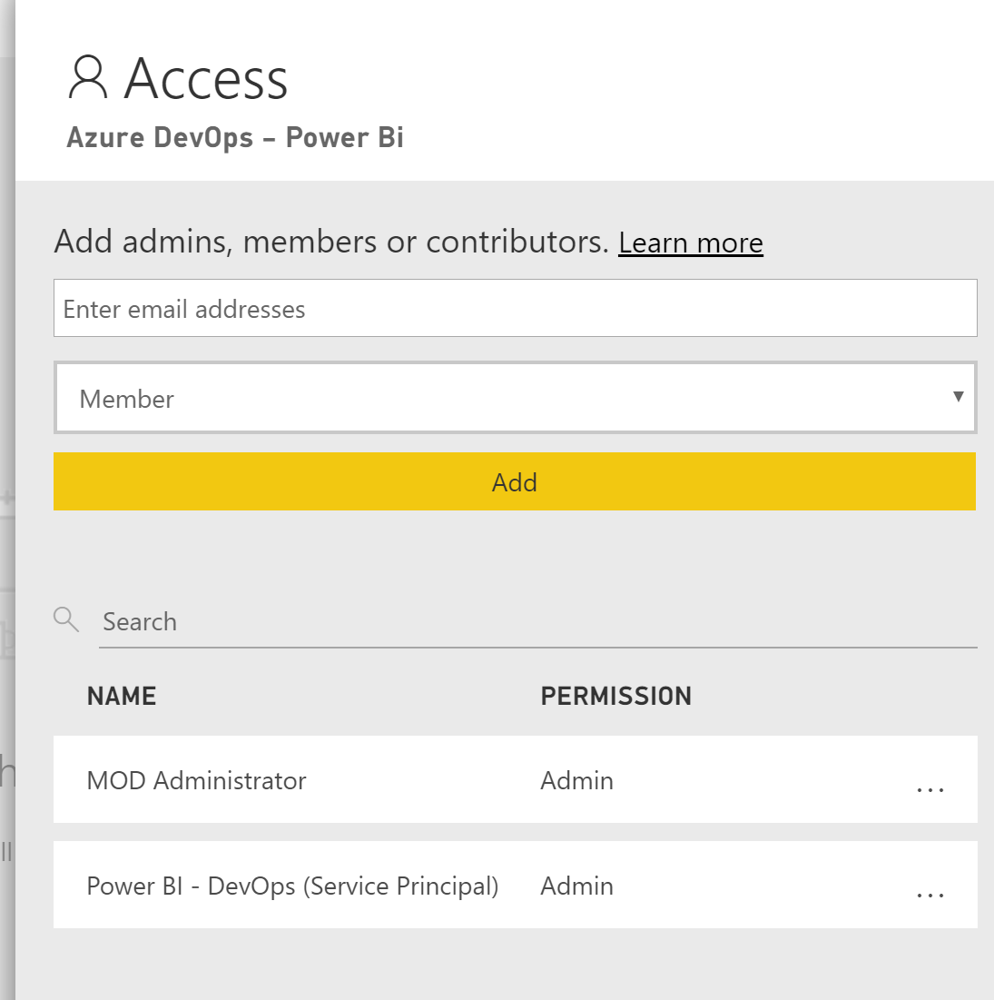

# Link App To Power BI

We now need to add the registered application as an Admin member of the workspace we created on [Step 4]

- [Login] to Power BI
- Navigate to Power the workspace Azure DevOps - Power Bi
- Select Access and type the name of your Azure Registered App: Power Bi - Devops

 Make sure user type is Admin

Next: [create DevOps Pipeline]

[create DevOps Pipeline]:<https://github.com/MarchingBug/powerbi-devops/blob/master/7-CreateDevOpsPipeline\ReadMe.md>
[Login]:https://powerbi.microsoft.com/en-us/landing/signin/
