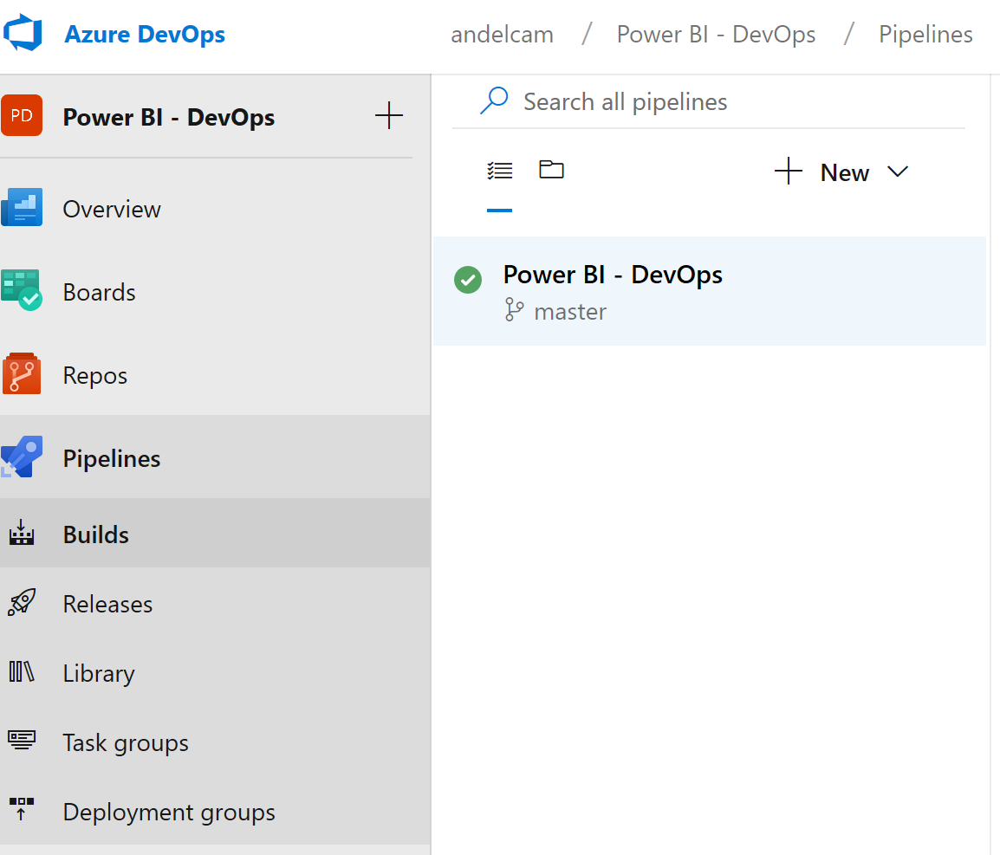
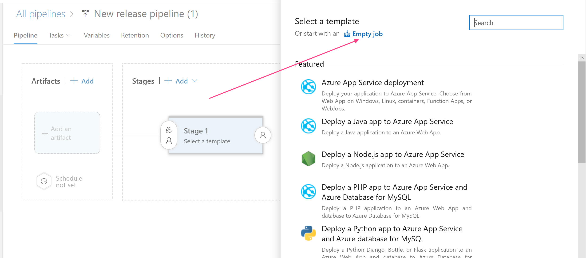
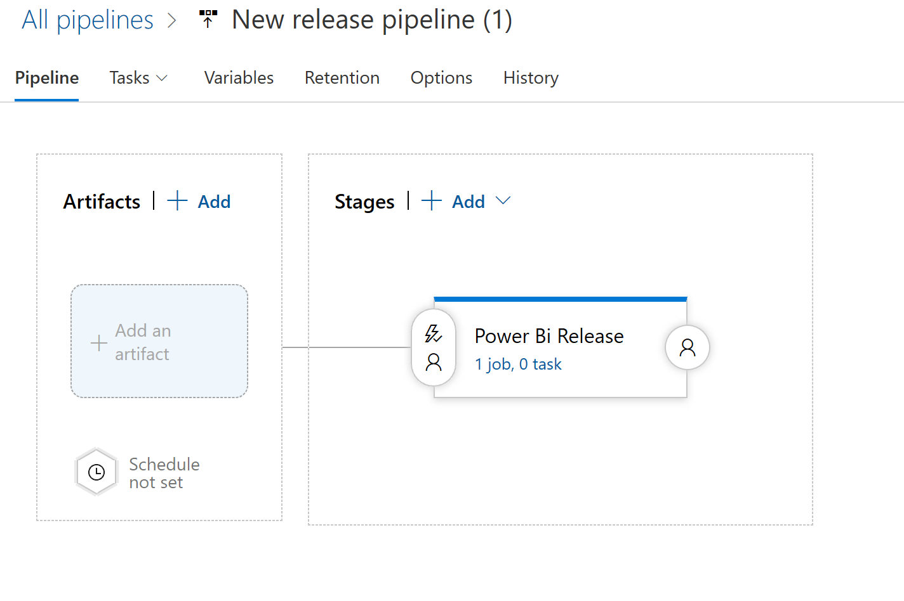
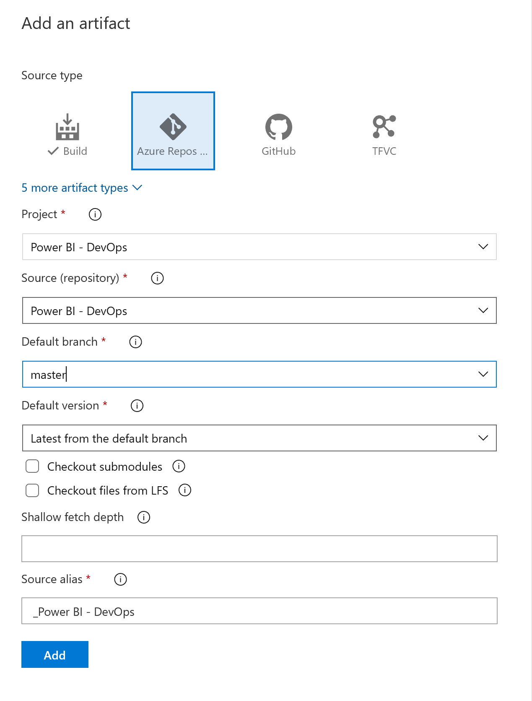
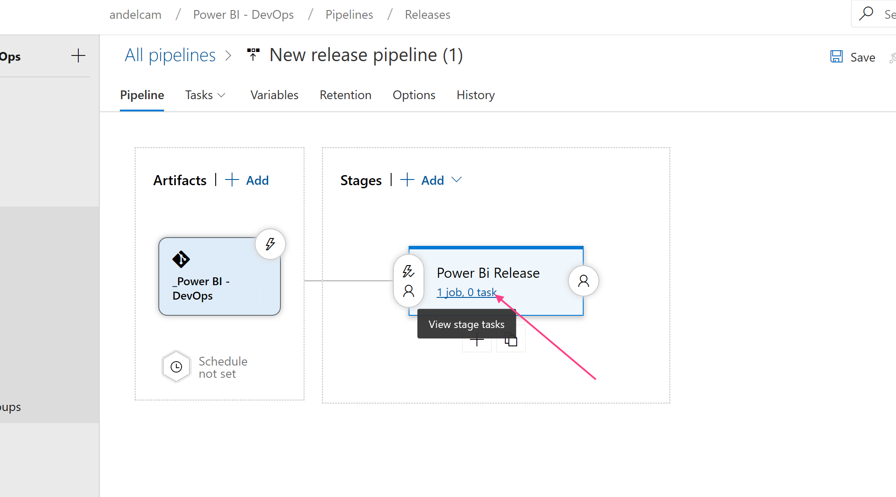
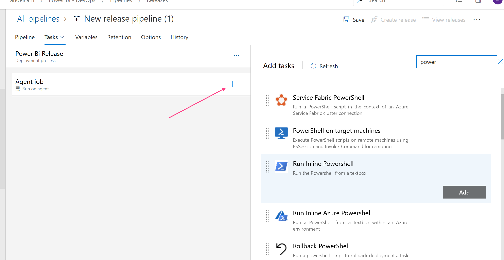
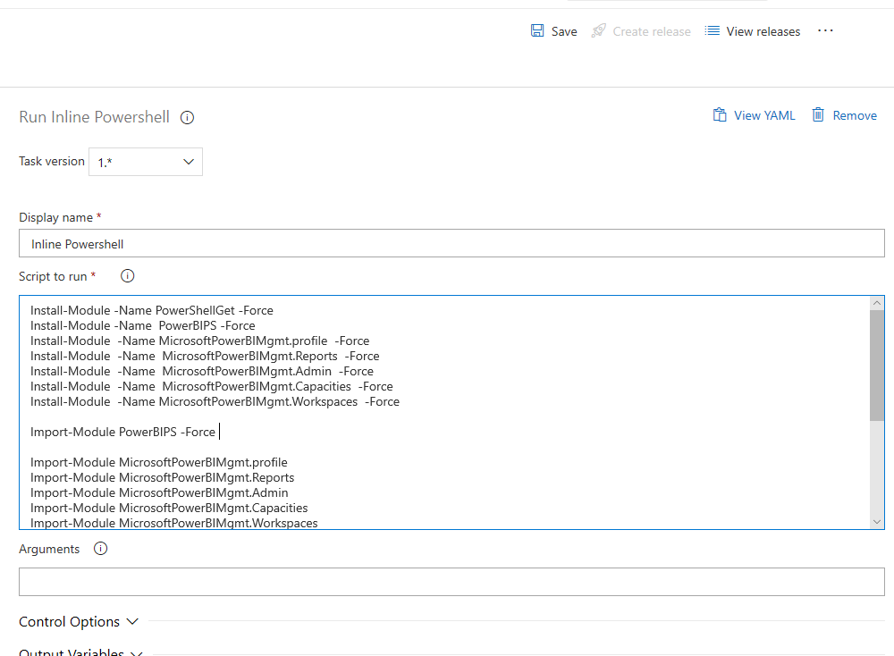
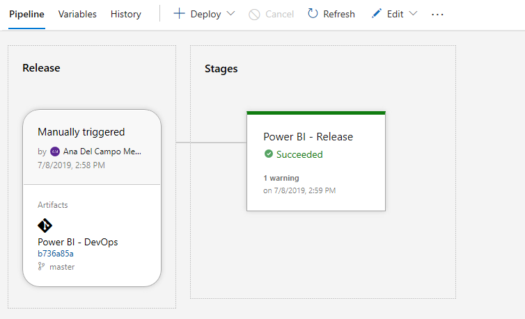
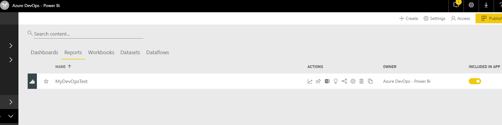

# Create DevOps Pipeline

Azure Pipelines helps you implement a build, test, and deployment pipeline for any app. Tutorials, references, and other documentation show you how to configure and manage continuous integration and continuous delivery (CI/CD) for the app and platform of your choice. For more information checkout [Pipelines Documentation]

- [Login] to Azure DevOps
- Navigate to your Power BI - DevOps project > Pipelines
You will see the first build based on the initial commit of your code

- Select Releases > + New, click on empty pipeline template

- Enter a name: Power BI Release and press enter

- Click on Artifacts > + Add > Azure Repos Git and select the options from the dropdown box

- Click on Tasks

- Click on the plus sign,
 - Type **power** in the search box on the task panel
 - Select Inline Powershell
 - Copy the code below and paste it to the text box

 

Fill out the following variables that you copied from to your text file

> $Username =  Application Id copied to the text file

> $Password =  Registered App Secret

> $TenantId =  Tenant id - Registerd app
 
~~~~

Install-Module -Name PowerShellGet -Force
Install-Module -Name  PowerBIPS -Force
Install-Module  -Name MicrosoftPowerBIMgmt.profile  -Force
Install-Module  -Name  MicrosoftPowerBIMgmt.Reports  -Force
Install-Module  -Name  MicrosoftPowerBIMgmt.Admin  -Force
Install-Module  -Name  MicrosoftPowerBIMgmt.Capacities  -Force
Install-Module  -Name MicrosoftPowerBIMgmt.Workspaces  -Force

Import-Module PowerBIPS -Force

Import-Module MicrosoftPowerBIMgmt.profile
Import-Module MicrosoftPowerBIMgmt.Reports
Import-Module MicrosoftPowerBIMgmt.Admin
Import-Module MicrosoftPowerBIMgmt.Capacities
Import-Module MicrosoftPowerBIMgmt.Workspaces

$Username = "from your records"
$Password = "from your records"
$TenantId = "from your records"

$SecurePassword = ConvertTo-SecureString $Password -AsPlainText -Force 
$Credential = New-Object System.Management.Automation.PSCredential ($Username, $SecurePassword)
Connect-PowerBIServiceAccount -ServicePrincipal -Tenant $TenantId -Credential $Credential

$FilePath ='$(System.DefaultWorkingDirectory)\Power BI - DevOps\PowerBiDevops/_dev_ IPEDS Enrollment Trends.pbix'

New-PowerBIReport -Path $FilePath -Name 'MyDevOpsTest' -Workspace ( Get-PowerBIWorkspace -Name "Azure DevOps - Power Bi" ) -ConflictAction CreateOrOverwrite

~~~~

 

- Click on Save
- Click Create release

State of the release will be displayed

 

 Login to Power BI and navigate to the Azure DevOps - Power BI workspace > Reports

 

[Login]:https://azure.microsoft.com/en-us/services/devops/
[Pipelines Documentation]:https://docs.microsoft.com/en-us/azure/devops/pipelines/index?view=azure-devops
 [Download Release Pipeline]:<https://github.com/MarchingBug/powerbi-devops/blob/master/sourcefiles\dev_IPEDSEnrollmentTrends.zip>
