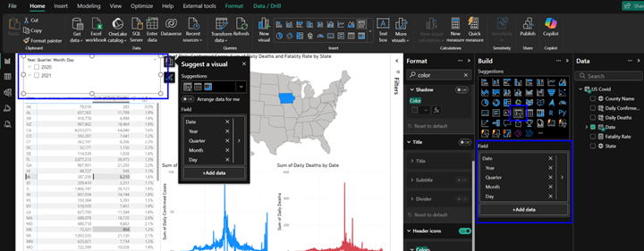

# Use Power BI Desktop to create a report on COVID-19 cases in the US

## Part 2 - Task List

- [Prepare tabular model](#Prepare-tabular-model)
- [Design report](#Design-report)

### Prepare tabular model

1. Save the Power BI report before doing anymore work.  Click **File** in the upper lefthand corner:

Click **Save as**:

    
Navigate to a folder where you want to save the file and name the file **US Covid-19**:

1. The first step in preparing tables will be to hide the two tables that we merged.  Click on the **eyeball icon** to the right of the **covid_confirmed_usafacts** table to hide:

    Repeat the process to hide the **covid_deaths_usafacts** table:

1. Some of the identifiers included in the imported data are not needed to perform analysis and can be hidden.  Click on the eyeball icon to the right of the **countyFIPS** column to hide:

Repeat the process to hide the **stateFIPS** column:

1. Notice that some of the columns have an icon to the left of the column name.  The icons can indicate that the column is aggregated using a **Summarization** method or that they belong to a predefined **Data category**. Click on **Confirmed Cases** and review the **Summarization** and **Data category** located on the **Column tools** ribbon:

1. Set the **Data catogory** for both the **County Name** and **State** columns by selecting the column and setting the **Data category** using the drop down selector:

1. The **US Covid** table is now ready for report design:

### Design report

Power BI has incorporated many design features common to other office products, such as PowerPoint.  Using the USAFacts National COVID-19 Report as an example, we will design a similar report using basic design features:

1. The confirmed cases listing by state matrix will be the first visual added to the report.  Click on **Confirmed Cases**, drag and drop it onto the report canvas:

1. **Confirmed Cases** is now highlighted in the **Fields** list and place in the **Value** landing zone for the visualization.  A column chart (see icon highlighted in the **Visualizations** panel) was automatically selected as the default visualization for **Confirmed Cases** based on its properties:

1. Change the visualization to a **Matrix** by selecting the **Matrix icon** in the **Visualizations** panel:

1. Click on **Deaths**, drag and drop it onto **Matrix** visual:

1. Click on **State**, drag and drop it onto **Matrix** visual:

1. Visuals can be moved and resized on the canvas using the same methods as with any other Office application.  Click and drag the lower righthand corner of the **Matrix** visual to resize it:

1. The rows in a matrix visual can be sorted by clicking on the column headers.  Click on the **Confirmed Cases** column header to sort the rows:

1. Click on the **Data icon** to the left of the report canvas to view the rows of the **US Covid** table.  Notice how each row contains a running total of **Confirmed Cases** and **Deaths** by State by County by Date:

1. We need to add two new columns to the table for the **Confirmed Cases** and **Deaths** added each day.  This will enable us to trend the measures over time.  We will use [**Data Analysis Expressions** or **DAX**](https://docs.microsoft.com/en-us/power-bi/guided-learning/introductiontodax) to create the new columns.  DAX is a rich expression language that can be used to create complex calculations within tabular models.  Here is the DAX needed for the new columns:

    **Daily Confirmed Cases** =
    VAR __CountyName = 'US Covid'[countyFIPS]
    VAR __stateFIPS = 'US Covid'[stateFIPS]
    VAR __Yesterday =
        DATEADD ( 'US Covid'[Date], -1, DAY )
    VAR __TodaysCases = 'US Covid'[Confirmed Cases]
    RETURN
        __TodaysCases
            - CALCULATE (
                SUM ( 'US Covid'[Confirmed Cases] ),
                FILTER (
                    'US Covid',
                    'US Covid'[Date] = __Yesterday
                        && 'US Covid'[countyFIPS] = __CountyName
                        && 'US Covid'[stateFIPS] = __stateFIPS
                )
            ) + 0

    **Daily Deaths** =
    VAR __CountyName = 'US Covid'[countyFIPS]
    VAR __stateFIPS = 'US Covid'[stateFIPS]
    VAR __Yesterday =
        DATEADD ( 'US Covid'[Date], -1, DAY )
    VAR __TodaysCases = 'US Covid'[Deaths]
    RETURN
        __TodaysCases
            - CALCULATE (
                SUM ( 'US Covid'[Deaths] ),
                FILTER (
                    'US Covid',
                    'US Covid'[Date] = __Yesterday
                        && 'US Covid'[countyFIPS] = __CountyName
                        && 'US Covid'[stateFIPS] = __stateFIPS
                )
            ) + 0

    Here is how the DAX looks when correctly formatted:
    
1. Click on **New column** and copy and past the DAX for **Daily Confirmed Cases** into the column editor:

1. Click on **New column** and copy and past the DAX for **Daily Deaths** into the column editor:

1. Review the rows of the **US Covid** table to validate that the new calculated columns are correctly showing the changes from one date to the next:

1. Hide the **Confirmed Cases** running total column by right clicking on the column header and selecting **Hide in report view**:

1. Hide the **Deaths** running total column by right clicking on the column header and selecting **Hide in report view**:

1. The **Column tools** are also available in the **Data view**.  Use the **Format** options to format the two new columns:

1. Return to the report canvas by clicking on the **Report view** button to the left of the data table view:

1. Even though the original columns are hidden, they are still visible in the matrix that was added earlier.  Delete the original columns from the **Value** landing zone of the matrix and drag and drop the new columns into the **Value** landing zone:

1. Power BI has a feature called [**Quick Measures**](https://docs.microsoft.com/en-us/power-bi/desktop-quick-measures) that is a template driven feature for creating common time intelligence and other metrics.  Right click on the **US Covid** table and select **New quick measure**:

1. Use the **Calculation** dropdown menu to select the template for **Divisioni**:

1. Drag and drop **Daily Deaths** onto the **Numerator** and **Daily Confirmed Cases** onto the **Denominator**.  Click **OK**:

1. By default the **Quick Measures** feature will create a verbose name describing the new measure.  Right click on the new measure and select **Rename**

1. Rename the measure, **Fatality Rate**.  Use **Measure Tools** to format the **Fatality Rate** as a percentage with 1 decimal place:

1. The state matrix is now complete with all metrics properly formated:

1. Drag and drop **State** onto a blank area of the report canvas to the right of the state matrix:

1. Since the **Data category** for **State** is set, the default visual is a map.  Resize the map to take the top half of the canvas to the right of the state matrix:

1. Change the map visual to a **Shape Map** by clicking on the **Shape Map icon** in the **Visulizations** pane:

1. Drag **Daily Confirmed Cases** to **Color saturation** and drag **Daily Deaths** and **Fatality Rate** to **Tooltips**.  Each state is now colored according to the number of **Daily Confirmed Cases** and hovering over a state will provide the additional information from **Tooltips**:

1. Drag **Daily Confirmed Cases** onto a blank area of the report canvas to the right of the state matrix and underneath the shape map:

1. Resize so the right edge aligns with the middle of the shape map:

1. Drag and drop **Date** to the **Axis** for the new column chart.  By default, a date hierarchy will automatically be created allowing users to drill up/down the hierarchy when interatcting with the visualization.  Click on the down arrow to the right of **Date** and select **Date** to remove the hierarchy and just use the date value for the axis:

1. Right click on the new column chart and select **Copy**, then **Copy visual**:

1. Click on the empty canvas to the right of the column chart and paste a new chart using **Ctrl-v**.  Change the **Value** of the new chart to use **Daily Deaths**:

1. Click on the **paint roller icon** to modify the properties of the daily deaths column chart.  Expand **Data colors** and change the **Default color** to red:

1. The charts include early dates where there is very little data. Resize the state matrix to create room for a new date slicer. Drag and drop **Date** onto the canvas just above the state matrix. Click on the **Slicer icon** in the **Visualizations** pane to create a date slicer: 

1. By default, a date hierarchy will automatically be created allowing users to drill up/down the hierarchy when interatcting with the visualization.  Click on the down arrow to the right of **Date** and select **Date** to remove the hierarchy and just use the date value for the axis:

1. Click on the down arrow in the upper righthand corner of the date slicer:

1. Select **Between** to create a date range slicer:

1. Use the date slicer to set the starting date to March 10th, 2020.

1. As a final step, modify the cross filtering behavior of the report.  The default cross filtering behavior is to highlight the contribution of a selected state instead of filtering the counts to only show data for a selected state.  Click on the shape map, then click on **Edit interactions** on the **Format** ribbon.  Click on the **Filter icons** above both of the column charts below the shape map:

1. Click on Michigan and the column charts are now filtered according the data for Michigan only:

## *You have completed Part 2 - Use Power BI Desktop workshop*

## [Back to Syllabus](readme.md)
